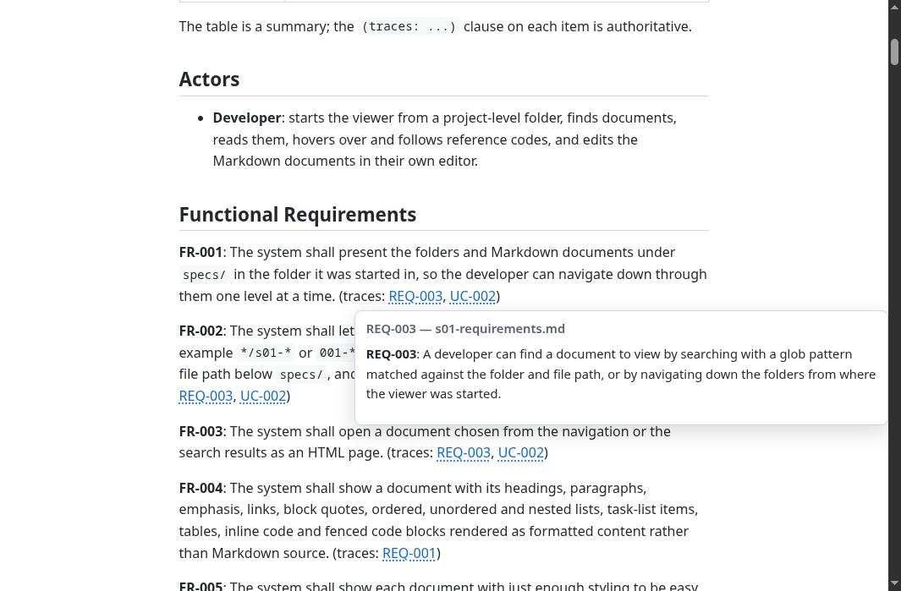
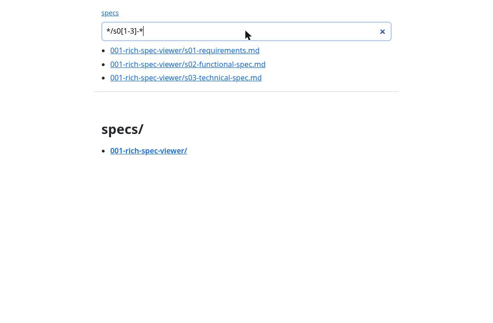
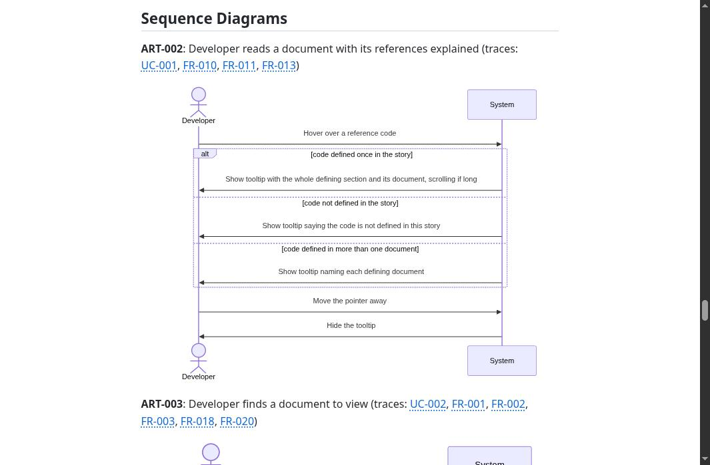

# Rich Specification Viewer

A single-file, standard-library-only Python viewer for [Spec Kit](https://github.com/github/spec-kit) Markdown documents under `specs/`.

- Hover a reference code (`REQ-001`, `FR-012`, `DEC-004`, `ART-007`, `CH-003`, ...) to see the section that defines it; click to follow it. Codes with no definition, or more than one, are shown as errors.
- Search with glob patterns or navigate by story and folder, with breadcrumbs.
- Mermaid diagrams (flowchart, sequence, ER, C4) are drawn in the page. This is the only outside script: `mermaid@11` from jsDelivr. A diagram that fails shows an error in its place, and diagrams need internet access to jsDelivr. Mermaid's C4 support is experimental, so C4 layouts can look rough.
- Minimal CSS, no other JavaScript dependencies, no configuration.

## Screenshots

**Hover a reference code** to read the section that defines it, without leaving the page:



**Search by glob pattern** (here `*/s0[1-3]-*`) or navigate by folder:



**Mermaid diagrams** are drawn in place of their source:



## Run

Python 3.11 or later, nothing to install. From the project folder that contains `specs/`:

```sh
python3 specview.py            # first free port from 8000 to 8019
python3 specview.py --port 9000
python3 specview.py --host 0.0.0.0
```

Open the printed URL (for example `http://localhost:8000/`) in a browser. Only `specs/` below the start folder is served. Inside a dev container or Codespace the viewer binds `0.0.0.0` so port forwarding works; otherwise it binds `127.0.0.1`.

## Test

```sh
python3 -m unittest discover -s tests
```

## How it was built

The story lives in [`specs/001-rich-spec-viewer`](specs/001-rich-spec-viewer) and was specified and built with the [engineer-in-the-loop](https://github.com/leejsinclair/speckit-engineer-in-loop) Spec Kit preset: requirements, functional and technical specifications, plan and tasks, each with its design decisions and traceability to the code.
