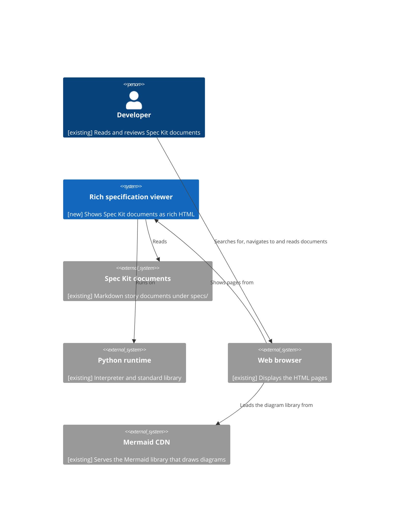

<!--
  STAGE 1 OF THE DEFINITION PIPELINE: WHY are we doing this?

  Gate: REQ-G01 to REQ-G14 (the Requirements quality gate). Run `eil check` to evaluate it.
  Approval: one recorded confirmation from the developer (or a person named in the extension's
  eil-config.yml). The AI drafts and challenges; it cannot approve.

  - Describe the problem and the outcome. Do not prescribe an implementation.
  - Tag any text the AI wrote with [ai-draft] until a human has reviewed it. Approval is refused
    while a tag remains (unless a named override is recorded).
  - A section that does not apply is removed and listed under "Not applicable" with a reason.
  - Open questions are not assumptions. Never turn one into the other without a human decision.
-->

# Requirements: Rich specification viewer

## Background

Spec Kit stories are written as a set of Markdown documents that refer to each other through short codes such as functional requirements (`FR-NNN`), decisions, requirements (`REQ-NNN`), use cases (`UC-NNN`) and open questions (`OQ-NNN`). The documents also contain Mermaid diagrams. Read as plain Markdown, a code is only a label, and a Mermaid block is only diagram source text.

## Problem Statement

A developer reading a Spec Kit document cannot see what a referenced code means without finding and opening the document that defines it, and cannot see a Mermaid diagram as a diagram. This makes the documents slow to read and review, and makes it easy to misread a reference. Left unresolved, reviewing a story means repeatedly switching between files and reading diagrams as source text.

## Desired Outcome

**REQ-001**: A developer can view any Spec Kit Markdown document in the story folders under `specs/` as a readable HTML page, and the HTML is regenerated whenever the Markdown changes so it always matches the current document.

**REQ-002**: When a developer hovers over a reference code (any code that refers to another document or a section of one, for example FR, decisions such as D-01, REQ, ART and CH) in a viewed document, they see the whole section that defines it in the referenced document, without leaving the page.

**REQ-003**: A developer can find a document to view by searching with a glob pattern matched against the folder and file path, or by navigating down the folders from where the viewer was started.

**REQ-004**: Every valid Mermaid diagram in a viewed document, of any type including the C4 model diagrams, is shown as a viewable diagram rather than as source text.

**REQ-005**: Producing the viewable documents needs nothing beyond Python and its standard library, with no extra installation or configuration.

**REQ-006**: A developer can click a reference code to go to the document and section that defines it.

**REQ-007**: A reference code that has no defining section in the story, or is defined in more than one document of the story, is highlighted in the page as an error, with an error icon and red text.

## Users and Stakeholders

- **Developer**: reads and reviews Spec Kit documents and wants them presented richly.

## Use Cases

**UC-001**: Developer reads a document with its references explained (actor: Developer; goal: understand a referenced code in context; trigger: the developer hovers over a reference code in a viewed document; outcome: the whole defining section from the referenced document in the same story is shown in a tooltip).

**UC-002**: Developer finds a document to view (actor: Developer; goal: open a particular Spec Kit document; trigger: the developer searches with a glob pattern on the folder and file path, or navigates down the folders from where the viewer was started; outcome: the document is shown as an HTML page).

**UC-003**: Developer reads a diagram (actor: Developer; goal: understand a diagram in a document; trigger: the developer views a document that contains a Mermaid diagram; outcome: each valid diagram is shown in a viewable form, and a diagram that cannot be drawn is replaced by an error message).

**UC-004**: Developer follows a reference (actor: Developer; goal: read the full context of a referenced code; trigger: the developer clicks a reference code; outcome: the referenced document is shown at the defining section).

## Scope

### In Scope

- Turning Spec Kit Markdown documents in the story folders under `specs/` into HTML pages that are easy to read.
- Rich hover tooltips showing the whole defining section for reference codes, and click-through to that section, within the same story.
- Glob pattern search on folder and file paths, and navigation down the folders from where the viewer was started.
- Showing every valid Mermaid diagram, including the C4 model diagrams, in a viewable form, with an error message for any diagram that cannot be drawn.

### Out of Scope

- Editing Markdown documents from the viewer.
- Changing the content or format of Spec Kit documents.
- Markdown documents outside `specs/`, such as the constitution and templates under `.specify/`.
- Resolving references across stories.
- Reaching tooltips without a mouse (keyboard focus or touch).
- Use by anyone other than the developer, such as reviewers on other machines.
- Searching the text inside documents.

## Constraints

- The transformation of Markdown into HTML is done in Python using the standard library only, with no additional libraries or configuration.
- The JavaScript in the HTML does not include any third-party modules, except the Mermaid library loaded from a public CDN to draw diagrams (OQ-008).
- The CSS is kept to just enough to make the pages easy to read.
- The viewer is started from a project-level folder and only shows documents from that folder downwards; it never reads or shows anything outside the folder it was started in.

## Dependencies

- **Spec Kit documents**: the existing Markdown documents (for example under `specs/`) that are viewed and referenced.
- **Python runtime**: the existing Python interpreter and its standard library on the developer's machine.
- **Web browser**: the developer's existing browser, used to display the HTML pages.
- **Mermaid CDN**: the existing Mermaid JavaScript library, served from a public CDN, which draws the diagrams in the page.

## Risks

- Mermaid's C4 diagram support is marked experimental, so C4Context, C4Container and C4Component layouts may be rough or change between Mermaid releases.
- If the CDN cannot be reached (no network, or the CDN is down), diagrams cannot be drawn.
- Spec Kit documents use Markdown features (tables, HTML comments, fenced blocks) that a standard-library-only transformation must handle to stay readable.
- Keeping the HTML in step with Markdown changes using only the Python standard library may lag behind edits or miss changes.

## Assumptions

- The developer has Python installed on the machine where the documents are viewed.
- The developer views the documents on the machine that holds the project folder.
- The developer's machine has internet access when viewing pages with diagrams.

## Open Questions

**OQ-001**: How does the developer reach the viewer: by opening HTML pages generated ahead of time, or through pages produced on request while they browse? (status: resolved) Answer (Lee Sinclair): generate the HTML as the Markdown changes. (material: yes)

**OQ-002**: Which Mermaid diagram types must be shown as viewable diagrams? (status: resolved) Answer (Lee Sinclair): flowchart, sequence, C4Context, C4Container and C4Component; a diagram that cannot be drawn shows an error message (CH-005). Widened by CH-011 (Lee Sinclair): all mermaid diagrams including c4model diagrams. (material: yes)

**OQ-003**: Which reference codes must get tooltips? (status: resolved) Answer (Lee Sinclair): all codes that reference other documents or sections of documents, for example FR, decisions (written like D-01), REQ, ART and CH. (material: yes)

**OQ-004**: Where is a reference resolved? (status: resolved) Answer (Lee Sinclair): within the same story only. (material: yes)

**OQ-005**: Which Markdown documents are in scope? (status: resolved) Answer (Lee Sinclair): only documents under `specs/`. (material: yes)

**OQ-006**: Is the viewer for the developer alone? (status: resolved) Answer (Lee Sinclair): just for the developer. (material: no)

**OQ-007**: What should the developer see when a code has no defining section in the story, or is defined in more than one document of the story? (status: resolved) Answer (Lee Sinclair): highlight it in the preview as an error, with an icon and red font colour. (material: no)

**OQ-008**: May a third-party JavaScript library loaded from a CDN be used to draw the Mermaid diagrams? (status: resolved) Answer (Lee Sinclair): yes; it would be easier than building a Mermaid diagram system in Python. (material: yes)

## Success Criteria

- Every Markdown document under `specs/` can be opened as an HTML page, with headings, lists, tables and code blocks rendered.
- A reviewer checking readability finds: text in a fixed, comfortable reading width; clear fonts; visible spacing between paragraphs and other elements; and headings and lists that let the page be scanned.
- Hovering over each reference code shows the whole section that defines it in the same story, and clicking the code opens that section.
- A reference code with no defining section, or defined twice in the story, is shown with an error icon in red text.
- After a Markdown document is saved, its HTML page shows the change without the developer running anything by hand.
- A glob pattern search on a folder and file path finds the matching documents, and every document under the starting folder can be reached by navigating down.
- Every valid Mermaid diagram, of any type, is shown as a diagram, not as source text; any diagram that cannot be drawn (including when the CDN cannot be reached) shows an error message and the rest of the page still displays.
- The viewer never shows a file outside the folder it was started in.
- The transformation runs on a machine with only Python installed, with no packages installed and no configuration written.
- The only third-party JavaScript the pages load is the Mermaid library from the CDN.

## System Context

**ART-001**: System context (traces: REQ-001, REQ-002, REQ-003, REQ-004, REQ-005, REQ-006, REQ-007)



## Not applicable

<!-- Sections removed from this document, each with its reason: `- Constraints: none for this spike`. -->

## Challenges

<!-- Recorded by `eil challenge`. -->

```eil:challenge
{
  "id": "CH-001",
  "stage": "requirements",
  "raised_by": "ai",
  "raised_at": "2026-09-27T10:22:11Z",
  "target": "REQ-002",
  "text": "REQ-002 and UC-001 do not say what the 'snippet' is: the single defining line or item, the whole section it sits in, or a bounded excerpt. Without this the tooltip content cannot be tested.",
  "status": "closed",
  "responder": "Lee Sinclair",
  "response": "accepted",
  "at": "2026-09-27T10:34:51Z",
  "reason": "the whole section"
}
```

```eil:challenge
{
  "id": "CH-002",
  "stage": "requirements",
  "raised_by": "ai",
  "raised_at": "2026-09-27T10:22:12Z",
  "target": "UC-001",
  "text": "UC-001 covers hover only. It is not stated whether a reference code also links to its referenced document (click-through), or how the tooltip is reached without a mouse (keyboard focus, touch).",
  "status": "closed",
  "responder": "Lee Sinclair",
  "response": "accepted",
  "at": "2026-09-27T10:34:52Z",
  "reason": "clickable"
}
```

```eil:challenge
{
  "id": "CH-003",
  "stage": "requirements",
  "raised_by": "ai",
  "raised_at": "2026-09-27T10:22:12Z",
  "target": "REQ-003",
  "text": "REQ-003 does not say what search matches on: file name and path, document title, reference codes, or the full text of the documents. Each implies a different outcome for UC-002.",
  "status": "closed",
  "responder": "Lee Sinclair",
  "response": "accepted",
  "at": "2026-09-27T10:34:52Z",
  "reason": "fuzzy matching foldername/filename"
}
```

```eil:challenge
{
  "id": "CH-004",
  "stage": "requirements",
  "raised_by": "ai",
  "raised_at": "2026-09-27T10:22:12Z",
  "target": "Success Criteria",
  "text": "The success criteria 'readable' and 'easy to read' (and the constraint 'just enough CSS') have no observable measure, so they cannot be assessed objectively. State what a reviewer would check.",
  "status": "closed",
  "responder": "Lee Sinclair",
  "response": "accepted",
  "at": "2026-09-27T10:34:52Z",
  "reason": "normal fixed width display, clear fonts, spacing between paragraphs and other elements of reabability including scanability"
}
```

```eil:challenge
{
  "id": "CH-005",
  "stage": "requirements",
  "raised_by": "ai",
  "raised_at": "2026-09-27T10:22:12Z",
  "target": "REQ-004",
  "text": "No failure path is defined for a Mermaid block whose syntax is invalid or cannot be drawn: whether the page still renders, and what the developer sees in place of the diagram.",
  "status": "closed",
  "responder": "Lee Sinclair",
  "response": "accepted",
  "at": "2026-09-27T10:34:52Z",
  "reason": "Show and error message"
}
```

```eil:challenge
{
  "id": "CH-006",
  "stage": "requirements",
  "raised_by": "ai",
  "raised_at": "2026-09-27T10:22:12Z",
  "target": "Constraints",
  "text": "The constraint 'no additional configuration' leaves unstated how the viewer knows which folder of documents to show (the current repository, a path given on the command line, or something else). This interacts with OQ-001.",
  "status": "closed",
  "responder": "Lee Sinclair",
  "response": "accepted",
  "at": "2026-09-27T10:34:52Z",
  "reason": "the view will be run inside a project level folder, so it will be a matter of navigating down from that point (never outsiede the initiating folder)"
}
```

## Overrides

<!-- Recorded by `eil override`, each naming who, what and why. -->

## Quality Assessment

<!-- eil:begin assessment -->
```json
{
  "stage": "requirements",
  "evaluated_at": "2026-09-27T11:31:07Z",
  "fingerprint": "sha256:fccddf46c6afd00018cb7992051f337fab8724433c4b3d61b9807e4339676126",
  "criteria": [
    {
      "id": "REQ-G01",
      "kind": "judgment",
      "status": "met",
      "reason": "AI assessment: Background and Problem Statement say who is affected (the developer), what goes wrong (codes and Mermaid source cannot be read in place) and the cost of leaving it."
    },
    {
      "id": "REQ-G02",
      "kind": "structural",
      "status": "met",
      "reason": ""
    },
    {
      "id": "REQ-G03",
      "kind": "structural",
      "status": "met",
      "reason": ""
    },
    {
      "id": "REQ-G04",
      "kind": "structural",
      "status": "met",
      "reason": ""
    },
    {
      "id": "REQ-G05",
      "kind": "structural",
      "status": "met",
      "reason": ""
    },
    {
      "id": "REQ-G06",
      "kind": "structural",
      "status": "met",
      "reason": ""
    },
    {
      "id": "REQ-G07",
      "kind": "structural",
      "status": "met",
      "reason": ""
    },
    {
      "id": "REQ-G08",
      "kind": "structural",
      "status": "met",
      "reason": ""
    },
    {
      "id": "REQ-G09",
      "kind": "structural",
      "status": "met",
      "reason": ""
    },
    {
      "id": "REQ-G10",
      "kind": "traceability",
      "status": "met",
      "reason": ""
    },
    {
      "id": "REQ-G11",
      "kind": "judgment",
      "status": "met",
      "reason": "AI assessment: Each success criterion names an observable check, including that the Mermaid library is the only third-party script loaded and that an unreachable CDN yields an error message."
    },
    {
      "id": "REQ-G12",
      "kind": "judgment",
      "status": "met",
      "reason": "AI assessment: Outcomes describe what the developer sees and does; the Python standard library rule and the Mermaid CDN exception are the developer's own decisions (OQ-008), recorded as constraints."
    },
    {
      "id": "REQ-G13",
      "kind": "judgment",
      "status": "met",
      "reason": "AI assessment: The problem statement gives a clear reason for the work: reading references and diagrams in place instead of switching files and reading source."
    },
    {
      "id": "REQ-G14",
      "kind": "structural",
      "status": "met",
      "reason": ""
    }
  ],
  "assessment": {
    "ambiguity": [
      "'clear fonts' and 'comfortable reading width' in the readability criterion still rely on reviewer judgment",
      "Only D-01 is given as the pattern for decision codes; other decision code forms are assumed to follow it"
    ],
    "missing": [
      "How quickly after a save the HTML must reflect the change is not stated",
      "Whether the Mermaid library version is fixed is not stated; an unpinned CDN version could change diagram output without notice"
    ],
    "contradictions": [],
    "unsupported_assumptions": [
      "Internet access while viewing is newly assumed as a consequence of OQ-008; the developer has not confirmed it"
    ],
    "untestable": []
  },
  "findings": []
}
```
<!-- eil:end assessment -->

## Approval

<!-- eil:begin approval -->
```json
{
  "stage": "requirements",
  "by": "Lee Sinclair",
  "at": "2026-09-27T11:32:19Z",
  "fingerprint": "sha256:fccddf46c6afd00018cb7992051f337fab8724433c4b3d61b9807e4339676126",
  "attestation": "I confirm the specification are correct",
  "upstream": {},
  "items": {
    "REQ-001": "sha256:70d62161c0531be472148b63db07bb4d709960bc3ac9b70875b290ea8411f02d",
    "REQ-002": "sha256:50368aac103f27c542e6e4d4c401cf76e2bd867e2cff3861fdd143be6f61a9fa",
    "REQ-003": "sha256:96fa6d12c3455f1a6ac9ceecaf3821664307a791711156070d5d70cacabdf13c",
    "REQ-004": "sha256:8fd238e0b656f6a8de5e92553ed01d200585cfe0d358816ac984ed1bf3cbf1a7",
    "REQ-005": "sha256:923a5862868f564d85ad671740cb90127cdb50216822b3c46e99265fe5865ef0",
    "REQ-006": "sha256:0aa1836933b9002448ace1cae4fbcfc1f3f4621adc017dd8bdbdf9e8d62bbae0",
    "REQ-007": "sha256:64d9c728ba564806319c533b6e00cfe1f7dfdf28fcb4a2092a41584d8a92b14d",
    "UC-001": "sha256:108db131e96635d7412867c5568ce5a8ee22091f6123eff72365c62d99640605",
    "UC-002": "sha256:3ee6f2dd67b5e2b1c70d9ca88b29c0c013f0d50ac43fb051902dbf645084715d",
    "UC-003": "sha256:da8d8cea6eb4de281fb2f514334c4d0585d7aba97650ba09da268c1c3e0f23bd",
    "UC-004": "sha256:25908e3fdb294d1764e1b610144ea09290e705868d043db5f324b552e3716f2b",
    "OQ-001": "sha256:66236277607952f1513f55f713d7e66a6bfa20c3b2b255e4cb6a1dfc0b49b276",
    "OQ-002": "sha256:74dc59d3b84ecdb5414dcc13158481f9c28e79b370dbac45636741e17959d983",
    "OQ-003": "sha256:e378116e38d2835cf943b4b45c1614cae826152097f474e4d0561cab495b21ff",
    "OQ-004": "sha256:50adf92a10d48dbddec55768bd4089fab187a5b8561fc1017f96e53dd157f583",
    "OQ-005": "sha256:3934d8502eb88afa886ebaec4ce393b85ca9a46cc23f338fbb84b70c914e7c82",
    "OQ-006": "sha256:925bc4bf4807222e56f1352eea5795bfa7ab2377c7dfa908465e1d6c93e18650",
    "OQ-007": "sha256:d8699759024714cc215fc08e259afecfe82b5bffaeb1367b4457b105f95efc9b",
    "OQ-008": "sha256:d6a0b60435a5643e12e6ef43967072ff78a762a6cab3d40add4e82b3710b4aea",
    "ART-001": "sha256:a14d8baf833c857f09f39155ed6b52552889f7a6801e0e24b203015839da0aa1"
  },
  "overrides_used": []
}
```
<!-- eil:end approval -->
