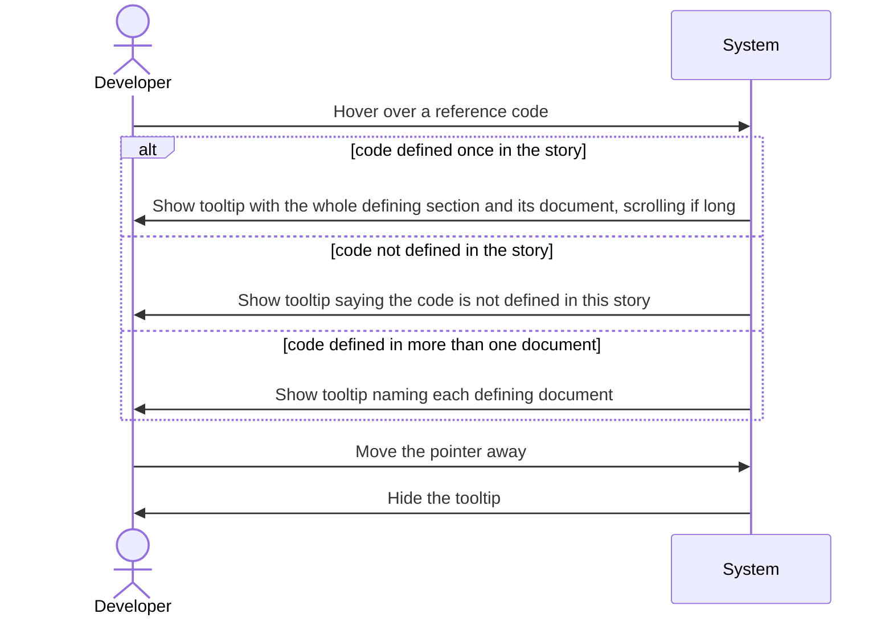
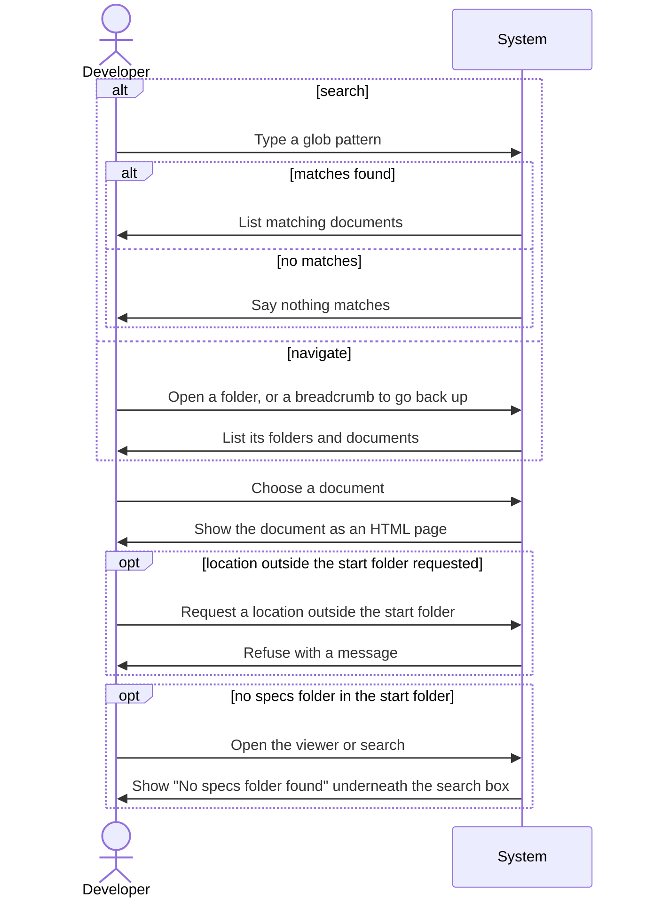
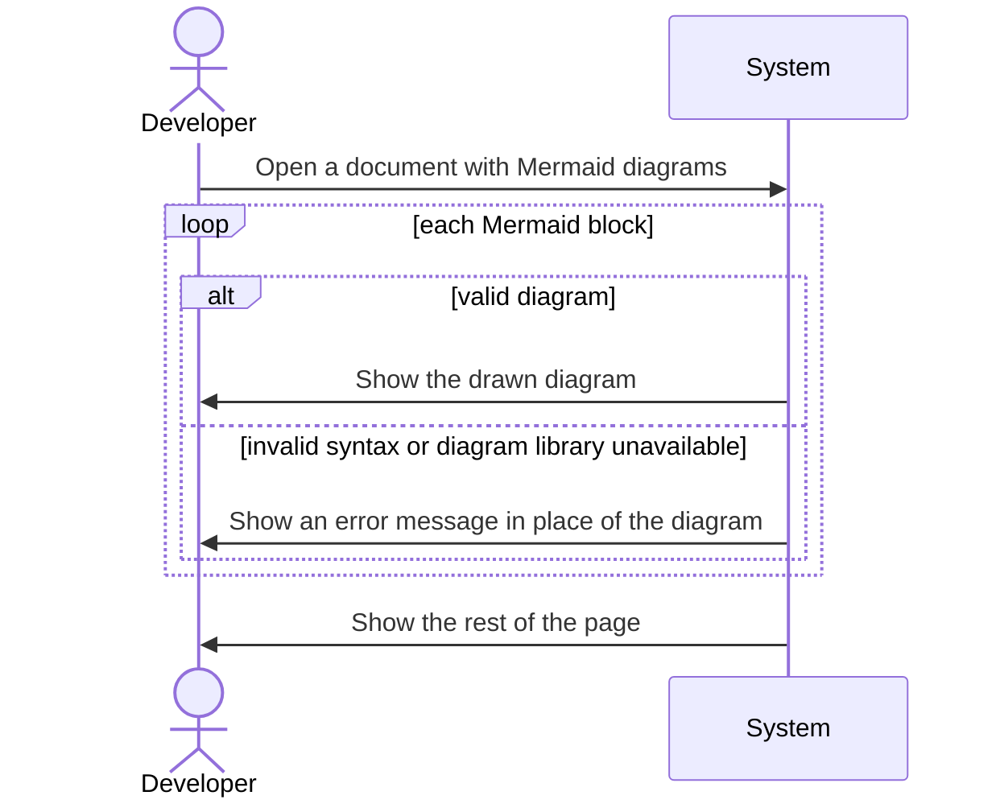
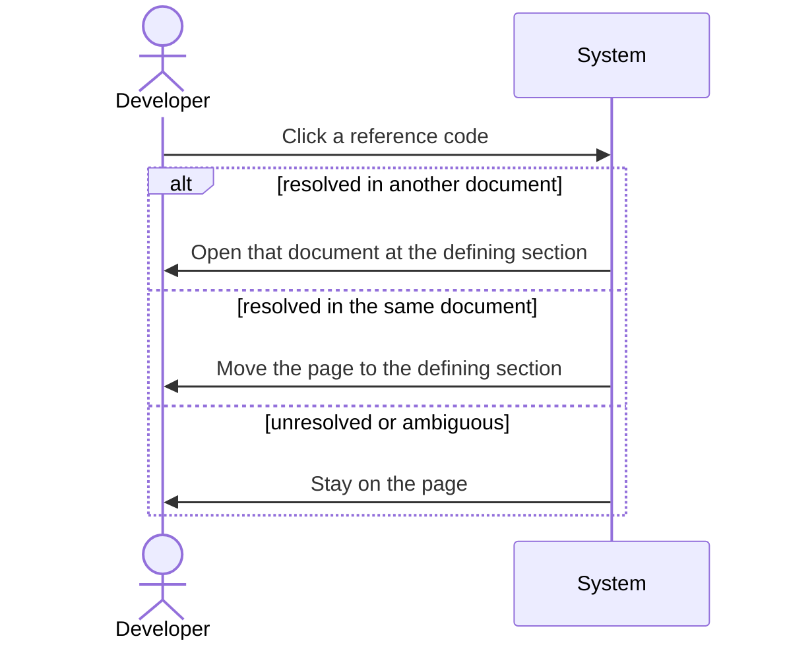

<!--
  STAGE 2 OF THE DEFINITION PIPELINE: WHAT must the system do?

  Gate: FUN-G01 to FUN-G16 (the Functional quality gate). Run `eil check --stage functional`.
  Approval: one recorded confirmation from the developer (or a person named in eil-config.yml),
  after the comprehension check has been taken on this version (`/speckit-eil-comprehend`).

  - Describe behaviour, not implementation. "Store it in PostgreSQL" belongs in the Technical stage.
  - Every functional requirement traces to an approved requirement or use case.
  - Tag any text the AI wrote with [ai-draft] until a human has reviewed it.
  - A section that does not apply is removed and listed under "Not applicable" with a reason.
-->

# Functional Specification: Rich specification viewer

## Requirements Traceability

| Requirement | Functional requirements |
|---|---|
| REQ-001 | FR-004, FR-005, FR-006, FR-007, FR-019, NFR-001, NFR-002 |
| REQ-002 | FR-008, FR-009, FR-010, FR-011, FR-021, FR-022, FR-023, FR-024, FR-025, FR-026 | [ai-draft]
| REQ-003 | FR-001, FR-002, FR-003, FR-018, FR-020 |
| REQ-004 | FR-014, FR-015, FR-016, NFR-003 |
| REQ-005 | FR-017, NFR-003 |
| REQ-006 | FR-012, FR-022 |
| REQ-007 | FR-013 |

The table is a summary; the `(traces: ...)` clause on each item is authoritative.

## Actors

- **Developer**: starts the viewer from a project-level folder, finds documents, reads them, hovers over and follows reference codes, and edits the Markdown documents in their own editor.

## Functional Requirements

**FR-001**: The system shall present the folders and Markdown documents under `specs/` in the folder it was started in, so the developer can navigate down through them one level at a time. (traces: REQ-003, UC-002)

**FR-002**: The system shall let the developer search by typing a glob pattern (for example `*/s01-*` or `001-*/*spec*`), matched against each document's folder and file path below `specs/`, and shall list every document whose path matches. (traces: REQ-003, UC-002)

**FR-003**: The system shall open a document chosen from the navigation or the search results as an HTML page. (traces: REQ-003, UC-002)

**FR-004**: The system shall show a document with its headings, paragraphs, emphasis, links, block quotes, ordered, unordered and nested lists, task-list items, tables, inline code and fenced code blocks rendered as formatted content rather than Markdown source. (traces: REQ-001)

**FR-005**: The system shall show each document with just enough styling to be easy to read and scan, as defined in NFR-001. (traces: REQ-001)

**FR-006**: The system shall regenerate a document's HTML page whenever the Markdown document changes, without the developer running anything, so that refreshing or reopening the page shows the saved content. A page that is already open is not required to update itself. (traces: REQ-001)

**FR-007**: The system shall show the navigation and search results as they are at the time they are shown, including documents added, renamed or removed since the viewer was started. (traces: REQ-001, REQ-003)

**FR-008**: The system shall recognise every reference code in a viewed document, as defined by the business rules below, and mark it so the developer can see it is a reference. (traces: REQ-002, UC-001)

**FR-009**: The system shall resolve each reference code only against the documents of the same story, the story being the folder directly under `specs/` that contains the viewed document at any depth (FR-025). A document directly in `specs/`, in no story folder, is shown without marking any codes: no tooltips and no errors. (traces: REQ-002)

**FR-010**: When the developer hovers over a resolved reference code, the system shall show a tooltip containing the whole defining section of the code, formatted as it would be in its own page, together with the name of the document it comes from, without leaving the page. The tooltip has a maximum size; content larger than that scrolls inside the tooltip. (traces: REQ-002, UC-001)

**FR-011**: The system shall show the tooltip for a code that is defined in the viewed document itself, as well as for codes defined in other documents of the story. (traces: REQ-002, UC-001)

**FR-012**: When the developer clicks a resolved reference code, the system shall open the defining document at the defining section. (traces: REQ-006, UC-004)

**FR-013**: The system shall highlight a reference code that has no definition in the story, or is defined in more than one document of the story, as an error with an error icon and red text. (traces: REQ-007)

**FR-014**: The system shall show every valid Mermaid diagram in a viewed document, of any type the diagram syntax supports (including flowchart, sequence, C4Context, C4Container, C4Component and entity relationship diagrams), as a drawn diagram in place of its source. (traces: REQ-004, UC-003)

**FR-015**: When a diagram cannot be drawn, including when the diagram library cannot be loaded, the system shall show an error message in place of that diagram and shall still show the rest of the page. (traces: REQ-004, UC-003)

**FR-016**: The system shall show a Mermaid block that is not valid diagram syntax as an undrawable diagram (FR-015). (traces: REQ-004)

**FR-017**: The system shall start with a single command run from the project-level folder, with no configuration and nothing to install. (traces: REQ-005)

**FR-018**: The system shall never read, list or show any file or folder outside the folder it was started in, and shall refuse a request for one with a message saying the location is outside the viewer's folder. (traces: REQ-003)

**FR-019**: The system shall not show HTML comments or the helper's recorded blocks (`eil:` blocks and the assessment, comprehension and approval regions) in a viewed document. (traces: REQ-001)

**FR-020**: The system shall show breadcrumb navigation on every navigation view and document page, from the top of `specs/` through each folder to the current location, with each part opening that folder, and shall keep the search available. (traces: REQ-003, UC-002)

**FR-021**: The system shall not open a tooltip for a code shown inside a tooltip. (traces: REQ-002, UC-001)

**FR-022**: For a challenge code (`CH-001` and so on), whose recorded block is hidden (FR-019), the system shall show in the tooltip the challenge's text, its target, its status and, once answered, the response, who answered and their reason; clicking the code shall open the Challenges section of the document that records it. (traces: REQ-002, REQ-006, UC-001, UC-004)

**FR-023**: The system shall not draw diagrams inside a tooltip; in their place the tooltip shall say that a diagram is shown in the document. (traces: REQ-002, REQ-004)

**FR-024**: The system shall treat an alias and its target as one document when resolving codes: a symbolic link to another document of the story, or a file whose content is identical to another document of the story, does not make a code defined twice. The alias still appears in navigation and search and opens normally. (traces: REQ-002, REQ-007, UC-001)

**FR-025**: The system shall treat every `.md` file at any depth under a story folder as a document of that story when resolving codes. (traces: REQ-002, UC-001)

**FR-026**: The system shall treat a heading for a code that is already defined as an item elsewhere in the story as an expansion of that definition, not a second definition: the item remains the code's definition for its tooltip and link, and the heading keeps its own anchor on its page. (traces: REQ-002, REQ-007, UC-001) [ai-draft]

## Use Cases and Scenarios

### UC-001: Developer reads a document with its references explained

- **Preconditions**: the viewer is running; the developer is viewing a document of a story.
- **Trigger**: the developer hovers over a reference code.
- **Main flow**: the system shows a tooltip with the whole defining section and the name of its document, scrolling within a maximum size when the section is long (FR-010); the tooltip disappears when the pointer leaves the code and the tooltip.
- **Alternative flows**: the code is defined in the viewed document itself; the tooltip is shown the same way (FR-011).
- **Exception flows**: the code has no definition in the story, or more than one; the code is already highlighted as an error (FR-013) and the tooltip explains which, as set out in Error and Exception Behaviour.
- **Expected outcome**: the developer understands the code without leaving the page.

### UC-002: Developer finds a document to view

- **Preconditions**: the viewer has been started from a project-level folder.
- **Trigger**: the developer types a glob pattern in the search box, or navigates into a folder.
- **Main flow**: the system lists matching documents (FR-002) or the folder's contents (FR-001); the developer chooses a document; the system shows it as an HTML page (FR-003).
- **Alternative flows**: the developer navigates down through story folders rather than searching; the developer uses the breadcrumbs to go back up to a parent folder or the top of `specs/` (FR-020).
- **Exception flows**: no document matches the pattern, so the system says there are no matches; there is no `specs/` folder, so the system shows "No specs folder found" underneath the search box; a location outside the start folder is requested, so the system refuses it (FR-018).
- **Expected outcome**: the chosen document is shown as an HTML page.

### UC-003: Developer reads a diagram

- **Preconditions**: the developer is viewing a document that contains one or more Mermaid blocks.
- **Trigger**: the document is shown.
- **Main flow**: each valid Mermaid diagram, of any type, is drawn in place of its source (FR-014).
- **Alternative flows**: none.
- **Exception flows**: a diagram's syntax is invalid, or the diagram library cannot be loaded; an error message replaces that diagram and the rest of the page is shown (FR-015).
- **Expected outcome**: the developer reads every supported diagram as a diagram.

### UC-004: Developer follows a reference

- **Preconditions**: the developer is viewing a document with a resolved reference code.
- **Trigger**: the developer clicks the code.
- **Main flow**: the system opens the defining document at the defining section (FR-012).
- **Alternative flows**: the defining section is in the same document; the page moves to it.
- **Exception flows**: the code is highlighted as an error (FR-013); clicking it does not navigate.
- **Expected outcome**: the developer is reading the defining section in its own document.

## Business Rules

- **BR-1 Reference code**: a code is an upper-case prefix, a hyphen and a number used in a document to point at an item or section. Every code form that Spec Kit and the engineer-in-the-loop documents produce is a reference code: `REQ`, `UC`, `OQ`, `ART`, `CH`, `FR`, `NFR`, `SC`, `DEC`, `AIS`, `EVD` (each as `PREFIX-001`), decisions written as `D-01`, and tasks written as `T001`.
- **BR-2 Definition**: a code is defined where a document introduces it rather than mentions it: a line that starts with the code in bold followed by a colon (`**FR-001**: ...`, optionally as a list item), a heading that starts with the code, a task line (`- [ ] T001 ...`), or a recorded challenge block whose `id` is the code. A heading for a code already defined as an item elsewhere in the story expands that item and is not a further definition (FR-026). [ai-draft]
- **BR-3 Defining section**: the whole section of a definition is the content from the defining line up to, but not including, the next definition or the next heading of the same or higher level, whichever comes first. For `FR-003` it is FR-003's own paragraph, not the whole Functional Requirements section.
- **BR-4 Story scope**: codes resolve only within the story folder that holds the viewed document, including its subfolders (FR-009, FR-025); the same code in another story is ignored.
- **BR-5 Unresolved**: a code with no definition in the story is unresolved; a code with definitions in two or more documents of the story is ambiguous, counting an alias and its target as one document (FR-024) and not counting a heading that expands an item (FR-026). Both are errors (FR-013). [ai-draft]
- **BR-6 Not a reference**: a code inside inline code or a fenced code block, and the code on its own defining line, is not treated as a reference.

## Inputs

- **Start folder**: the folder the viewer is started in; required; everything shown is at or below it.
- **Markdown documents**: the `.md` files under `specs/` in the start folder; read only.
- **Search pattern**: a glob pattern typed by the developer; optional; matched against each document's folder and file path below `specs/`.
- **Navigation choice**: the folder or document the developer selects.
- **Pointer actions**: hovering over and clicking reference codes.

## Outputs

- **Navigation view**: the folders and documents at the current level under `specs/`.
- **Search results**: the documents whose folder and file path matches the glob pattern, each showing its story folder and file name.
- **Document page**: the HTML rendering of one document, with reference codes marked, supported diagrams drawn and errors highlighted.
- **Tooltip**: the whole defining section of a code and the name of its document.
- **Error indications**: the error icon and red text on an unresolved or ambiguous code; the error message in place of an undrawable diagram; the message for a refused location or an empty search, and "No specs folder found" underneath the search box when there is no `specs/` folder.

## State and Workflow

A document page is **current** when it reflects the saved Markdown. When the Markdown is saved, the page becomes **out of date** until the system regenerates it (FR-006), and is then **current** again. A document that is renamed or removed while being viewed stays on screen unchanged until the page is refreshed. The viewer itself is either **running** (started from a folder) or **stopped**; there is no other workflow state.

## Validation

- A requested document or folder is valid only if it is at or below the start folder and under `specs/` (FR-018).
- Only files with the `.md` extension are shown as documents.
- Any search pattern is valid, including an empty one, which leaves the navigation view as it is.

## Error and Exception Behaviour

- **Unresolved code**: shown with an error icon and red text; its tooltip says the code is not defined in this story.
- **Ambiguous code**: shown with an error icon and red text; its tooltip names each document that defines it.
- **Undrawable diagram**: an error message replaces the diagram; the rest of the page is shown (FR-015).
- **Diagram library unavailable**: every diagram on the page shows the error message; the rest of the page, including references and tooltips, still works.
- **Location outside the start folder**: refused with a message (FR-018).
- **No matches**: the search results say that nothing matches.
- **No `specs/` folder**: the error message "No specs folder found" is shown underneath the search box.
- **Markdown the system cannot fully interpret**: the page is still shown, with that part shown as plain text.

## Security and Access Behaviour

- The system only reads documents; it never creates, changes or deletes a file in the project.
- The system never reads or shows anything outside the start folder (FR-018).
- The system is reachable only from the developer's own machine, since it is for the developer alone.
- No document content is sent anywhere outside the developer's machine; the only outside request is for the diagram library.

## Non-Functional Requirements

**NFR-001**: Readability: a reviewer finds text set in a fixed, comfortable reading width; clear fonts; visible spacing between paragraphs, lists, tables, code blocks and diagrams; and headings and lists that let the page be scanned. (traces: REQ-001)

**NFR-002**: Freshness: after a Markdown document is saved, refreshing its page shows the change. (traces: REQ-001)

**NFR-003**: Dependencies: the viewer needs nothing installed and no configuration; the pages load no outside script other than the Mermaid diagram library. (traces: REQ-004, REQ-005)

## Acceptance Criteria

- **AC-1**: Starting the viewer in a project folder with a `specs/` folder, and no packages or configuration, shows the story folders under `specs/`. (FR-001, FR-017)
- **AC-2**: Typing the glob pattern `*/s01-*` lists the Requirements document of every story; a pattern that matches nothing shows a no-matches message. (FR-002)
- **AC-17**: Starting the viewer in a folder with no `specs/` folder shows "No specs folder found" underneath the search box. (FR-001, FR-002)
- **AC-18**: In a story where `spec.md` links to `s04-ai-spec.md`, hovering an `AIS` code shows its section and no error; the same holds when `spec.md` is a byte-for-byte copy instead of a link. (FR-024)
- **AC-19**: A code defined in `checklists/requirements.md` inside a story folder resolves when referenced from a document at the top of that story. (FR-025)
- **AC-20**: Opening `specs/README.md` shows its codes as plain text, with no tooltips and no error highlighting. (FR-009)
- **AC-21**: A use case defined as an item `UC-001` in `s01-requirements.md` and expanded under a heading `### UC-001: …` in `s02-functional-spec.md` shows no error; its tooltip shows the `s01` item, and the `s02` heading can still be linked to. (FR-026) [ai-draft]
- **AC-3**: Opening `s01-requirements.md` of a story shows its headings, lists, tables and code blocks formatted, not as Markdown source. (FR-003, FR-004)
- **AC-4**: Hovering over `REQ-001` in the story's `s02-functional-spec.md` shows the whole REQ-001 definition from `s01-requirements.md` and names that document. (FR-008, FR-010)
- **AC-5**: Clicking `REQ-001` opens `s01-requirements.md` at REQ-001. (FR-012)
- **AC-6**: A code that appears in the story but is defined nowhere in it, and a code defined in two of its documents, are each shown with an error icon in red text. (FR-013)
- **AC-7**: A document with a flowchart, a sequence, a C4Context, a C4Container, a C4Component and an entity relationship diagram shows all six as diagrams. (FR-014)
- **AC-8**: A diagram with invalid syntax, and every diagram when the diagram library cannot be loaded, shows an error message while the rest of the page is shown. (FR-015)
- **AC-9**: After a Markdown document is saved with a change, refreshing its page shows the change without the developer running anything else. (FR-006, NFR-002)
- **AC-10**: A request for a path above the start folder is refused with a message and no file content is shown. (FR-018)
- **AC-11**: The same code defined in another story does not appear in a tooltip. (FR-009)
- **AC-12**: A section longer than the tooltip's maximum size can be scrolled inside the tooltip, and hovering a code inside the tooltip opens no further tooltip. (FR-010, FR-021)
- **AC-13**: From a document page, each breadcrumb opens its folder, and the top breadcrumb opens `specs/`. (FR-020)
- **AC-14**: HTML comments and `eil:` blocks in a document do not appear on its page. (FR-019)
- **AC-15**: Hovering over `CH-007` in a story shows the challenge's text, target, status and answer; clicking it opens the Challenges section of `s02-functional-spec.md`. (FR-022)
- **AC-16**: A tooltip for a section that contains a Mermaid diagram shows a note in place of the diagram, not a drawn diagram. (FR-023)

## Sequence Diagrams

**ART-002**: Developer reads a document with its references explained (traces: UC-001, FR-010, FR-011, FR-013)



**ART-003**: Developer finds a document to view (traces: UC-002, FR-001, FR-002, FR-003, FR-018, FR-020)



**ART-004**: Developer reads a diagram (traces: UC-003, FR-014, FR-015, FR-016)



**ART-005**: Developer follows a reference (traces: UC-004, FR-012, FR-013)



## Wireframes

**ART-006**: Navigation view, default state (traces: FR-001, UC-002)

**ART-007**: Navigation view, empty state with no `specs/` folder (traces: FR-001, UC-002)

**ART-008**: Search results, default and no-matches states (traces: FR-002, UC-002)

**ART-009**: Document page, default state with marked references and a drawn diagram (traces: FR-004, FR-008, FR-014, UC-003)

**ART-010**: Document page with a reference tooltip open (traces: FR-010, UC-001)

**ART-011**: Document page, error states: an unresolved code and an undrawable diagram (traces: FR-013, FR-015, UC-003)

## Open Questions

**OQ-009**: How soon after a Markdown document is saved must its page show the change, and must a page that is already open update itself, or is it enough that the page is current the next time it is opened or refreshed? (status: resolved) Answer (Lee Sinclair): refresh is enough. (material: yes)

**OQ-010**: What should be shown for a Mermaid block of a type outside the approved five? The preset's own Technical Specification template contains an `erDiagram` (entity relationship), and plan documents may contain `graph` blocks. Options: draw it anyway if the diagram library can, show its source, or show an error message. (status: resolved) Answer (Lee Sinclair): erdiagrams (any valid mermaid) should be rendered. (material: yes)

**OQ-011**: Which code forms count as references? Stage documents write decisions as `DEC-001`, research notes write them as `D-01`, tasks are `T001`, and other prefixes (`AIS`, `EVD`, `SC`, `NFR`) exist. Should every upper-case prefix, hyphen and number be treated as a code (BR-1), or only a fixed list? And are there definition forms beyond those in BR-2? (status: resolved) Answer (Lee Sinclair): all codes produced by speckit including DEC-XYZ. (material: yes)

**OQ-012**: Is the "whole section" of a definition the content up to the next definition or heading (BR-3)? For example, for `FR-003` it would be only FR-003's own paragraph, not the whole Functional Requirements section. (status: resolved) Answer (Lee Sinclair): yes. (material: yes)

**OQ-013**: Should codes inside inline code and fenced code blocks be left unmarked (BR-6)? This includes the JSON of recorded challenges, where `"target": "REQ-002"` appears. (status: resolved) Answer (Lee Sinclair): yes. (material: no)

**OQ-014**: What should the developer see when the document they are viewing is renamed or removed? (status: resolved) Answer (Lee Sinclair): no change until page is refreshed. (material: no)

**OQ-015**: How should HTML comments (which the templates use for guidance) and the helper's recorded blocks (`eil:challenge`, `eil:artifact`, and the assessment and approval regions) be shown: hidden, shown as they are, or shown in a readable form? (status: resolved) Answer (Lee Sinclair): hidden. (material: yes)

**OQ-016**: The draft says the tooltip of an unresolved or ambiguous code explains the error (not defined in this story, or naming each defining document), and that the tooltip names the defining document. REQ-007 only asks for the icon and red text. Keep this? (status: resolved) Answer (Lee Sinclair): yes. (material: no)

**OQ-017**: Are diagrams inside a tooltip drawn, or shown some other way? (status: resolved) Answer (Lee Sinclair): no. (material: no)

**OQ-018**: With glob matching, what does a pattern without wildcards match (for example `s01`): only a path that is exactly `s01`, or any path containing it? Is matching case-sensitive? In what order are matching documents listed? (status: open) (material: no)

## Not applicable

- Audit and Compliance Behaviour: the viewer is a read-only local tool for one developer; no requirement asks for audit trails, logging or retention.

## Challenges

<!-- Recorded by `eil challenge`. -->

```eil:challenge
{
  "id": "CH-007",
  "stage": "functional",
  "raised_by": "ai",
  "raised_at": "2026-09-27T10:59:33Z",
  "target": "FR-017",
  "text": "FR-017 and NFR-003 name technologies (Python and its standard library, the Mermaid library) carried over from REQ-005 and the Requirements constraints. Behaviourally the need is: starts with one command, needs no installation or configuration, and loads no outside script other than the diagram library. The technology choice belongs in the Technical stage as a decision.",
  "status": "closed",
  "responder": "Lee Sinclair",
  "response": "accepted",
  "at": "2026-09-27T11:11:43Z",
  "reason": "mermaid is the diagram syntax we use, ok to remove python for those requirements"
}
```

```eil:challenge
{
  "id": "CH-008",
  "stage": "functional",
  "raised_by": "ai",
  "raised_at": "2026-09-27T10:59:33Z",
  "target": "FR-010",
  "text": "FR-010 shows the whole defining section in a tooltip, but no behaviour is defined for a long section (for example a use case with all its flows, or a section with a diagram): whether the tooltip has a maximum size and scrolls, is truncated with a link, or grows to fit, and whether diagrams inside it are drawn.",
  "status": "closed",
  "responder": "Lee Sinclair",
  "response": "accepted",
  "at": "2026-09-27T11:11:44Z",
  "reason": "max size and scroll"
}
```

```eil:challenge
{
  "id": "CH-009",
  "stage": "functional",
  "raised_by": "ai",
  "raised_at": "2026-09-27T10:59:33Z",
  "target": "FR-010",
  "text": "The defining section shown in a tooltip will itself contain reference codes (for example FR items trace to REQ items). It is not defined whether codes inside a tooltip are marked, get their own tooltips, or can be clicked.",
  "status": "closed",
  "responder": "Lee Sinclair",
  "response": "accepted",
  "at": "2026-09-27T11:11:44Z",
  "reason": "no nested tooltips"
}
```

```eil:challenge
{
  "id": "CH-010",
  "stage": "functional",
  "raised_by": "ai",
  "raised_at": "2026-09-27T10:59:34Z",
  "target": "FR-001",
  "text": "FR-001 and UC-002 describe navigating down, but not how the developer returns to a parent folder, the top of specs/, or the search from a document page. Without it, the only way back is the browser's own back button.",
  "status": "closed",
  "responder": "Lee Sinclair",
  "response": "accepted",
  "at": "2026-09-27T11:11:44Z",
  "reason": "use breadcrumb navigation"
}
```

```eil:challenge
{
  "id": "CH-011",
  "stage": "functional",
  "raised_by": "ai",
  "raised_at": "2026-09-27T11:11:58Z",
  "target": "FR-014",
  "text": "FR-014 (after OQ-010) draws every valid Mermaid diagram type, but the approved Requirements limit REQ-004 to five types and list 'Mermaid diagram types other than flowchart, sequence, C4Context, C4Container and C4Component' as Out of Scope. The Functional Specification now contradicts its approved upstream. Either the Requirements are amended and approved again, or FR-014 is narrowed.",
  "status": "closed",
  "responder": "Lee Sinclair",
  "response": "accepted",
  "at": "2026-09-27T11:15:12Z",
  "reason": "all mermaid diagrams including c4model diagrams is correct"
}
```

```eil:challenge
{
  "id": "CH-012",
  "stage": "functional",
  "raised_by": "ai",
  "raised_at": "2026-09-27T11:11:58Z",
  "target": "FR-019",
  "text": "FR-019 (after OQ-015) hides eil: blocks, but challenge codes (CH-001 and so on) are defined only inside eil:challenge blocks (BR-2), and REQ-002 names CH as a code that must get a tooltip. It is not defined what a CH tooltip shows, or where clicking a CH code goes, when its defining block is hidden.",
  "status": "closed",
  "responder": "Lee Sinclair",
  "response": "accepted",
  "at": "2026-09-27T11:15:12Z",
  "reason": "go with your recommendation"
}
```

```eil:challenge
{
  "id": "CH-013",
  "stage": "functional",
  "raised_by": "ai",
  "raised_at": "2026-09-27T11:25:52Z",
  "target": "FR-002",
  "text": "FR-002 says search is 'fuzzy matched against folder and file names' but does not define what counts as a match beyond AC-2's example of missing letters (for example: letters in order with gaps, typos, case), nor the order in which matching documents are listed.",
  "status": "closed",
  "responder": "Lee Sinclair",
  "response": "accepted",
  "at": "2026-09-27T11:29:33Z",
  "reason": "glob path match"
}
```

```eil:challenge
{
  "id": "CH-014",
  "stage": "functional",
  "raised_by": "ai",
  "raised_at": "2026-09-27T11:25:52Z",
  "target": "ART-003",
  "text": "UC-002's exception flows include 'there is no specs/ folder, so the system says so', but the sequence diagram ART-003 does not show that flow; it shows only the no-matches and outside-the-start-folder exceptions.",
  "status": "closed",
  "responder": "Lee Sinclair",
  "response": "accepted",
  "at": "2026-09-27T11:29:33Z",
  "reason": "add the sequence diagram, display an error message underneath the search box saying \"No specs folder found\""
}
```

```eil:challenge
{
  "id": "CH-019",
  "stage": "functional",
  "raised_by": "ai",
  "raised_at": "2026-09-27T12:22:34Z",
  "target": "FR-009",
  "text": "FR-009 defines the story as the folder directly under specs/ that contains the viewed document, but a Markdown file directly in specs/ (for example specs/README.md) is in no story folder. It is not stated which documents its codes resolve against: none (every code is unresolved), all of specs/, or codes are not marked at all on such a page.",
  "status": "closed",
  "responder": "Lee Sinclair",
  "response": "accepted",
  "at": "2026-09-27T12:24:00Z",
  "reason": "A"
}
```

## Overrides

<!-- Recorded by `eil override`, each naming who, what and why. -->

```eil:override
{
  "id": "OVR-001",
  "stage": "functional",
  "criterion": "FUN-G15",
  "by": "Lee Sinclair",
  "at": "2026-09-27T11:16:07Z",
  "reason": "this is a simple function that should not require wireframes"
}
```

## Comprehension Check

<!-- The record of the check taken on this version: levels, outcomes, attempts and item ids only. Never a question, an answer, a hint or a score. -->

<!-- eil:begin comprehension -->
```json
{
  "stage": "functional",
  "fingerprint": "sha256:96e1a6bca50be78ec8a72f4517714738a89178d8fcbc88ec7ae0e6278bf27c0c",
  "taken_by": "Lee Sinclair",
  "started_at": "2026-09-27T12:25:40Z",
  "updated_at": "2026-09-27T12:29:50Z",
  "levels": [
    {
      "level": "recognise",
      "outcome": "understood",
      "attempts": 1,
      "items": [
        "FR-003"
      ]
    },
    {
      "level": "explain",
      "outcome": "coached",
      "attempts": 2,
      "items": [
        "FR-014"
      ]
    },
    {
      "level": "apply",
      "outcome": "understood",
      "attempts": 1,
      "items": [
        "UC-002"
      ]
    },
    {
      "level": "trace",
      "outcome": "understood",
      "attempts": 1,
      "items": [
        "FR-011",
        "REQ-002",
        "UC-001",
        "ART-002"
      ]
    },
    {
      "level": "evaluate",
      "outcome": "understood",
      "attempts": 1,
      "items": [
        "NFR-002"
      ]
    }
  ]
}
```
<!-- eil:end comprehension -->

## Quality Assessment

<!-- eil:begin assessment -->
```json
{
  "stage": "functional",
  "evaluated_at": "2026-09-29T11:33:48Z",
  "fingerprint": "sha256:a970ee4abc37537edb05a3ea0b49c9ca3f9a16e4eacf3979af3d8ab7b6caba65",
  "criteria": [
    {
      "id": "FUN-G01",
      "kind": "traceability",
      "status": "met",
      "reason": ""
    },
    {
      "id": "FUN-G02",
      "kind": "structural",
      "status": "met",
      "reason": ""
    },
    {
      "id": "FUN-G03",
      "kind": "structural",
      "status": "met",
      "reason": ""
    },
    {
      "id": "FUN-G04",
      "kind": "structural",
      "status": "met",
      "reason": ""
    },
    {
      "id": "FUN-G05",
      "kind": "structural",
      "status": "met",
      "reason": ""
    },
    {
      "id": "FUN-G06",
      "kind": "structural",
      "status": "met",
      "reason": ""
    },
    {
      "id": "FUN-G07",
      "kind": "structural",
      "status": "met",
      "reason": ""
    },
    {
      "id": "FUN-G08",
      "kind": "structural",
      "status": "met",
      "reason": ""
    },
    {
      "id": "FUN-G09",
      "kind": "structural",
      "status": "met",
      "reason": ""
    },
    {
      "id": "FUN-G10",
      "kind": "judgment",
      "status": "met",
      "reason": "AI assessment: Each of AC-1 to AC-21 names a concrete action and an observable result, including headings that expand an earlier item (AC-21)."
    },
    {
      "id": "FUN-G11",
      "kind": "traceability",
      "status": "met",
      "reason": ""
    },
    {
      "id": "FUN-G12",
      "kind": "judgment",
      "status": "met",
      "reason": "AI assessment: No technology, store or design is named; Mermaid is the diagram syntax the documents are written in, and the glob pattern is the search syntax the developer types, both visible behaviour."
    },
    {
      "id": "FUN-G13",
      "kind": "judgment",
      "status": "met",
      "reason": "AI assessment: The functional requirements, use case flows and acceptance criteria describe what the developer sees and does in plain terms, without reference to how pages are produced."
    },
    {
      "id": "FUN-G14",
      "kind": "structural",
      "status": "met",
      "reason": ""
    },
    {
      "id": "FUN-G15",
      "kind": "structural",
      "status": "overridden",
      "reason": "overridden by Lee Sinclair: this is a simple function that should not require wireframes (OVR-001)"
    },
    {
      "id": "FUN-G16",
      "kind": "structural",
      "status": "not-met",
      "reason": "the check was taken on an earlier version of this document; take it again"
    }
  ],
  "assessment": {
    "ambiguity": [
      "'fixed, comfortable reading width' in NFR-001 relies on reviewer judgment",
      "Whether codes inside a tooltip can be clicked is not stated (FR-021 only rules out nested tooltips)",
      "What a glob pattern without wildcards matches, case sensitivity and result order (OQ-018)"
    ],
    "missing": [
      "What is shown after refreshing a page whose document was removed",
      "Wireframe exports for ART-006 to ART-011"
    ],
    "contradictions": [],
    "unsupported_assumptions": [
      "Markdown that cannot be fully interpreted is shown as plain text: not stated by the developer"
    ],
    "untestable": []
  },
  "findings": [
    {
      "code": "artifact-unregistered",
      "where": "ART-006",
      "message": "ART-006 has no mermaid fence or eil:artifact record"
    },
    {
      "code": "artifact-unregistered",
      "where": "ART-007",
      "message": "ART-007 has no mermaid fence or eil:artifact record"
    },
    {
      "code": "artifact-unregistered",
      "where": "ART-008",
      "message": "ART-008 has no mermaid fence or eil:artifact record"
    },
    {
      "code": "artifact-unregistered",
      "where": "ART-009",
      "message": "ART-009 has no mermaid fence or eil:artifact record"
    },
    {
      "code": "artifact-unregistered",
      "where": "ART-010",
      "message": "ART-010 has no mermaid fence or eil:artifact record"
    },
    {
      "code": "artifact-unregistered",
      "where": "ART-011",
      "message": "ART-011 has no mermaid fence or eil:artifact record"
    },
    {
      "code": "comprehension-stale",
      "where": "s02-functional-spec.md",
      "message": "the check was taken on an earlier version of this document; take it again"
    }
  ]
}
```
<!-- eil:end assessment -->

## Approval

<!-- eil:begin approval -->
```json
{
  "stage": "functional",
  "by": "Lee Sinclair",
  "at": "2026-09-27T12:30:42Z",
  "fingerprint": "sha256:96e1a6bca50be78ec8a72f4517714738a89178d8fcbc88ec7ae0e6278bf27c0c",
  "attestation": "I confirm this is correct",
  "upstream": {
    "requirements": "sha256:fccddf46c6afd00018cb7992051f337fab8724433c4b3d61b9807e4339676126"
  },
  "items": {
    "FR-001": "sha256:67896b929b87134836d6720eb6e51d9150a9b76b1863a70766a8ff1b1d71b5b8",
    "FR-002": "sha256:5a3011c5ac814ad49caa7cc0f5353aac7c728ad2745660b331263cc4f12303bb",
    "FR-003": "sha256:c5ca2f3e295a396be20315402e6a905bf7991f7ea20a445b03fbc06be5021622",
    "FR-004": "sha256:49856255568a760b379c6a2e84fb327730a205b499b804450bbb2ab93a239467",
    "FR-005": "sha256:6a2746d9a61894da7d11b0f502fd62d80755bcf2b7d36ac423242e49383f01ce",
    "FR-006": "sha256:bcfacb726177717e2c627db1129231a37dfe77d5dc9746ba784f16ba7e6b0743",
    "FR-007": "sha256:a9522419fd3ea8edd973750d27a42513f748ce377c9dc2863a74a348d3dc032b",
    "FR-008": "sha256:61945f5802eef780e14d65127d6388d0d83498e33e03d223fd2f7f71ea46e144",
    "FR-009": "sha256:ba249c9051a9d3f6a41eb5595b63c76cbadcb1b3a34c0a15ecdc042b741d52c1",
    "FR-010": "sha256:f2232899e16438f5384a8605ebd03f540d81226f17643501431c1ca97b705b4a",
    "FR-011": "sha256:d2bd3f356c2407127bba438a66476fe99e4b20d0a5490b203ba1234775b6a87a",
    "FR-012": "sha256:1a746aeeb1251d22083ee5a136daed70e05d8f806eb6fe5603a7e2757bd7e3e6",
    "FR-013": "sha256:0acce80002e80e696aefa0757a2fa3bf5903c4e66c8aac1322a71b1152e41ccc",
    "FR-014": "sha256:6d70ff9b859b7b42fc032ff42fc100e88e0ff9b0fffa0c3f6744be4cf847fbaa",
    "FR-015": "sha256:7c5ddecbae478644a421e32cdacb7fb9a03d0da9e160cc33155dcf89af4c2f72",
    "FR-016": "sha256:841c6611d08fe515f67f616f20b0f9a2d6dd6bb27eaf44e80cd9a81bc4a2b0c3",
    "FR-017": "sha256:e7d5c6861f3144eecf4aa1e157e105f346ab7c0dca831eaad8c29e3c071d149a",
    "FR-018": "sha256:669eb6e635614cf5f4d7ca966c2a03e53d6146707737ac10a24600369eaaf7a7",
    "FR-019": "sha256:c73a7d5feb9ceaadde4b613ad6e1385adee534ab1bbdc3f3e3b04535a01ad05d",
    "FR-020": "sha256:23d6f7061943e58f0348cbe29c20e07fcbc7b2a54868980110fb1dc80d4866ec",
    "FR-021": "sha256:e031069f21d0db44ea3c253a20cd12235c50c8305b1a5260a60b1f92698f8464",
    "FR-022": "sha256:e8c732d5eb0b1f8b0a0c980c2037c2b5120811df8fad715f1f64a0fc9ae397e1",
    "FR-023": "sha256:94b1cb54a8a81488502fc023f1ea1008f1bf62abb5122f3af52730cd238bec07",
    "FR-024": "sha256:e9a1408ca40fdfc1bb6c9e80fac9993a84a35adef030f18524bad993fcf14bad",
    "FR-025": "sha256:6e075a9f9c1ba94627c76dc9a8e7b1c34bc6dcb87a2fa81b1e8a457d5851ae8d",
    "NFR-001": "sha256:f7f87331fc4d7a35aac1407f897629c5c14701cf3fcaf29dee8a4dcb54d588f5",
    "NFR-002": "sha256:bc302e034c79792496c55797b03b8c45445142614558def71c692e0896a1169b",
    "NFR-003": "sha256:92986aa1b795a72529b1642731e4605789f9292caeee7d2b72342b4375d31b5a",
    "ART-002": "sha256:2e0ced3243b2c5896fa70e45490c28b46ab0b50089a31f1599e83e9d2e62000d",
    "ART-003": "sha256:27046e031848dc641c83b95abfabe917505735425ae0b18307982ef35f70590e",
    "ART-004": "sha256:4553ceb5674924067e78d63a6814e998a43867f5286525cefcfb362a4a520987",
    "ART-005": "sha256:31ef3052a036f743211066f4b5d6effaa2c0280dc1555511da23a6116e587b28",
    "ART-006": "sha256:12960028ba669b5bd5231f53e10fe8c2440bd8e440a8fd80b0d12010f20badda",
    "ART-007": "sha256:6d805098f7143a29eb54716417a5415bc237a5c34be08b9983baa1186fcba458",
    "ART-008": "sha256:03d0f3c10238dc59cfafea782f20e9eb8e18825418daabe79441f4d9e2c9d3ff",
    "ART-009": "sha256:283be359b4cc94fb581a006b0d46576c21ed021d2a4a4df78a0a61e177a87441",
    "ART-010": "sha256:58955fe7f701014e7835a2113dab67e05746b673461510fa40459089cea8f59b",
    "ART-011": "sha256:5e01f90deae66baa9ad7ea7ec2556ac7c5c8ffe35b1bc1d18673ddcbee210273",
    "OQ-009": "sha256:a01f858c29804d16f21479c0049bdc955d6cd1b17351320efec9a45ddd45e226",
    "OQ-010": "sha256:c9cbc1c8ca9545ff1fc1097823b06b2191d7460cf2a847ee5888f8c137127a73",
    "OQ-011": "sha256:9d0161f2ab3370278a57a24c6bcd51d588a5583f6a7bd814b2de2e41e17dea3e",
    "OQ-012": "sha256:9063e283c3d40846160bb1baf1aed09cd4dbcd156afa0973f7df76b185f6e501",
    "OQ-013": "sha256:9a7467f1e6f5c09c18cc9ac851f65a446122ff9ab21806300fa2cb4f6986178a",
    "OQ-014": "sha256:123203f867f0fe8de63db4fc1eb2c90565bf48cc49d42603c21d50831511925a",
    "OQ-015": "sha256:0c5ccaa95bdb4773707e1175e38afe0fc439a8a720dbdd12511d8ddb16332f75",
    "OQ-016": "sha256:3b67ae36307cdca6b8d6464ee90e76e8e0a9dd6dfcd3487fd0b1e1b73171d235",
    "OQ-017": "sha256:20765c8249e927f9e0f5d75ca81bd8bf1185397b6222064dde44a2d4c211c489",
    "OQ-018": "sha256:9d10efd7eb26ed3e76b92a7aee1630e9040eee0266d992b032ee047cc3cd53b1"
  },
  "overrides_used": [
    "OVR-001"
  ],
  "comprehension": {
    "understood": 4,
    "coached": 1,
    "revealed": 0,
    "skipped": 0,
    "not_applicable": 0
  }
}
```
<!-- eil:end approval -->
