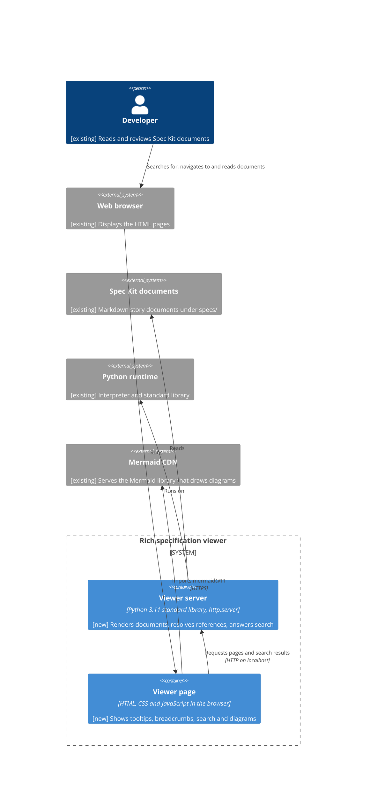
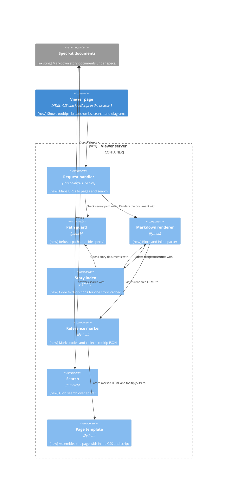
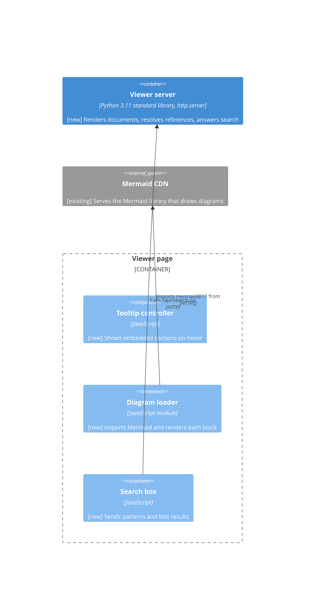
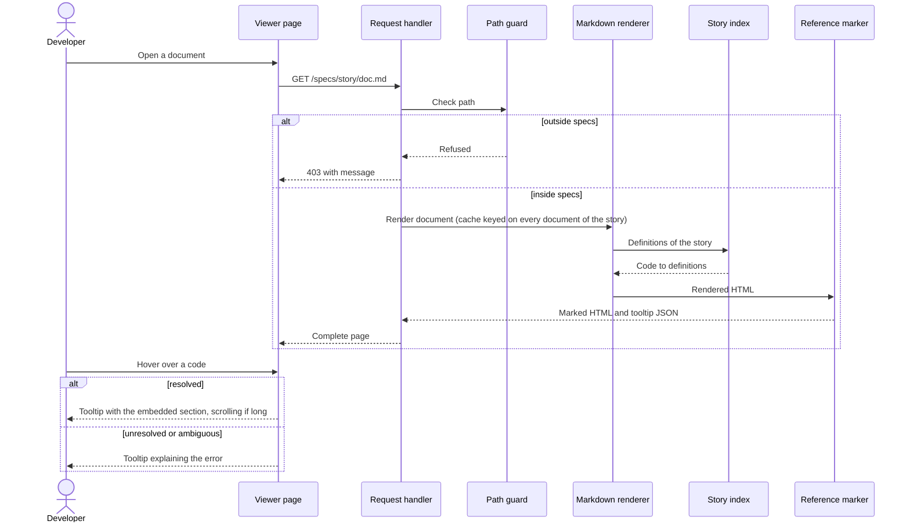
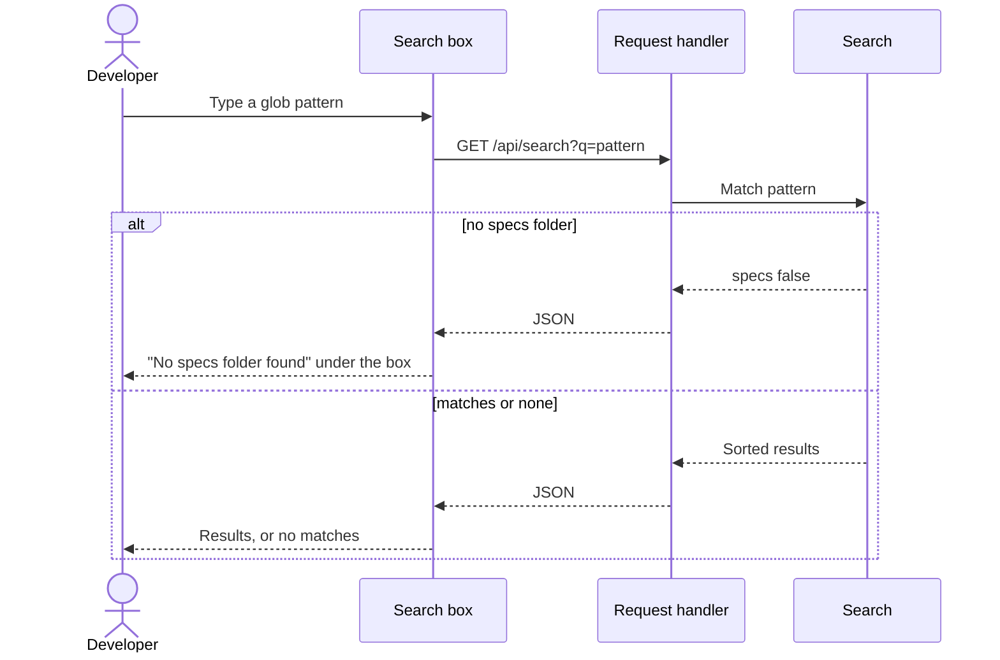
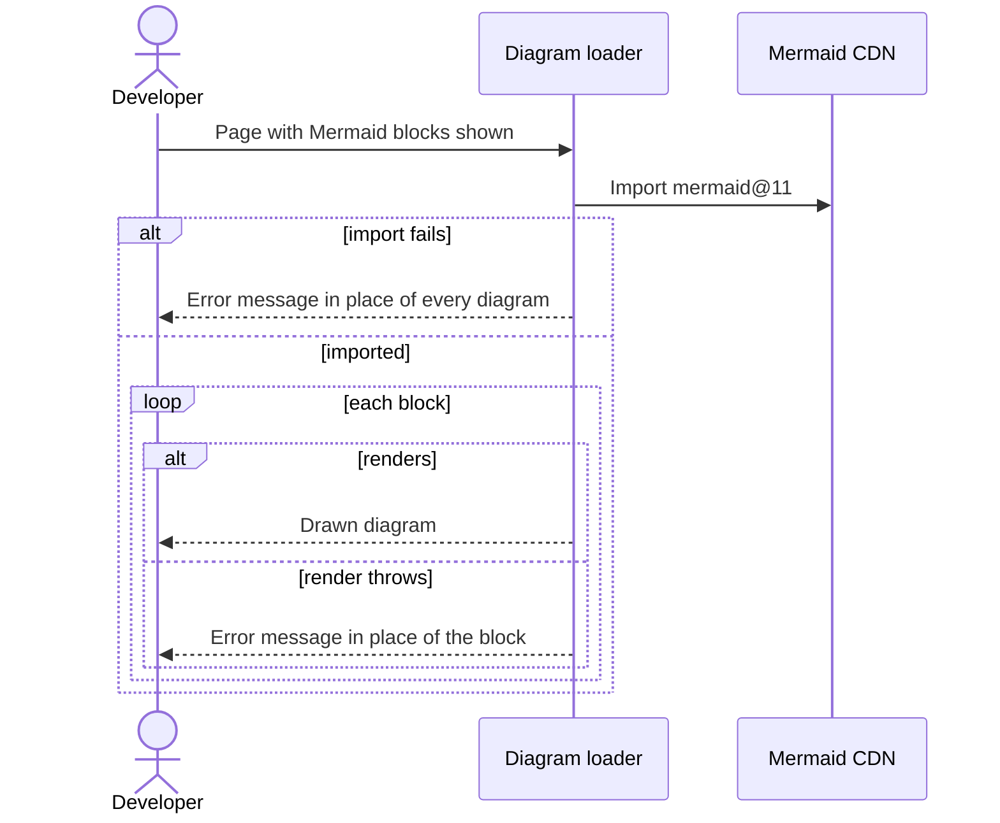
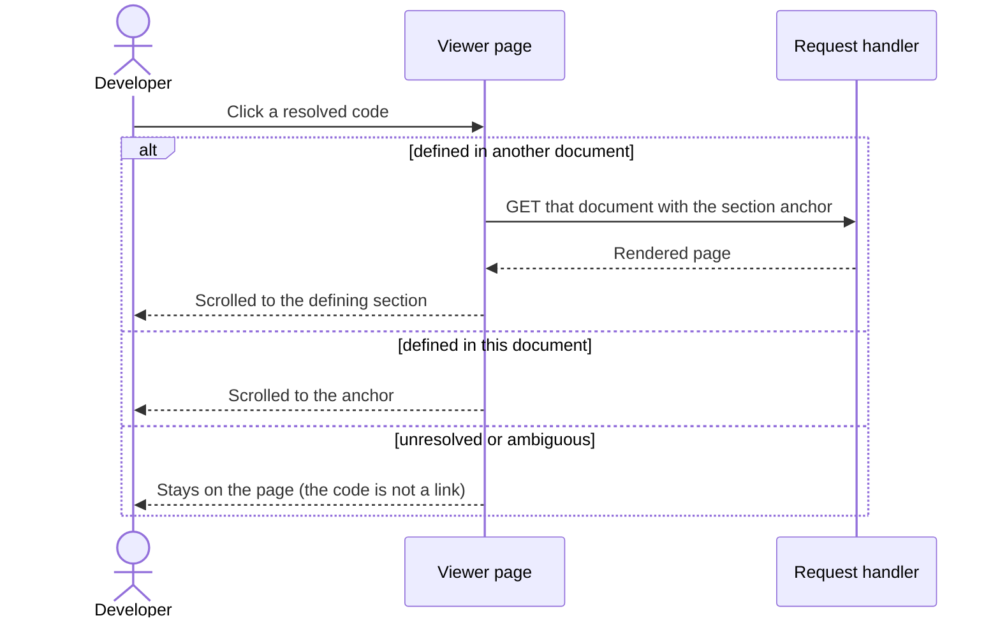

<!--
  STAGE 3 OF THE DEFINITION PIPELINE: HOW will the system do it?

  Gate: TEC-G01 to TEC-G19 (the Technical quality gate). Run `eil check --stage technical`.
  Approval: one recorded confirmation from the responsible developer (or a person named in
  eil-config.yml), after the comprehension check has been taken on this version
  (`/speckit-eil-comprehend`).

  - The developer owns the design. The AI may propose alternatives and challenge decisions; what is
    written as a decision is the developer's choice, and its owner is a person.
  - Every decision traces to the functional or non-functional requirements it serves.
  - Tag any text the AI wrote with [ai-draft] until a human has reviewed it.
  - A section or diagram that does not apply is removed and listed under "Not applicable" with a reason.
-->

# Technical Specification: Rich specification viewer

## Technical Requirements

- The viewer runs on Python 3.11 or later using only the standard library, and is started with one command from the project folder (FR-017, NFR-003, DEC-006, DEC-007).
- It listens on the loopback interface, or on all interfaces when it runs inside a container so that port forwarding works (DEC-007, DEC-008), and it answers only requests addressed to `localhost` or `127.0.0.1` (CH-016).
- It never writes to the project; its only state is an in-memory cache (FR-018, DEC-001).
- Every request path is resolved and confirmed to lie inside `specs/` below the start folder before any file is opened (FR-018).
- The only script loaded from outside the machine is Mermaid 11 from jsDelivr (NFR-003, DEC-003).

## Architecture

One Python process, the **Viewer server**, serves every page over HTTP, on `127.0.0.1` or, inside a container, on `0.0.0.0` (DEC-001, DEC-007, DEC-008). It reads the Markdown documents under `specs/`, renders the requested document on each request with a cache keyed on the modification time and size of every document in the story (CH-015), and returns a complete HTML page. The CSS and the page's JavaScript are embedded in the server script and inlined into every page. In the browser, the **Viewer page** handles tooltips, breadcrumbs and the search box, and loads Mermaid from the CDN to draw diagrams (DEC-003). Tooltip content for every code on a page is resolved by the server at render time and embedded in the page as JSON (DEC-004). Search is a request to the server, which walks `specs/` on each call (DEC-005). The container view (ART-012) shows this.

## Component Design

**Viewer server** (one script, `specview.py`):

- **Request handler**: first refuses, with `403`, any request whose `Host` header names anything other than `localhost` or `127.0.0.1` (any port, since port forwarding may change it) (CH-016); then maps URLs to responses: `/` and folder paths return a navigation view, `*.md` paths return a document page, `/api/search?q=` returns JSON results. It passes every path through the Path guard first. Built on `http.server.ThreadingHTTPServer`.
- **Path guard**: resolves the requested path with `Path.resolve()` (following symbolic links) and refuses it unless it is inside `<start>/specs` (FR-018).
- **Markdown renderer**: a line-based block parser followed by an inline pass (DEC-002). It drops HTML comments and `eil:` blocks and regions from the output (FR-019), records each definition (BR-2) with the HTML of its defining section (BR-3), and gives headings and definitions stable anchors.
- **Story index**: for a story folder, walks it at every depth and parses each `.md` file (FR-025), building a map from each code to its definitions, and reads `eil:challenge` blocks into challenge definitions (FR-022). A file that resolves, through a symbolic link, to a document already read, or whose content is identical to one already read, is counted as that same document, so an alias such as `spec.md` does not make its codes ambiguous (FR-024). A heading for a code that some other document of the story defines as an item is recorded as an anchor only, not a definition, so the item stays the code's definition (FR-026). A code with none or several definitions is unresolved or ambiguous (BR-5). A document directly in `specs/`, in no story folder, gets no index and no codes are marked on its page (FR-009). On each request it lists the story's documents and their modification times and sizes; this list is the cache key for both the index and every rendered page of the story, so a change to any document of the story, or a document added or removed, re-renders the pages of that story (CH-015). It opens every document through the Path guard, so a symbolic link in a story folder that resolves outside `specs/` is skipped (CH-017).
- **Reference marker**: in the rendered page, wraps each code outside inline code and code blocks (BR-6) in a link element carrying the code, its target anchor or its error state (FR-008, FR-012, FR-013), and collects the tooltip JSON for the codes used on the page (DEC-004). An unresolved or ambiguous code is rendered as a `<span>`, not a link, so clicking it does not navigate (FR-013, CH-018).
- **Search**: walks `specs/`, matches each path relative to `specs/` with `fnmatch`, lower-cased, wrapping a pattern that has no wildcard as `*term*`, and sorts the results by path (DEC-005).
- **Page template**: assembles the breadcrumb, the search box, the rendered body, the tooltip JSON, the inline CSS and the inline script (FR-005, FR-020, NFR-001). When the start folder has no `specs/` folder, every page it builds shows "No specs folder found" underneath the search box (AC-17).

**Viewer page** (inline script and style in every page):

- **Tooltip controller**: shows the embedded section HTML on hover, with a maximum size and scrolling inside (FR-010); opens no tooltip for codes inside a tooltip (FR-021); replaces diagrams inside a tooltip with a note (FR-023).
- **Diagram loader**: imports `mermaid@11` as an ES module from jsDelivr; renders each block with `mermaid.render()` inside `try`/`catch`; puts an error message in place of a block that fails, and in place of every block if the import fails (FR-014, FR-015).
- **Search box**: sends the pattern to `/api/search` and lists the results, or "No specs folder found" underneath the box when the server reports no `specs/` folder (FR-002).

## API and Integration Design

All responses come from the Viewer server; there is no authentication, because only the local developer can reach it (DEC-007, DEC-008). A request whose `Host` header is not `localhost` or `127.0.0.1` gets `403` (CH-016).

- `GET /` and `GET /specs/<folder>/`: HTML navigation view of that folder (FR-001, FR-020).
- `GET /specs/<story>/<file>.md`: HTML document page (FR-003).
- `GET /api/search?q=<pattern>`: JSON `{"specs": true|false, "results": [{"story": ..., "file": ..., "href": ...}]}` (FR-002, DEC-005).
- A path outside `specs/` returns `403` with an HTML message saying the location is outside the viewer's folder (FR-018); a missing path returns `404`.
- **Mermaid CDN**: `https://cdn.jsdelivr.net/npm/mermaid@11/dist/mermaid.esm.min.mjs`, loaded by the browser, never by the server (DEC-003).

## Security Design

- **Trust boundary**: the developer's machine. The server binds to `127.0.0.1`, or to `0.0.0.0` inside a container, where only the forwarded port reaches it from the host (DEC-007, DEC-008).
- **Host check**: every request whose `Host` header names anything other than `localhost` or `127.0.0.1` is refused with `403`, so a web page open in the browser cannot read the documents through DNS rebinding (CH-016).
- **Path confinement**: the Path guard resolves every path, including symbolic links and `..` segments, and requires the result to be inside `<start>/specs` (FR-018). This check is the only route by which a file is opened.
- **Read only**: the server opens files for reading only and creates no files.
- **Output escaping**: all document text is HTML-escaped before inline formatting is applied, so Markdown content cannot inject script into the page. Raw HTML in Markdown is shown escaped, not rendered. The tooltip JSON is embedded in a `<script type="application/json">` element with `<`, `>` and `&` escaped as Unicode escapes, so section content cannot close the element.
- **Outside requests**: the only outside request is the browser's import of Mermaid from jsDelivr; no document content leaves the machine.

## Error Handling and Resilience

- **Mermaid unavailable** (offline, CDN down): the import fails, and every diagram block shows an error message while the rest of the page, including tooltips, works (FR-015).
- **Invalid diagram**: `mermaid.render()` throws; that block shows the error message from Mermaid (FR-015, FR-016).
- **Unresolved or ambiguous code**: marked with an error icon and red text; its tooltip says why (FR-013).
- **Markdown the parser cannot interpret**: shown as escaped plain text in a paragraph; the page is still served.
- **Document removed or renamed after it was served**: the open page is unchanged (it is a complete page); a refresh returns `404` with a message.
- **Concurrent requests**: handled on separate threads; the cache is guarded by a lock, and a file changed during a read is re-read on the next request, because its modification time or size then differs from the cache key (CH-015).
- **Port in use**: the server tries ports 8000 to 8019 and stops with a message if all are taken (DEC-007).
- **Unexpected exception while rendering**: the handler returns `500` with the exception message on the page and logs the traceback to the terminal; the server keeps running.

## Observability

- One line per request to the terminal (method, path, status), as `http.server` does by default.
- Tracebacks of rendering errors are printed to the terminal.
- On start the server prints the start folder, the URL and how to stop it.

## Performance

- Expected volume: one developer, a few stories of up to about twenty documents each, each document under a few hundred kilobytes.
- Rendering is cached per story: each request lists the story's documents with their modification times (nanoseconds) and sizes, and re-renders only when that list has changed. A refresh of an unchanged story does no parsing (CH-015).
- No target latency is set by the Functional Specification; a page is expected to render well under a second at this volume.

## Testing Strategy

- **Unit tests** (`unittest`, standard library): the block parser and inline pass on each Markdown construct in FR-004, including HTML comments and `eil:` blocks being dropped (FR-019); definition finding and section boundaries (BR-2, BR-3); code marking and the not-a-reference rule (BR-6); story-scope resolution, unresolved and ambiguous codes (BR-4, BR-5); challenge definitions (FR-022); glob matching with and without wildcards, case and order (DEC-005); the Path guard with `..`, absolute paths and symbolic links (FR-018); the Host check (CH-016); container detection and the bind address (DEC-008); nested story documents, symbolic-link and identical-copy aliases counted once, and a document directly in `specs/` having no codes marked (FR-009, FR-024, FR-025).
- **Integration tests**: start the server on a free port against a fixture project in a temporary folder and request pages, search and forbidden paths over HTTP; check AC-1 to AC-5, AC-9 to AC-11, AC-13, AC-14 and AC-17; change one document of a story and check that another document's tooltip shows the new text after a refresh (CH-015); send a request with a foreign `Host` header and check it is refused (CH-016); check AC-18 to AC-20 against a fixture story with a `spec.md` link, a `spec.md` copy, a `checklists/` subfolder and a `specs/README.md`.
- **Manual browser checks**: tooltips, scrolling and no nested tooltips (AC-4, AC-12, AC-15, AC-16); diagrams of each type including C4 and ER (AC-7); offline and invalid diagrams (AC-8); readability (NFR-001).

## Deployment and Migration

There is nothing to deploy or migrate. The developer copies `specview.py` anywhere and runs `python3 path/to/specview.py` from a project folder; it serves that folder's `specs/`. Inside a devcontainer the same command binds to `0.0.0.0` and the editor's port forwarding makes it available at `http://localhost:<port>/` on the host (DEC-008). Stopping it with Ctrl+C removes all state.

## Existing System Impact

None. The viewer only reads the Spec Kit documents and changes no existing file, tool or process.

## Alternatives Considered

- **Serving** (DEC-001): a static generator with a file watcher writing HTML files was rejected, because it needs somewhere to write, lags behind saves, and `file://` pages cannot fetch search results.
- **Markdown** (DEC-002): a full CommonMark implementation was rejected as far more work for constructs Spec Kit documents do not use; regular-expression substitution alone was rejected because it cannot give the structure needed for sections and nesting.
- **Mermaid version** (DEC-003): pinning an exact version was proposed and declined by the developer.
- **Tooltips** (DEC-004): fetching each tooltip on hover was rejected because it needs the server running and a request per hover; one index file per story was rejected because it downloads every definition of the story.
- **Search** (DEC-005): exact, case-sensitive glob matching was rejected because a plain word would find nothing; matching in the browser was rejected because the list would be stale and JavaScript has no glob.
- **Startup** (DEC-007): a package run with `python -m` and a fixed port that fails when busy were rejected.

## Risks and Trade-offs

- `mermaid@11` follows new minor releases, so a diagram can change or break without any change in the project (DEC-003). Mermaid's C4 support is experimental.
- The Markdown parser covers a subset; a construct outside it is shown as plain text.
- Pages embed the tooltip content of every code they use, so a document with many codes gives a larger page (DEC-004).
- If the developer starts the viewer outside the project folder, it serves nothing ("No specs folder found").
- Inside a container the server listens on all interfaces, so other containers on the same Docker network can reach it directly and can send any `Host` header they like; the Host check protects against web pages, not against those containers (DEC-008).

## Technical Decisions

**DEC-001**: Serve pages from a local server that renders on request (traces: FR-003, FR-006, FR-007, FR-018, NFR-002)
Decision: A single Python process serves every page over HTTP and renders the requested Markdown document on each request, caching the result by the modification time and size of every document in its story (CH-015).
Reason: A refresh always shows the saved content without a file watcher, and search, tooltips and path confinement live in one process.
Rejected alternative: A static generator with a file watcher writing HTML files opened through `file://`.
Trade-off: The viewer must be running to read the pages.
Owner: Lee Sinclair

**DEC-002**: Convert Markdown with an own block and inline parser covering the Spec Kit subset (traces: FR-004, FR-008, FR-019, NFR-003)
Decision: A line-based block parser and an inline pass, written with the standard library, render the constructs in FR-004, drop comments and `eil:` blocks, and record definitions and section boundaries in the same pass.
Reason: No third-party library is allowed, and the parser must know the document's structure to find defining sections.
Rejected alternative: A full CommonMark implementation, or regular-expression substitution alone.
Trade-off: Markdown outside the subset is shown as plain text.
Owner: Lee Sinclair

**DEC-003**: Load Mermaid 11 from jsDelivr by major version (traces: FR-014, FR-015, NFR-003)
Decision: Each page imports `mermaid@11` as an ES module from jsDelivr and renders each diagram block in `try`/`catch`.
Reason: Mermaid fixes arrive without a change to the viewer.
Rejected alternative: Pinning an exact Mermaid version, proposed by the AI and declined by the developer: "It will receive updates".
Trade-off: A new Mermaid minor release can change how diagrams look, or break them, without any change on the developer's side.
Owner: Lee Sinclair

**DEC-004**: Resolve references at render time and embed tooltip content in the page (traces: FR-008, FR-009, FR-010, FR-011, FR-012, FR-013, FR-021, FR-022, FR-024, FR-025)
Decision: When a page is rendered the server builds or reuses the story's code index, marks each code, and embeds the pre-rendered defining sections of the codes used on the page as JSON.
Reason: Hovering is instant and still works if the server has stopped.
Rejected alternative: Fetching each tooltip from the server on hover, or loading one index of the whole story.
Trade-off: Pages with many codes are larger.
Owner: Lee Sinclair

**DEC-005**: Search on the server with case-insensitive glob matching (traces: FR-002, FR-007)
Decision: `/api/search` walks `specs/` on each request and matches each path relative to `specs/` with `fnmatch`, lower-cased; a pattern with no wildcard is treated as `*pattern*`; results are sorted by path. This settles OQ-018.
Reason: The results always reflect the current files, and a plain word still finds documents.
Rejected alternative: Exact, case-sensitive glob matching, or matching in the browser over a file list.
Trade-off: A pattern cannot ask for an exact name without using a wildcard.
Owner: Lee Sinclair

**DEC-006**: Require Python 3.11 or later (traces: FR-017, NFR-003)
Decision: The viewer supports Python 3.11 and later.
Reason: It matches the engineer-in-the-loop preset's own requirement, so a machine that runs the preset can run the viewer.
Rejected alternative: Supporting Python 3.9, or requiring 3.12.
Trade-off: Machines with only Python 3.9 or 3.10 cannot run it.
Owner: Lee Sinclair

**DEC-007**: Start as one script, trying ports 8000 to 8019 (traces: FR-017, FR-018, NFR-003)
Decision: `python3 specview.py`, run from the project folder, binds to the address chosen by DEC-008, uses the first free port from 8000 to 8019, prints the URL and opens it in the browser; the optional `--port` and `--host` flags are never required.
Reason: One command with no configuration, and it still starts when port 8000 is busy.
Rejected alternative: A package run with `python -m`, or a fixed port that fails when busy.
Trade-off: The single file grows large, and the port can differ between runs.
Owner: Lee Sinclair

**DEC-008**: Bind to 0.0.0.0 inside a container, otherwise to 127.0.0.1 (traces: FR-017, FR-018, NFR-003)
Decision: The viewer binds to `0.0.0.0` when it detects a container (`/.dockerenv` exists, or `REMOTE_CONTAINERS` or `CODESPACES` is set) and to `127.0.0.1` otherwise, printing which address it chose and why; an optional `--host` flag overrides the choice. The Host check (CH-016) applies in both cases.
Reason: "from within a devcontainer we will need to bind to 0.0.0.0 for port forwarding to work" (Lee Sinclair, CH-016), while the single command must still need no configuration (FR-017).
Rejected alternative: A `--host 0.0.0.0` flag the developer must pass inside a container, or always binding to `0.0.0.0`.
Trade-off: Inside a container the viewer is reachable from other containers on the same network; detection can be wrong in an unusual container setup, which the `--host` flag corrects.
Owner: Lee Sinclair

## Container View

**ART-012**: Containers of the rich specification viewer (traces: FR-003, FR-010, FR-014, DEC-001, DEC-003, DEC-004)



## Component Views

**ART-013**: Inside the viewer server (traces: FR-002, FR-004, FR-008, FR-013, FR-018, FR-019, DEC-001, DEC-002, DEC-004, DEC-005)



**ART-014**: Inside the viewer page (traces: FR-002, FR-010, FR-014, FR-015, FR-021, FR-023, DEC-003, DEC-004, DEC-005)



## Sequence Diagrams

**ART-015**: Reading a document with its references explained (traces: UC-001, FR-010, FR-013, DEC-001, DEC-004)



**ART-016**: Finding a document by search (traces: UC-002, FR-002, DEC-005)



**ART-017**: Drawing diagrams (traces: UC-003, FR-014, FR-015, DEC-003)



**ART-018**: Following a reference (traces: UC-004, FR-012, DEC-001, DEC-004)



## Not applicable

- Data Design: nothing is stored; the only state is an in-memory cache that is lost when the viewer stops.
- Data Model: no persistent data is added or changed.

## Challenges

<!-- Recorded by `eil challenge`. -->

```eil:challenge
{
  "id": "CH-015",
  "stage": "technical",
  "raised_by": "ai",
  "raised_at": "2026-09-27T11:53:30Z",
  "target": "DEC-001",
  "text": "DEC-001 caches a rendered page by the viewed file's modification time and size, but the page also embeds tooltip sections from other documents of the story (DEC-004). If s01-requirements.md changes, a cached s02-functional-spec.md page would keep showing the old REQ text in its tooltips, and a code newly defined or removed elsewhere would keep its old resolved or error state. The cache key or invalidation must cover every document of the story, or the story index must be re-checked on each request.",
  "status": "closed",
  "responder": "Lee Sinclair",
  "response": "accepted",
  "at": "2026-09-27T11:58:26Z",
  "reason": "Agreed"
}
```

```eil:challenge
{
  "id": "CH-016",
  "stage": "technical",
  "raised_by": "ai",
  "raised_at": "2026-09-27T11:53:30Z",
  "target": "Security Design",
  "text": "Binding to 127.0.0.1 keeps other machines out, but a web page open in the developer's browser can still reach http://127.0.0.1:8000 (for example through DNS rebinding) and read the specification documents through /api/search and the document pages. The design has no check of the Host header (accepting only 127.0.0.1 and localhost with the viewer's port) or other defence against this.",
  "status": "closed",
  "responder": "Lee Sinclair",
  "response": "accepted",
  "at": "2026-09-27T11:58:27Z",
  "reason": "Agreed, however from within a devcontainer we will need to bind to 0.0.0.0 for port forwarding to work"
}
```

```eil:challenge
{
  "id": "CH-017",
  "stage": "technical",
  "raised_by": "ai",
  "raised_at": "2026-09-27T12:00:53Z",
  "target": "ART-013",
  "text": "ART-013 shows the Path guard opening files for the Request handler, but not how the Story index reads the other documents of the story (it has no relation to the Path guard or to Spec Kit documents), while Security Design says the Path guard is 'the only route by which a file is opened'. It is not stated whether the Story index opens files through the Path guard, so a symbolic link inside a story folder pointing outside specs/ could be read into a tooltip.",
  "status": "closed",
  "responder": "Lee Sinclair",
  "response": "accepted",
  "at": "2026-09-27T12:03:06Z",
  "reason": "accept"
}
```

```eil:challenge
{
  "id": "CH-018",
  "stage": "technical",
  "raised_by": "ai",
  "raised_at": "2026-09-27T12:04:25Z",
  "target": "ART-018",
  "text": "ART-018 (following a reference) shows only the two resolved branches. UC-004's exception flow and FR-013 say an unresolved or ambiguous code does not navigate when clicked, and the functional diagram ART-005 shows that branch, but the technical diagram leaves it out, so it does not say which component stops the navigation (the server-marked link or the page script).",
  "status": "closed",
  "responder": "Lee Sinclair",
  "response": "accepted",
  "at": "2026-09-27T12:05:00Z",
  "reason": "accept"
}
```

## Overrides

<!-- Recorded by `eil override`, each naming who, what and why. -->

## Comprehension Check

<!-- The record of the check taken on this version: levels, outcomes, attempts and item ids only. Never a question, an answer, a hint or a score. -->

<!-- eil:begin comprehension -->
```json
{
  "stage": "technical",
  "fingerprint": "sha256:82b669a5c901ca69617f1c6ad544604af763c2b1448982888b1d17f7d7907aee",
  "taken_by": "Lee Sinclair",
  "started_at": "2026-09-29T10:52:43Z",
  "updated_at": "2026-09-29T10:56:20Z",
  "levels": [
    {
      "level": "recognise",
      "outcome": "coached",
      "attempts": 2,
      "items": [
        "ART-014"
      ]
    },
    {
      "level": "explain",
      "outcome": "revealed",
      "attempts": 2,
      "items": [
        "DEC-004"
      ]
    },
    {
      "level": "apply",
      "outcome": "not-applicable",
      "attempts": 0,
      "items": [
        "DEC-004"
      ],
      "reason": "not part of this delta check (D-27): only the changed items are asked about"
    },
    {
      "level": "trace",
      "outcome": "not-applicable",
      "attempts": 0,
      "items": [
        "DEC-004"
      ],
      "reason": "not part of this delta check (D-27): only the changed items are asked about"
    },
    {
      "level": "evaluate",
      "outcome": "not-applicable",
      "attempts": 0,
      "items": [
        "DEC-004"
      ],
      "reason": "not part of this delta check (D-27): only the changed items are asked about"
    }
  ]
}
```
<!-- eil:end comprehension -->

## Quality Assessment

<!-- eil:begin assessment -->
```json
{
  "stage": "technical",
  "evaluated_at": "2026-09-29T11:33:48Z",
  "fingerprint": "sha256:c106c0607b28e0df3ccbc641532e3b44579b26b08d1252d0ec97f452d1f4c32b",
  "criteria": [
    {
      "id": "TEC-G01",
      "kind": "judgment",
      "status": "met",
      "reason": "AI assessment: Each functional requirement is served by a named component; the story-wide cache key (CH-015) keeps tooltips current after any document of the story changes, and the Host check with DEC-008 keeps access to the developer."
    },
    {
      "id": "TEC-G02",
      "kind": "traceability",
      "status": "met",
      "reason": ""
    },
    {
      "id": "TEC-G03",
      "kind": "structural",
      "status": "met",
      "reason": ""
    },
    {
      "id": "TEC-G04",
      "kind": "structural",
      "status": "met",
      "reason": ""
    },
    {
      "id": "TEC-G05",
      "kind": "structural",
      "status": "met",
      "reason": ""
    },
    {
      "id": "TEC-G06",
      "kind": "structural",
      "status": "met",
      "reason": ""
    },
    {
      "id": "TEC-G07",
      "kind": "structural",
      "status": "met",
      "reason": ""
    },
    {
      "id": "TEC-G08",
      "kind": "judgment",
      "status": "met",
      "reason": "AI assessment: Unit tests cover the parser, business rules, glob matching and path guard; integration tests drive the server over HTTP against a fixture project; the browser-only criteria are named for manual checks."
    },
    {
      "id": "TEC-G09",
      "kind": "structural",
      "status": "met",
      "reason": ""
    },
    {
      "id": "TEC-G10",
      "kind": "structural",
      "status": "met",
      "reason": ""
    },
    {
      "id": "TEC-G11",
      "kind": "structural",
      "status": "met",
      "reason": ""
    },
    {
      "id": "TEC-G12",
      "kind": "traceability",
      "status": "met",
      "reason": ""
    },
    {
      "id": "TEC-G13",
      "kind": "judgment",
      "status": "met",
      "reason": "AI assessment: There is no existing system to fit; the design keeps to the standard-library-only constraint and to the loopback, read-only behaviour the Functional Specification requires."
    },
    {
      "id": "TEC-G14",
      "kind": "judgment",
      "status": "met",
      "reason": "AI assessment: The architecture, component design, eight decisions and four sequence diagrams explain how a page is rendered, resolved, searched and drawn, and each decision gives its reason and rejected alternative."
    },
    {
      "id": "TEC-G15",
      "kind": "structural",
      "status": "met",
      "reason": ""
    },
    {
      "id": "TEC-G16",
      "kind": "structural",
      "status": "met",
      "reason": ""
    },
    {
      "id": "TEC-G17",
      "kind": "structural",
      "status": "met",
      "reason": ""
    },
    {
      "id": "TEC-G18",
      "kind": "structural",
      "status": "met",
      "reason": ""
    },
    {
      "id": "TEC-G19",
      "kind": "structural",
      "status": "not-met",
      "reason": "the check was taken on an earlier version of this document; take it again"
    }
  ],
  "assessment": {
    "ambiguity": [
      "In GitHub Codespaces (detected by DEC-008) the viewer runs on a remote machine reached through port forwarding, which reads differently from the approved 'reachable only from the developer's own machine'"
    ],
    "missing": [
      "OQ-018 remains open in the approved Functional Specification although DEC-005 settles it"
    ],
    "contradictions": [],
    "unsupported_assumptions": [
      "Expected volume (a few stories of up to about twenty documents) is an estimate, not stated by the developer",
      "Container detection by /.dockerenv, REMOTE_CONTAINERS or CODESPACES covers the developer's devcontainer setup: not confirmed"
    ],
    "untestable": []
  },
  "findings": [
    {
      "code": "comprehension-stale",
      "where": "s03-technical-spec.md",
      "message": "the check was taken on an earlier version of this document; take it again"
    }
  ]
}
```
<!-- eil:end assessment -->

## Approval

<!-- eil:begin approval -->
```json
{
  "stage": "technical",
  "by": "Lee Sinclair",
  "at": "2026-09-29T10:58:36Z",
  "fingerprint": "sha256:82b669a5c901ca69617f1c6ad544604af763c2b1448982888b1d17f7d7907aee",
  "attestation": "I approve this version",
  "upstream": {
    "requirements": "sha256:fccddf46c6afd00018cb7992051f337fab8724433c4b3d61b9807e4339676126",
    "functional": "sha256:96e1a6bca50be78ec8a72f4517714738a89178d8fcbc88ec7ae0e6278bf27c0c"
  },
  "items": {
    "DEC-001": "sha256:1f3e788520867eeee4a8424820306ce0efdd9e1c26d52a4b93ab8d7dc48786eb",
    "DEC-002": "sha256:0599ffee6fe94943537539d570b3a1e3a2a4da55833c5a0704b6cfe8d1e1872e",
    "DEC-003": "sha256:b355695abe1660d04cb2b2e2893b25497b53f5018ac11bdd03abdb273e67e7d8",
    "DEC-004": "sha256:3da7510234d926bb47622883fc4e7be3c7adc1df6d9daff469c9ce9814fb0b1a",
    "DEC-005": "sha256:dd548513487f44e7b345f7afceb5ac78733a9428a1fd240453b236c7c9977b73",
    "DEC-006": "sha256:89e1dbcd11df4f220bdaa04b46da9f9b5e890f0209881aba7d08182cb4042649",
    "DEC-007": "sha256:26b04b08a2e2ad2d847f54c8c6f8680ffedc2c0c1f6d4c473e6daadd3a3eb9e2",
    "DEC-008": "sha256:e81413abed4a5baacf6038fc74fa5b15330e8e37207be1ca42004f17f6d874d4",
    "ART-012": "sha256:f4f01b8ff5d902d1c93cbf01ea272d7f7397e95469aa95ed27a2e81d7bfbf3af",
    "ART-013": "sha256:4d77abd1d6b1673be757765e2ac9fb659d52aaf6c769a1172ae757e690e2eafe",
    "ART-014": "sha256:e3416f768beb582770016ec3e3cb0efb934cca430fa77f36adae84a7ef5aa33a",
    "ART-015": "sha256:c712fd858a251b6801ea21b67a134c7110bc3b17ee5869ce27921c538a2a3e73",
    "ART-016": "sha256:d326ba7db9089ea825283afff78b76b16d70d98a217bac27882db2fcab4a2a46",
    "ART-017": "sha256:6ec68e90b434db5418a57cf0a1bc1906c3edba01152f14eaa612c8e1cb9030e7",
    "ART-018": "sha256:84123733e5c9076c468083bef3319c5f291f213bef51e6fae1bf615298c9b060"
  },
  "prose_fingerprint": "sha256:70607b41a3a5c863b959ae5303171bc0ba830b8f96fa43061f2d2d9fd59f15f0",
  "upstream_items": {
    "NFR-003": "sha256:92986aa1b795a72529b1642731e4605789f9292caeee7d2b72342b4375d31b5a",
    "REQ-007": "sha256:64d9c728ba564806319c533b6e00cfe1f7dfdf28fcb4a2092a41584d8a92b14d",
    "FR-006": "sha256:bcfacb726177717e2c627db1129231a37dfe77d5dc9746ba784f16ba7e6b0743",
    "UC-001": "sha256:108db131e96635d7412867c5568ce5a8ee22091f6123eff72365c62d99640605",
    "FR-012": "sha256:1a746aeeb1251d22083ee5a136daed70e05d8f806eb6fe5603a7e2757bd7e3e6",
    "FR-009": "sha256:ba249c9051a9d3f6a41eb5595b63c76cbadcb1b3a34c0a15ecdc042b741d52c1",
    "FR-024": "sha256:e9a1408ca40fdfc1bb6c9e80fac9993a84a35adef030f18524bad993fcf14bad",
    "FR-014": "sha256:6d70ff9b859b7b42fc032ff42fc100e88e0ff9b0fffa0c3f6744be4cf847fbaa",
    "FR-010": "sha256:f2232899e16438f5384a8605ebd03f540d81226f17643501431c1ca97b705b4a",
    "REQ-006": "sha256:0aa1836933b9002448ace1cae4fbcfc1f3f4621adc017dd8bdbdf9e8d62bbae0",
    "FR-004": "sha256:49856255568a760b379c6a2e84fb327730a205b499b804450bbb2ab93a239467",
    "FR-023": "sha256:94b1cb54a8a81488502fc023f1ea1008f1bf62abb5122f3af52730cd238bec07",
    "REQ-004": "sha256:8fd238e0b656f6a8de5e92553ed01d200585cfe0d358816ac984ed1bf3cbf1a7",
    "FR-011": "sha256:d2bd3f356c2407127bba438a66476fe99e4b20d0a5490b203ba1234775b6a87a",
    "REQ-002": "sha256:50368aac103f27c542e6e4d4c401cf76e2bd867e2cff3861fdd143be6f61a9fa",
    "FR-007": "sha256:a9522419fd3ea8edd973750d27a42513f748ce377c9dc2863a74a348d3dc032b",
    "UC-003": "sha256:da8d8cea6eb4de281fb2f514334c4d0585d7aba97650ba09da268c1c3e0f23bd",
    "UC-002": "sha256:3ee6f2dd67b5e2b1c70d9ca88b29c0c013f0d50ac43fb051902dbf645084715d",
    "REQ-001": "sha256:70d62161c0531be472148b63db07bb4d709960bc3ac9b70875b290ea8411f02d",
    "FR-021": "sha256:e031069f21d0db44ea3c253a20cd12235c50c8305b1a5260a60b1f92698f8464",
    "FR-002": "sha256:5a3011c5ac814ad49caa7cc0f5353aac7c728ad2745660b331263cc4f12303bb",
    "FR-018": "sha256:669eb6e635614cf5f4d7ca966c2a03e53d6146707737ac10a24600369eaaf7a7",
    "NFR-002": "sha256:bc302e034c79792496c55797b03b8c45445142614558def71c692e0896a1169b",
    "REQ-003": "sha256:96fa6d12c3455f1a6ac9ceecaf3821664307a791711156070d5d70cacabdf13c",
    "FR-008": "sha256:61945f5802eef780e14d65127d6388d0d83498e33e03d223fd2f7f71ea46e144",
    "FR-017": "sha256:e7d5c6861f3144eecf4aa1e157e105f346ab7c0dca831eaad8c29e3c071d149a",
    "FR-003": "sha256:c5ca2f3e295a396be20315402e6a905bf7991f7ea20a445b03fbc06be5021622",
    "FR-013": "sha256:0acce80002e80e696aefa0757a2fa3bf5903c4e66c8aac1322a71b1152e41ccc",
    "FR-019": "sha256:c73a7d5feb9ceaadde4b613ad6e1385adee534ab1bbdc3f3e3b04535a01ad05d",
    "UC-004": "sha256:25908e3fdb294d1764e1b610144ea09290e705868d043db5f324b552e3716f2b",
    "FR-022": "sha256:e8c732d5eb0b1f8b0a0c980c2037c2b5120811df8fad715f1f64a0fc9ae397e1",
    "FR-025": "sha256:6e075a9f9c1ba94627c76dc9a8e7b1c34bc6dcb87a2fa81b1e8a457d5851ae8d",
    "FR-015": "sha256:7c5ddecbae478644a421e32cdacb7fb9a03d0da9e160cc33155dcf89af4c2f72",
    "REQ-005": "sha256:923a5862868f564d85ad671740cb90127cdb50216822b3c46e99265fe5865ef0"
  },
  "overrides_used": [],
  "comprehension": {
    "understood": 0,
    "coached": 1,
    "revealed": 1,
    "skipped": 0,
    "not_applicable": 3
  }
}
```
<!-- eil:end approval -->
