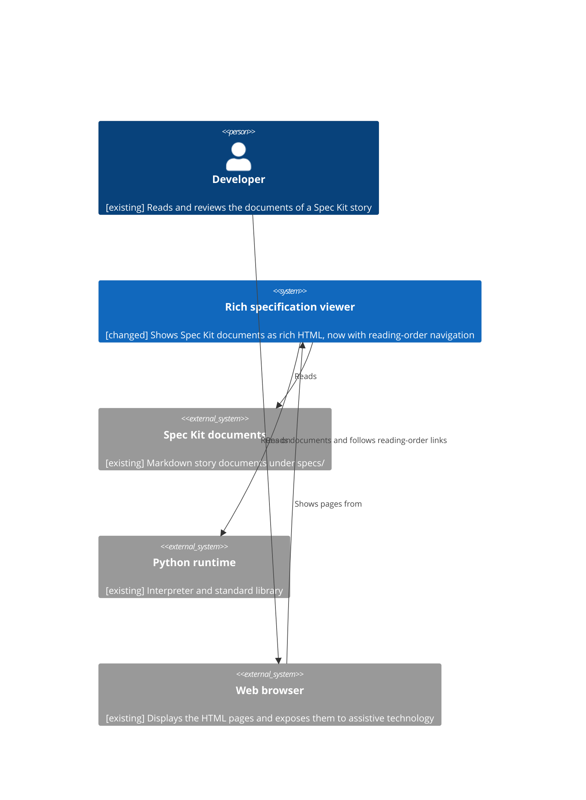

<!--
  STAGE 1 OF THE DEFINITION PIPELINE: WHY are we doing this?

  Gate: REQ-G01 to REQ-G14 (the Requirements quality gate). Run `eil check` to evaluate it.
  Approval: one recorded confirmation from the developer (or a person named in the extension's
  eil-config.yml). The AI drafts and challenges; it cannot approve.

  - Describe the problem and the outcome. Do not prescribe an implementation.
  - Tag any text the AI wrote with [ai-draft] until a human has reviewed it. Approval is refused
    while a tag remains (unless a named override is recorded).
  - A section that does not apply is removed and listed under "Not applicable" with a reason.
  - Open questions are not assumptions. Never turn one into the other without a human decision.
-->

# Requirements: Reading-order navigation for story documents

## Background

The rich specification viewer shows each Markdown document under `specs/` as an HTML page. A story is a folder directly under `specs/` (`specs/<story>/`) that holds a set of documents, and may hold nested subfolders with more documents. Stage documents carry a numeric prefix (`s00`, `s01`, ... `s10`) that records the order in which a story is meant to be read. Today a viewed page shows only its own document: the way to reach any other document in the story is the folder navigation view or the search.

## Problem Statement

A developer who has finished reading one document of a story cannot see which documents come next, or which exist at all, without leaving the page and going back to the folder navigation. Because the order of a story's documents matters, and the folder view lists plain names rather than a reading sequence, the developer has to work out the order from file names. Left unresolved, reading a story end to end means repeatedly leaving the page and re-deriving the order, and a document in a nested folder is easy to miss.

## Desired Outcome

**REQ-001**: At the bottom of each document viewed from a story folder (`specs/<story>/`), at any depth, the page shows a "Documents in reading order" section containing a link to every Markdown document in that story folder and all of its nested subfolders.

**REQ-002**: Each entry shows the document's path relative to the story folder, without the file extension.

**REQ-003**: The links are in a deterministic natural order: the same order on every run, numbers inside names compared by their numeric value (so `s00`, `s01`, `s02` ... `s09`, `s10` read in that order, not `s10` before `s02`), and the documents of a folder before the documents of its nested folders. Documents without a stage follow all the documents that have a stage, in alphanumeric order.

**REQ-004**: The document currently being viewed is included in the list, is marked as the current page with `aria-current="page"`, is shown as plain text rather than a link, and is visually distinguished from the links by more than colour: the links are underlined and the plain text is not. This applies equally when it is the only document in the story.

**REQ-005**: The section is accessible: assistive technology can find it as a navigation region named "Documents in reading order", read its entries as a list, and identify the current document. The links can be operated with the keyboard, and the section has high visual contrast.

**REQ-006**: A document directly under `specs/` (not inside a story folder) gets no reading-order section, and the section of a story never lists a document that belongs to another story. A symbolic link inside a story that points to a document elsewhere under `specs/`, including in another story, is allowed and is listed in the story that holds the link.

**REQ-007**: The section lists only documents the viewer already considers reachable under `specs/`, found and checked by the viewer's existing document discovery and path resolution; a file that resolves outside `specs/` is never listed or linked.

**REQ-008**: A story folder or nested folder that holds no Markdown documents adds no entry and causes no error or empty heading, and a story whose folders are all empty shows no broken section.

**REQ-009**: Every feature the viewer has today keeps working unchanged, including reference tooltips and click-through, error marking of references, search, folder navigation and breadcrumbs, and Mermaid diagrams.

**REQ-010**: Automated tests demonstrate the behaviour for nested documents, ordering, the current-document state, isolation between stories, documents directly under `specs/`, empty folders, path safety, aliased documents and the entry label formats.

**REQ-011**: A document that Spec Kit aliases (`spec.md`, `plan.md` and `tasks.md`, which have the same content as a stage document) is not listed as a separate entry; its file name is shown in brackets after the name of the source document.

**REQ-012**: A document that has a stage is shown as `[stage NN: <name>]`, where NN is the two-digit number of its `s<NN>` prefix and `<name>` is the file name without the prefix and the extension; the file name itself is not repeated, and any folder path before the file name is kept. A document without a stage is shown as its name followed by a marker in brackets, `[ref doc: <name>]`, where `<name>` is the file name without the extension. For example `s01-requirements.md` reads `[stage 01: requirements]`, and `notes.md` reads `notes [ref doc: notes]`.

## Users and Stakeholders

- **Developer**: reads and reviews the documents of a Spec Kit story in the viewer and wants to move through them in the intended order.

## Use Cases

**UC-001**: Developer reads a story from start to finish (actor: Developer; goal: read every document of a story in its intended order; trigger: the developer reaches the bottom of a document in a story; outcome: the "Documents in reading order" section shows all of the story's documents in order, with the current one marked, and the developer follows the link to the next).

**UC-002**: Developer finds a nested document (actor: Developer; goal: reach a document held in a subfolder of the story; trigger: the developer looks at the bottom of any document of that story; outcome: the nested document is listed with its path relative to the story folder, after the documents of its parent folder, and the link opens it).

**UC-003**: Developer reads a document directly under `specs/` (actor: Developer; goal: read a document that is not part of a story; trigger: the developer opens a Markdown document directly in `specs/`; outcome: the page ends with the document's own content and has no reading-order section).

## Scope

### In Scope

- A "Documents in reading order" section at the bottom of each document inside a story folder, covering every Markdown document in that story folder and its nested subfolders.
- Labels relative to the story folder without the file extension, aliased documents shown against their source document, stage and reference-document markers, deterministic natural ordering, parents before nested folders, and marking of the current document as plain text.
- Keeping documents directly under `specs/` free of the section.
- Tests for the scenarios listed in REQ-010.

### Out of Scope

- Previous and next buttons, a table of contents at the top of the page, or a side panel.
- Letting the developer configure or override the order.
- Listing files that are not Markdown documents.
- Navigation between stories.
- Changes to the folder navigation view, the search or the reference tooltips.
- Reading order for documents outside `specs/`.

## Constraints

- The existing `Viewer` document discovery and page rendering flow is reused; the section is produced by that flow rather than by a second, separate way of finding or reading files.
- The viewer's existing path resolution is the only way a document is found or opened for this feature; nothing outside `specs/` is read or shown.
- No new dependency: standard library Python only, and no new JavaScript library.
- Every current viewer feature is preserved.

## Dependencies

- **Rich specification viewer**: the existing viewer (`specview.py`) whose document discovery, path resolution and page rendering are reused and extended.
- **Spec Kit documents**: the existing Markdown story documents under `specs/`, whose names and folders define the list.
- **Python runtime**: the existing Python interpreter and standard library used to run the viewer and its tests.
- **Web browser**: the developer's existing browser, which shows the page and exposes the section to assistive technology.

## Risks

- A page that shows a stale list after a document is added, renamed or removed in the story, because the viewer reuses rendered pages.
- A story with very many documents makes the section long.
- Natural ordering of names that do not follow the stage-prefix pattern may not match what the developer expects.

## Assumptions

- A story is a folder directly under `specs/`; a Markdown document directly under `specs/` is not part of any story.
- The developer is the only user, as for the viewer today.

## Open Questions

**OQ-001**: Spec Kit's alias documents (`spec.md`, `plan.md`, `tasks.md`) have the same content as stage documents. Should the section list them as their own entries, or list only the stage documents? (status: resolved) Answer (Lee Sinclair): don't show aliased documents separately; add the aliased file name in brackets after the source document name (REQ-011). (material: yes)

**OQ-002**: How should names be ordered when they do not share a stage prefix, for example `README.md`, `notes.md` and `checklists/requirements.md` beside `s00-README.md`? Is the comparison case-insensitive? (status: resolved) Answer (Lee Sinclair): use the format [ref doc: <file-name>] after the file names that are without a stage; use the format [ stage #: <file-name] for documents which have a stage (REQ-012). The ordering and case-sensitivity part is asked again in OQ-005. (material: yes)

**OQ-003**: Should a document that is the only one in its story still show the section, listing only itself? (status: resolved) Answer (Lee Sinclair): show the document name as plain text, not a link; also remove the extension from the document name as it is displayed (REQ-002, REQ-004). (material: no)

**OQ-004**: The answers to OQ-002 give the formats `[stage #: <file-name>]` and `[ref doc: <file-name>]` but not where each sits relative to the document name, what `#` stands for (the number in the `s<NN>` prefix?), or whether `<file-name>` is the full file name, or the name without its prefix or extension. What should an entry read like for `s01-requirements.md`, for `notes.md` and for `s04-ai-spec.md` with the alias `spec.md`? (status: resolved) Answer (Lee Sinclair): yes, # is NN, and <file-name> is the full name without the prefix and the extension (REQ-012). (material: yes)

**OQ-005**: In what order are names without a stage prefix placed relative to staged names, and is the comparison of names case-insensitive? (status: resolved) Answer (Lee Sinclair): the order they were created. Changed by CH-005 (Lee Sinclair): alphanumeric order, displayed after the stage files (REQ-003). (material: no)

## Success Criteria

- Opening any document in a story shows, at the bottom, a "Documents in reading order" section that names every Markdown document in that story, including those in nested subfolders, and links to every one except the current document.
- Every entry shows the path relative to the story folder without the file extension.
- A document aliased by `spec.md`, `plan.md` or `tasks.md` appears once, with the alias file name in brackets after it, and the alias is not a separate entry.
- A document with a stage and one without are marked as set by REQ-012: `s01-requirements.md` reads `[stage 01: requirements]` and `notes.md` reads `notes [ref doc: notes]`.
- Documents without a stage are listed after the documents that have a stage, in alphanumeric order.
- A story containing `s00`, `s01`, `s02` and `s10` documents lists `s10` after `s02`, and a document in a nested folder is listed after all documents of its parent folder.
- The same story shows the same order on every page view and every run.
- The current document's entry carries `aria-current="page"` and is visibly different from the links by more than colour (links are underlined, the plain text is not) and is plain text rather than a link, including when it is the only document in the story; no other entry carries it.
- Every link in the section can be reached and followed with the keyboard, and the section has high visual contrast.
- Opening a document directly under `specs/` shows no such section.
- The section of one story never contains a document of another story, except through a symbolic link placed inside that story.
- A file or link resolving outside `specs/` never appears in the section.
- A story with empty folders shows no error and no entry for the empty folders.
- Hovering and clicking reference codes, search, folder navigation and Mermaid diagrams behave as before, and the existing tests still pass.
- Tests covering nested documents, ordering, the current-document state, story isolation, documents directly under `specs/`, empty folders, path safety, aliased documents and the entry label formats pass, and no new dependency is installed.

## System Context

**ART-001**: System context (traces: REQ-001, REQ-002, REQ-003, REQ-004, REQ-005, REQ-006, REQ-007, REQ-008, REQ-009, REQ-010, REQ-011, REQ-012)



## Not applicable

<!-- Sections removed from this document, each with its reason: `- Constraints: none for this spike`. -->

## Challenges

<!-- Recorded by `eil challenge`. -->

```eil:challenge
{
  "id": "CH-001",
  "stage": "requirements",
  "raised_by": "ai",
  "raised_at": "2026-10-01T11:21:49Z",
  "target": "REQ-006",
  "text": "REQ-006 says a story's section never lists another story's documents, but REQ-007 only excludes files resolving outside specs/. A symbolic link inside a story that points at a document in a different story (still inside specs/) is neither listed nor excluded explicitly. Decide which story such a file belongs to and whether it is listed.",
  "status": "closed",
  "severity": "medium",
  "responder": "Lee Sinclair",
  "response": "accepted",
  "at": "2026-10-01T12:10:11Z",
  "reason": "this scenario should not occur however if a symbolic does point to a different folder then allow it. In the future we could link stories this way"
}
```

```eil:challenge
{
  "id": "CH-002",
  "stage": "requirements",
  "raised_by": "ai",
  "raised_at": "2026-10-01T11:21:49Z",
  "target": "REQ-004",
  "text": "REQ-004 requires the current entry to be 'visually distinguished' but gives no observable test, and does not say whether the marking may rely on colour alone. State the minimum (for example a non-colour cue such as weight or a marker, plus aria-current) so it can be verified.",
  "status": "closed",
  "severity": "medium",
  "responder": "Lee Sinclair",
  "response": "accepted",
  "at": "2026-10-01T12:12:00Z",
  "reason": "The current page should be displayed in plain text which is visually distinguished from the links not only by colour but also because links are underlined and plain text is not"
}
```

```eil:challenge
{
  "id": "CH-003",
  "stage": "requirements",
  "raised_by": "ai",
  "raised_at": "2026-10-01T11:21:49Z",
  "target": "REQ-005",
  "text": "REQ-005 says 'accessible' without naming a standard or level (for example WCAG 2.2 AA contrast and keyboard operation of the links). Without one, 'accessible' cannot be assessed beyond the three listed properties.",
  "status": "closed",
  "severity": "low",
  "responder": "Lee Sinclair",
  "response": "accepted",
  "at": "2026-10-01T12:13:11Z",
  "reason": "Just keyboard and high visual contrast is fine"
}
```

```eil:challenge
{
  "id": "CH-004",
  "stage": "requirements",
  "raised_by": "ai",
  "raised_at": "2026-10-01T11:21:50Z",
  "target": "Risks",
  "text": "The stale-list risk (documents added, renamed or removed) has no matching outcome: no requirement says the section must reflect the story's current documents after a change. Add an outcome, or accept the risk, so the behaviour is defined.",
  "status": "closed",
  "severity": "medium",
  "responder": "Lee Sinclair",
  "response": "deferred",
  "at": "2026-10-01T12:14:38Z",
  "reason": "A stale page is acceptable, the developer can reload the page or deal with it another way"
}
```

```eil:challenge
{
  "id": "CH-005",
  "stage": "requirements",
  "raised_by": "ai",
  "raised_at": "2026-10-01T11:37:08Z",
  "target": "REQ-003",
  "text": "Ordering unstaged documents by 'the order they were created' conflicts with the deterministic order REQ-003 requires: Linux records no portable creation time, and a git checkout, copy or editor save resets file times, so the order can differ between machines and runs. It is also not stated where creation-ordered documents sit relative to staged documents. Decide what 'created' means (file timestamp, git history, or another rule) and the placement.",
  "status": "closed",
  "severity": "high",
  "responder": "Lee Sinclair",
  "response": "accepted",
  "at": "2026-10-01T12:16:17Z",
  "reason": "just alphanumeric order but these should be displayed after the stage files"
}
```

## Overrides

<!-- Recorded by `eil override`, each naming who, what and why. -->

## Change Log

<!-- eil:begin changelog -->
<!-- eil:end changelog -->

## Record

<!-- eil:begin provenance -->
```json
{
  "version": 1,
  "blocks": {
    "REQ-001": {
      "hash": "sha256:256ed10c2afe9e022501c4f25204361be56ca8ebe3e3b4e74b6738c84ce8c568",
      "class": "inferred",
      "reviewed": {
        "by": "Lee Sinclair",
        "at": "2026-10-01T12:06:07Z",
        "list": "RVW-001",
        "reply": "Yes"
      }
    },
    "REQ-002": {
      "hash": "sha256:7b9a9aeadce291263cd1c8f6106926ef0868c72ad872a99beac7bbbb688fb049",
      "class": "inferred",
      "reviewed": {
        "by": "Lee Sinclair",
        "at": "2026-10-01T12:06:07Z",
        "list": "RVW-001",
        "reply": "Yes"
      }
    },
    "REQ-003": {
      "hash": "sha256:aedb4376fbb5fa1aa745d236c36bf0e638196fe7604260ebfc5adba12d358b9e",
      "class": "inferred",
      "adds": "Replaces creation order with alphanumeric order after the staged documents, from the answer to CH-005.",
      "reviewed": {
        "by": "Lee Sinclair",
        "at": "2026-10-01T12:21:39Z",
        "list": "RVW-002",
        "reply": "Approve all 6"
      }
    },
    "REQ-004": {
      "hash": "sha256:b52a4907c94a13f2f9fa348ca1da6350f4504b1786482733a63bf8784b4b091f",
      "class": "inferred",
      "adds": "Adds that the current entry differs from links by more than colour, links underlined and plain text not, from the answer to CH-002.",
      "reviewed": {
        "by": "Lee Sinclair",
        "at": "2026-10-01T12:21:39Z",
        "list": "RVW-002",
        "reply": "Approve all 6"
      }
    },
    "REQ-005": {
      "hash": "sha256:05e5b7ff7f62222173552749b93cd16789de08c57b13afb8171919152c976b57",
      "class": "inferred",
      "adds": "Adds keyboard operation and high visual contrast, from the answer to CH-003.",
      "reviewed": {
        "by": "Lee Sinclair",
        "at": "2026-10-01T12:21:39Z",
        "list": "RVW-002",
        "reply": "Approve all 6"
      }
    },
    "REQ-006": {
      "hash": "sha256:e517cbec32193438afe0b76b99eb5cc9d95f0fce65987fc63aa5d8ee7f783a47",
      "class": "inferred",
      "adds": "Adds that a symbolic link inside a story to a document elsewhere under specs/ is allowed and listed in the story holding the link, from the answer to CH-001.",
      "reviewed": {
        "by": "Lee Sinclair",
        "at": "2026-10-01T12:21:39Z",
        "list": "RVW-002",
        "reply": "Approve all 6"
      }
    },
    "REQ-007": {
      "hash": "sha256:bb73c59fe2c6e1a8dc4e62a7718608d9cc9c9b2c1ca3dc4e1b8d91b8ace51041",
      "class": "inferred",
      "reviewed": {
        "by": "Lee Sinclair",
        "at": "2026-10-01T12:06:07Z",
        "list": "RVW-001",
        "reply": "Yes"
      }
    },
    "REQ-008": {
      "hash": "sha256:f70bd5a6e36b3acdc1e0ef4100073132fb4a46ffcc099383dc4bc14f247254fe",
      "class": "inferred",
      "adds": "States that an empty folder adds no entry, error or empty heading.",
      "reviewed": {
        "by": "Lee Sinclair",
        "at": "2026-10-01T12:06:07Z",
        "list": "RVW-001",
        "reply": "Yes"
      }
    },
    "REQ-009": {
      "hash": "sha256:726e06a357ca16e93d7ddde707c7d9b1a7a0d583ae14dfc677a33b7b0efa370c",
      "class": "inferred",
      "reviewed": {
        "by": "Lee Sinclair",
        "at": "2026-10-01T12:06:07Z",
        "list": "RVW-001",
        "reply": "Yes"
      }
    },
    "REQ-010": {
      "hash": "sha256:aeba84bc66554b71b5aa5286cde9cbe4906cc3b0b502f744baa1561c4f22890a",
      "class": "inferred",
      "reviewed": {
        "by": "Lee Sinclair",
        "at": "2026-10-01T12:06:07Z",
        "list": "RVW-001",
        "reply": "Yes"
      }
    },
    "UC-001": {
      "hash": "sha256:39bc034f14596d29449003ea963e3a0b3f51215ee9e15e11c5fef4ae2aaed9ab",
      "class": "inferred",
      "adds": "Frames the reading-from-start-to-finish scenario.",
      "reviewed": {
        "by": "Lee Sinclair",
        "at": "2026-10-01T12:06:07Z",
        "list": "RVW-001",
        "reply": "Yes"
      }
    },
    "UC-002": {
      "hash": "sha256:98a48e376358abb62b44feb49ed89036461de691abb57208c9127ef4e0918d00",
      "class": "inferred",
      "adds": "Frames the nested-document scenario.",
      "reviewed": {
        "by": "Lee Sinclair",
        "at": "2026-10-01T12:06:07Z",
        "list": "RVW-001",
        "reply": "Yes"
      }
    },
    "UC-003": {
      "hash": "sha256:e47e99898085ee543414e29d1821cf2de70b134f24d206a2cd379c24a9e577c6",
      "class": "inferred",
      "adds": "Frames the root-level document scenario.",
      "reviewed": {
        "by": "Lee Sinclair",
        "at": "2026-10-01T12:06:07Z",
        "list": "RVW-001",
        "reply": "Yes"
      }
    },
    "OQ-001": {
      "hash": "sha256:70cdcc9906e8d729142177ded104fccb5ac9adb6c76a0c729e850ec590c8da2a",
      "class": "inferred",
      "reviewed": {
        "by": "Lee Sinclair",
        "at": "2026-10-01T12:06:07Z",
        "list": "RVW-001",
        "reply": "Yes"
      }
    },
    "OQ-002": {
      "hash": "sha256:49af940618001f7c48821faf612974492f3a643a667a87699dab8b5fb05e3d7e",
      "class": "inferred",
      "reviewed": {
        "by": "Lee Sinclair",
        "at": "2026-10-01T12:06:07Z",
        "list": "RVW-001",
        "reply": "Yes"
      }
    },
    "OQ-003": {
      "hash": "sha256:8cb6caa75456317d54bcbbc85743da62227d809b94a508d6a8a7ae234de02266",
      "class": "inferred",
      "reviewed": {
        "by": "Lee Sinclair",
        "at": "2026-10-01T12:06:07Z",
        "list": "RVW-001",
        "reply": "Yes"
      }
    },
    "ART-001": {
      "hash": "sha256:db09019fe61826127e6ddee74f38ebd6ccf021a75950a1581faf261735a28082",
      "class": "inferred",
      "adds": "System context diagram drawn from the request.",
      "reviewed": {
        "by": "Lee Sinclair",
        "at": "2026-10-01T12:06:07Z",
        "list": "RVW-001",
        "reply": "Yes"
      }
    },
    "REQ-011": {
      "hash": "sha256:ef32b333ad49ed6d560a3000ff6018a61fc3b9c3c62c7ff1d361ca6da28ef3b6",
      "class": "inferred",
      "reviewed": {
        "by": "Lee Sinclair",
        "at": "2026-10-01T12:06:07Z",
        "list": "RVW-001",
        "reply": "Yes"
      }
    },
    "REQ-012": {
      "hash": "sha256:41c59c37940929ef97e7946344ce85005618b1123b73e752b8750066f6ee568d",
      "class": "inferred",
      "adds": "Turns the answers to OQ-002, OQ-004 and the reviewer's format into worked examples, and keeps any folder path before the file name, which the answers did not state.",
      "reviewed": {
        "by": "Lee Sinclair",
        "at": "2026-10-01T12:06:07Z",
        "list": "RVW-001",
        "reply": "Yes"
      }
    },
    "OQ-004": {
      "hash": "sha256:b6cc0ebe5efe313ba1a5b763faa954131c46efce1f45ba3ca9489c03660cd106",
      "class": "inferred",
      "adds": "New question about the exact entry text, raised because the answers leave it open.",
      "reviewed": {
        "by": "Lee Sinclair",
        "at": "2026-10-01T12:06:07Z",
        "list": "RVW-001",
        "reply": "Yes"
      }
    },
    "OQ-005": {
      "hash": "sha256:fee115fe681f62a077ab46448de8e3e8a346be6a68b32cde0bfc12868384cdbe",
      "class": "inferred",
      "adds": "New question about ordering of unstaged names and case, which no answer covered.",
      "reviewed": {
        "by": "Lee Sinclair",
        "at": "2026-10-01T12:21:39Z",
        "list": "RVW-002",
        "reply": "Approve all 6"
      }
    },
    "Background#635fb9140dd4": {
      "hash": "sha256:635fb9140dd427ca275890f36e01b19bfdd7753178c07581fe24e709bc41dc1a",
      "reviewed": {
        "by": "Lee Sinclair",
        "at": "2026-10-01T12:06:07Z",
        "list": "RVW-001",
        "reply": "Yes"
      },
      "class": "inferred"
    },
    "Problem Statement#73e82cb9bbe6": {
      "hash": "sha256:73e82cb9bbe6b65226b4fbc98774bd4354bf2f5d44d381ed719a1ebf09f8127f",
      "reviewed": {
        "by": "Lee Sinclair",
        "at": "2026-10-01T12:06:07Z",
        "list": "RVW-001",
        "reply": "Yes"
      },
      "class": "inferred"
    },
    "Users and Stakeholders#0695bd639355": {
      "hash": "sha256:0695bd639355c3afc7a28483f566e23bd2f1b84b25123151a39fa792341e60ce",
      "reviewed": {
        "by": "Lee Sinclair",
        "at": "2026-10-01T12:06:07Z",
        "list": "RVW-001",
        "reply": "Yes"
      },
      "class": "inferred"
    },
    "Scope#3cc2afdee255": {
      "hash": "sha256:3cc2afdee2554de5ac4e3214a12b6bf2c54e6575bb7d9a6c8477671309322ead",
      "reviewed": {
        "by": "Lee Sinclair",
        "at": "2026-10-01T12:06:07Z",
        "list": "RVW-001",
        "reply": "Yes"
      },
      "class": "inferred"
    },
    "Scope#e7f97d34c410": {
      "hash": "sha256:e7f97d34c410f63f0e12ebbde23dd1e2f9328ee98be37ed3bbd4c15e1aca7549",
      "reviewed": {
        "by": "Lee Sinclair",
        "at": "2026-10-01T12:06:07Z",
        "list": "RVW-001",
        "reply": "Yes"
      },
      "class": "inferred"
    },
    "Constraints#54207a472ec2": {
      "hash": "sha256:54207a472ec2d3b6a02be2f9ab9906ed9d515d13dc8bb67f78cf608d0fc80ab5",
      "reviewed": {
        "by": "Lee Sinclair",
        "at": "2026-10-01T12:06:07Z",
        "list": "RVW-001",
        "reply": "Yes"
      },
      "class": "inferred"
    },
    "Dependencies#b2c4f1e664d6": {
      "hash": "sha256:b2c4f1e664d6c37a6debe4d0fdc977f65b0897c749f095a48293b10ea7ef58a8",
      "reviewed": {
        "by": "Lee Sinclair",
        "at": "2026-10-01T12:06:07Z",
        "list": "RVW-001",
        "reply": "Yes"
      },
      "class": "inferred"
    },
    "Risks#e7cd98f5bbfb": {
      "hash": "sha256:e7cd98f5bbfbd377ad22eb6d8fd12a8c31e9edb1f4678388488e7a8a13ac1edb",
      "reviewed": {
        "by": "Lee Sinclair",
        "at": "2026-10-01T12:06:07Z",
        "list": "RVW-001",
        "reply": "Yes"
      },
      "class": "inferred"
    },
    "Assumptions#3fec69dade83": {
      "hash": "sha256:3fec69dade83adbf32c2165211220103c636b76a2b5ad13d1f01621e78c2ff1c",
      "reviewed": {
        "by": "Lee Sinclair",
        "at": "2026-10-01T12:06:07Z",
        "list": "RVW-001",
        "reply": "Yes"
      },
      "class": "inferred"
    },
    "Success Criteria#e2c265708419": {
      "hash": "sha256:e2c26570841939dabedcd7671a20462e59a5e60aa815dad08e3dcde0cc5cbfad",
      "reviewed": {
        "by": "Lee Sinclair",
        "at": "2026-10-01T12:06:07Z",
        "list": "RVW-001",
        "reply": "Yes"
      },
      "class": "inferred"
    },
    "Success Criteria#f137e71231a7": {
      "hash": "sha256:f137e71231a798ca33936cc7118296540e84eb514695e8e1107fde1dfcff6e81",
      "reviewed": {
        "by": "Lee Sinclair",
        "at": "2026-10-01T12:21:39Z",
        "list": "RVW-002",
        "reply": "Approve all 6"
      },
      "class": "inferred"
    }
  },
  "acceptances": [
    {
      "id": "RVW-001",
      "stage": "requirements",
      "kind": "inferred",
      "digest": "sha256:f15747dee020a8579058635e5409a8664bc429f11f000a10b12ca12cca8a8c47",
      "by": "Lee Sinclair",
      "at": "2026-10-01T12:06:07Z",
      "reply": "Yes",
      "accepted": [
        "Background#635fb9140dd4",
        "Problem Statement#73e82cb9bbe6",
        "REQ-001",
        "REQ-002",
        "REQ-003",
        "REQ-004",
        "REQ-005",
        "REQ-006",
        "REQ-007",
        "REQ-008",
        "REQ-009",
        "REQ-010",
        "REQ-011",
        "REQ-012",
        "Users and Stakeholders#0695bd639355",
        "UC-001",
        "UC-002",
        "UC-003",
        "Scope#3cc2afdee255",
        "Scope#e7f97d34c410",
        "Constraints#54207a472ec2",
        "Dependencies#b2c4f1e664d6",
        "Risks#e7cd98f5bbfb",
        "Assumptions#3fec69dade83",
        "OQ-001",
        "OQ-002",
        "OQ-003",
        "OQ-004",
        "OQ-005",
        "Success Criteria#e2c265708419",
        "ART-001"
      ],
      "except": [],
      "questioned": [],
      "reopened": [],
      "reason": null,
      "hashes": {
        "Background#635fb9140dd4": "sha256:635fb9140dd427ca275890f36e01b19bfdd7753178c07581fe24e709bc41dc1a",
        "Problem Statement#73e82cb9bbe6": "sha256:73e82cb9bbe6b65226b4fbc98774bd4354bf2f5d44d381ed719a1ebf09f8127f",
        "REQ-001": "sha256:256ed10c2afe9e022501c4f25204361be56ca8ebe3e3b4e74b6738c84ce8c568",
        "REQ-002": "sha256:7b9a9aeadce291263cd1c8f6106926ef0868c72ad872a99beac7bbbb688fb049",
        "REQ-003": "sha256:202f42e6cdbd2f2a97b9a72d85ff53cda9f9305fb1f3e249e68321a630338413",
        "REQ-004": "sha256:15369fb11898586d58130084864169875557bc769c533af736f745e3e9705155",
        "REQ-005": "sha256:89fe1d2ea7d794b4af6aa2fa18ab28f7ac6c340def12a54330570dc39c8f96e5",
        "REQ-006": "sha256:fba40df89e315640796869f63f1917631e0b5ee2c9e559847fb306108fc1c84d",
        "REQ-007": "sha256:bb73c59fe2c6e1a8dc4e62a7718608d9cc9c9b2c1ca3dc4e1b8d91b8ace51041",
        "REQ-008": "sha256:f70bd5a6e36b3acdc1e0ef4100073132fb4a46ffcc099383dc4bc14f247254fe",
        "REQ-009": "sha256:726e06a357ca16e93d7ddde707c7d9b1a7a0d583ae14dfc677a33b7b0efa370c",
        "REQ-010": "sha256:aeba84bc66554b71b5aa5286cde9cbe4906cc3b0b502f744baa1561c4f22890a",
        "REQ-011": "sha256:ef32b333ad49ed6d560a3000ff6018a61fc3b9c3c62c7ff1d361ca6da28ef3b6",
        "REQ-012": "sha256:41c59c37940929ef97e7946344ce85005618b1123b73e752b8750066f6ee568d",
        "Users and Stakeholders#0695bd639355": "sha256:0695bd639355c3afc7a28483f566e23bd2f1b84b25123151a39fa792341e60ce",
        "UC-001": "sha256:39bc034f14596d29449003ea963e3a0b3f51215ee9e15e11c5fef4ae2aaed9ab",
        "UC-002": "sha256:98a48e376358abb62b44feb49ed89036461de691abb57208c9127ef4e0918d00",
        "UC-003": "sha256:e47e99898085ee543414e29d1821cf2de70b134f24d206a2cd379c24a9e577c6",
        "Scope#3cc2afdee255": "sha256:3cc2afdee2554de5ac4e3214a12b6bf2c54e6575bb7d9a6c8477671309322ead",
        "Scope#e7f97d34c410": "sha256:e7f97d34c410f63f0e12ebbde23dd1e2f9328ee98be37ed3bbd4c15e1aca7549",
        "Constraints#54207a472ec2": "sha256:54207a472ec2d3b6a02be2f9ab9906ed9d515d13dc8bb67f78cf608d0fc80ab5",
        "Dependencies#b2c4f1e664d6": "sha256:b2c4f1e664d6c37a6debe4d0fdc977f65b0897c749f095a48293b10ea7ef58a8",
        "Risks#e7cd98f5bbfb": "sha256:e7cd98f5bbfbd377ad22eb6d8fd12a8c31e9edb1f4678388488e7a8a13ac1edb",
        "Assumptions#3fec69dade83": "sha256:3fec69dade83adbf32c2165211220103c636b76a2b5ad13d1f01621e78c2ff1c",
        "OQ-001": "sha256:70cdcc9906e8d729142177ded104fccb5ac9adb6c76a0c729e850ec590c8da2a",
        "OQ-002": "sha256:49af940618001f7c48821faf612974492f3a643a667a87699dab8b5fb05e3d7e",
        "OQ-003": "sha256:8cb6caa75456317d54bcbbc85743da62227d809b94a508d6a8a7ae234de02266",
        "OQ-004": "sha256:b6cc0ebe5efe313ba1a5b763faa954131c46efce1f45ba3ca9489c03660cd106",
        "OQ-005": "sha256:cdb45c3d2e1e4f713a37896b4bccf740f6fd538d83157b5cbb06c0003e377c08",
        "Success Criteria#e2c265708419": "sha256:e2c26570841939dabedcd7671a20462e59a5e60aa815dad08e3dcde0cc5cbfad",
        "ART-001": "sha256:db09019fe61826127e6ddee74f38ebd6ccf021a75950a1581faf261735a28082"
      }
    },
    {
      "id": "RVW-002",
      "stage": "requirements",
      "kind": "inferred",
      "digest": "sha256:42bf321a7b9bfb8eed6596279d76a834230325cb6db75045f8eefb95fa24d189",
      "by": "Lee Sinclair",
      "at": "2026-10-01T12:21:39Z",
      "reply": "Approve all 6",
      "accepted": [
        "REQ-003",
        "REQ-004",
        "REQ-005",
        "REQ-006",
        "OQ-005",
        "Success Criteria#f137e71231a7"
      ],
      "except": [],
      "questioned": [],
      "reopened": [],
      "reason": null,
      "hashes": {
        "REQ-003": "sha256:aedb4376fbb5fa1aa745d236c36bf0e638196fe7604260ebfc5adba12d358b9e",
        "REQ-004": "sha256:b52a4907c94a13f2f9fa348ca1da6350f4504b1786482733a63bf8784b4b091f",
        "REQ-005": "sha256:05e5b7ff7f62222173552749b93cd16789de08c57b13afb8171919152c976b57",
        "REQ-006": "sha256:e517cbec32193438afe0b76b99eb5cc9d95f0fce65987fc63aa5d8ee7f783a47",
        "OQ-005": "sha256:fee115fe681f62a077ab46448de8e3e8a346be6a68b32cde0bfc12868384cdbe",
        "Success Criteria#f137e71231a7": "sha256:f137e71231a798ca33936cc7118296540e84eb514695e8e1107fde1dfcff6e81"
      }
    }
  ]
}
```
<!-- eil:end provenance -->

## Quality Assessment

<!-- eil:begin assessment -->
```json
{
  "stage": "requirements",
  "evaluated_at": "2026-10-01T12:16:28Z",
  "fingerprint": "sha256:c220988973e9202a33a1882e931d570dde67f456ba124e34b4807d758bf9808f",
  "criteria": [
    {
      "id": "REQ-G01",
      "kind": "judgment",
      "status": "met",
      "reason": "AI assessment: The problem (no way to see or follow a story's documents in order from a page) is stated with who is affected and the consequence.",
      "basis": "sha256:3442da957e32bb722873f6f66a09f1f71f529b33bafc72f797a958d18e5fa800"
    },
    {
      "id": "REQ-G02",
      "kind": "structural",
      "status": "met",
      "reason": ""
    },
    {
      "id": "REQ-G03",
      "kind": "structural",
      "status": "met",
      "reason": ""
    },
    {
      "id": "REQ-G04",
      "kind": "structural",
      "status": "met",
      "reason": ""
    },
    {
      "id": "REQ-G05",
      "kind": "structural",
      "status": "met",
      "reason": ""
    },
    {
      "id": "REQ-G06",
      "kind": "structural",
      "status": "met",
      "reason": ""
    },
    {
      "id": "REQ-G07",
      "kind": "structural",
      "status": "met",
      "reason": ""
    },
    {
      "id": "REQ-G08",
      "kind": "structural",
      "status": "met",
      "reason": ""
    },
    {
      "id": "REQ-G09",
      "kind": "structural",
      "status": "met",
      "reason": ""
    },
    {
      "id": "REQ-G10",
      "kind": "traceability",
      "status": "met",
      "reason": ""
    },
    {
      "id": "REQ-G11",
      "kind": "judgment",
      "status": "met",
      "reason": "AI assessment: Each success criterion is observable (entries, order, aria-current, plain-text current entry, aliases, markers with examples, absence on root documents, tests passing).",
      "basis": "sha256:8038abede5c98d8dc86080af2cfef4fbc31e825de55039027b6f208177571417"
    },
    {
      "id": "REQ-G12",
      "kind": "judgment",
      "status": "met",
      "reason": "AI assessment: Outcomes are stated as behaviour; the only implementation-level statements are the user-mandated constraints to reuse the Viewer flow and path resolution and to add no dependency, and aria-current is a user-specified accessibility outcome.",
      "basis": "sha256:c220988973e9202a33a1882e931d570dde67f456ba124e34b4807d758bf9808f"
    },
    {
      "id": "REQ-G13",
      "kind": "judgment",
      "status": "met",
      "reason": "AI assessment: Background and problem statement explain that stories are meant to be read in stage order and the page offers no route through them.",
      "basis": "sha256:c220988973e9202a33a1882e931d570dde67f456ba124e34b4807d758bf9808f"
    },
    {
      "id": "REQ-G14",
      "kind": "structural",
      "status": "met",
      "reason": ""
    }
  ],
  "assessment": {
    "ambiguity": [
      "'Alphanumeric order' in REQ-003 does not say whether numbers inside unstaged names compare numerically",
      "'High visual contrast' in REQ-005 is not measured",
      "Whether a staged entry in a nested folder keeps its folder path (REQ-012) is my reading of the answers"
    ],
    "missing": [
      "Case-sensitivity of the alphanumeric order of unstaged documents is not stated",
      "'High visual contrast' in REQ-005 names no contrast ratio"
    ],
    "contradictions": [],
    "unsupported_assumptions": [],
    "untestable": [
      "'High visual contrast' (REQ-005) is testable only by inspection unless a ratio is chosen"
    ]
  },
  "findings": []
}
```
<!-- eil:end assessment -->

## Approval

<!-- eil:begin approval -->
```json
{
  "stage": "requirements",
  "by": "Lee Sinclair",
  "at": "2026-10-01T12:22:36Z",
  "fingerprint": "sha256:c220988973e9202a33a1882e931d570dde67f456ba124e34b4807d758bf9808f",
  "reached": "first",
  "attestation": "I approve this document",
  "upstream": {},
  "items": {
    "REQ-001": "sha256:256ed10c2afe9e022501c4f25204361be56ca8ebe3e3b4e74b6738c84ce8c568",
    "REQ-002": "sha256:7b9a9aeadce291263cd1c8f6106926ef0868c72ad872a99beac7bbbb688fb049",
    "REQ-003": "sha256:aedb4376fbb5fa1aa745d236c36bf0e638196fe7604260ebfc5adba12d358b9e",
    "REQ-004": "sha256:b52a4907c94a13f2f9fa348ca1da6350f4504b1786482733a63bf8784b4b091f",
    "REQ-005": "sha256:05e5b7ff7f62222173552749b93cd16789de08c57b13afb8171919152c976b57",
    "REQ-006": "sha256:e517cbec32193438afe0b76b99eb5cc9d95f0fce65987fc63aa5d8ee7f783a47",
    "REQ-007": "sha256:bb73c59fe2c6e1a8dc4e62a7718608d9cc9c9b2c1ca3dc4e1b8d91b8ace51041",
    "REQ-008": "sha256:f70bd5a6e36b3acdc1e0ef4100073132fb4a46ffcc099383dc4bc14f247254fe",
    "REQ-009": "sha256:726e06a357ca16e93d7ddde707c7d9b1a7a0d583ae14dfc677a33b7b0efa370c",
    "REQ-010": "sha256:aeba84bc66554b71b5aa5286cde9cbe4906cc3b0b502f744baa1561c4f22890a",
    "REQ-011": "sha256:ef32b333ad49ed6d560a3000ff6018a61fc3b9c3c62c7ff1d361ca6da28ef3b6",
    "REQ-012": "sha256:41c59c37940929ef97e7946344ce85005618b1123b73e752b8750066f6ee568d",
    "UC-001": "sha256:39bc034f14596d29449003ea963e3a0b3f51215ee9e15e11c5fef4ae2aaed9ab",
    "UC-002": "sha256:98a48e376358abb62b44feb49ed89036461de691abb57208c9127ef4e0918d00",
    "UC-003": "sha256:e47e99898085ee543414e29d1821cf2de70b134f24d206a2cd379c24a9e577c6",
    "OQ-001": "sha256:70cdcc9906e8d729142177ded104fccb5ac9adb6c76a0c729e850ec590c8da2a",
    "OQ-002": "sha256:49af940618001f7c48821faf612974492f3a643a667a87699dab8b5fb05e3d7e",
    "OQ-003": "sha256:8cb6caa75456317d54bcbbc85743da62227d809b94a508d6a8a7ae234de02266",
    "OQ-004": "sha256:b6cc0ebe5efe313ba1a5b763faa954131c46efce1f45ba3ca9489c03660cd106",
    "OQ-005": "sha256:fee115fe681f62a077ab46448de8e3e8a346be6a68b32cde0bfc12868384cdbe",
    "ART-001": "sha256:db09019fe61826127e6ddee74f38ebd6ccf021a75950a1581faf261735a28082"
  },
  "section_fingerprints": {
    "Background": "sha256:3c2ac10389444c9b8a529d8612755e4d01fd15a8082b0d5a31c59a5143534f29",
    "Problem Statement": "sha256:49fefa14a0c13ad7bb04a056fafd3151b81be259d60b60135fcdae62b145c6d7",
    "Desired Outcome": "sha256:c86818006aad0ceaf441428201b9923013b15511cf64897ec6d942b824715965",
    "Users and Stakeholders": "sha256:b94f8931d43af98ee6b90da525067e60bd9caeafeac5f2ab7d5e396f817f7b88",
    "Use Cases": "sha256:7e219e890d1d2e8a19042fd55e512e756591357a78295e9b408265a3af65c7de",
    "Scope": "sha256:95eb4cf722e1e55972e418d5d645f7a0fe8e72c7d367b5efc092cd4aa8b7b628",
    "Constraints": "sha256:e975c7c43f78e9ac23e9f8618984c360230c6c8b24f64685ef79f0d7df4da829",
    "Dependencies": "sha256:8ba9146a440da691921e728b412ed5ae187be368d2b307f7237a800e8f8a5a99",
    "Risks": "sha256:7d03121fcf44a7a776c7f2a37d624480193d7048aca6e1148c40b7e1b0a26e6a",
    "Assumptions": "sha256:354bad302910e60770cc9d15ff07e5660f6c01d5a37ce1c7938b56f63d33e6a5",
    "Open Questions": "sha256:e00670db156a33ee9d0524cd8bbb28a87dec8d3f1b94a50e5e73dcc269de8222",
    "Success Criteria": "sha256:12deb4085fd231830d0627ce8885a9a1d24f26f59958cfb7d89ee4ddc063739c",
    "System Context": "sha256:88cfbaea0daa4b450547ade48cadcdd0447a7a3edb571419d212cbfc4753a064",
    "Not applicable": "sha256:84020274243b31aa521d57b121f0aec1b40089683a488aff826d27ffc80c957f"
  },
  "upstream_items": {},
  "overrides_used": []
}
```
<!-- eil:end approval -->
