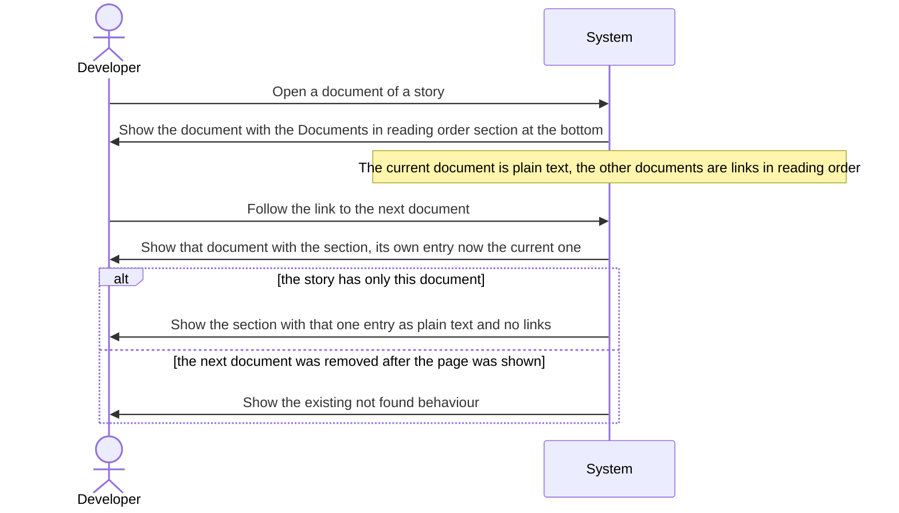
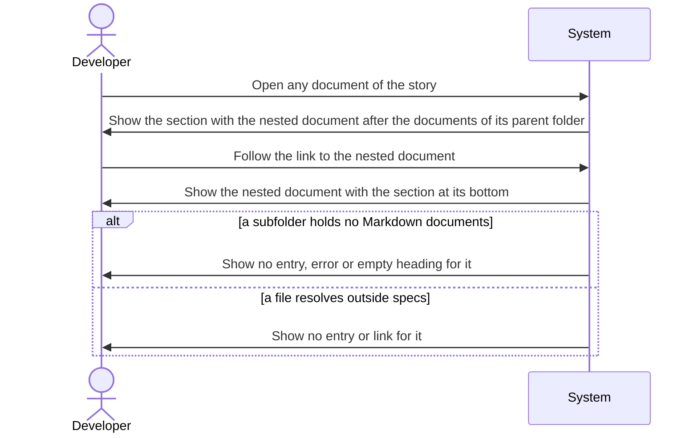
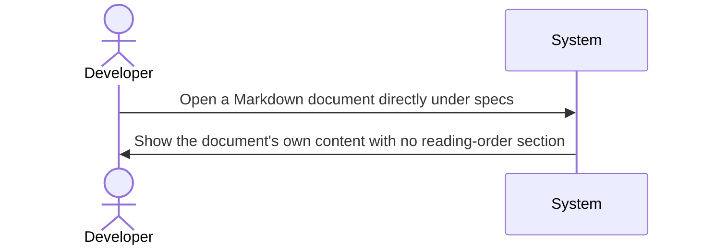

<!--
  STAGE 2 OF THE DEFINITION PIPELINE: WHAT must the system do?

  Gate: FUN-G01 to FUN-G16 (the Functional quality gate). Run `eil check --stage functional`.
  Approval: one recorded confirmation from the developer (or a person named in eil-config.yml),
  after the comprehension check has been taken on this version (`/speckit-eil-comprehend`).

  - Describe behaviour, not implementation. "Store it in PostgreSQL" belongs in the Technical stage.
  - Every functional requirement traces to an approved requirement or use case.
  - Tag any text the AI wrote with [ai-draft] until a human has reviewed it.
  - A section that does not apply is removed and listed under "Not applicable" with a reason.
-->

# Functional Specification: Reading-order navigation for story documents

## Requirements Traceability

| Requirement | Satisfied by |
| --- | --- |
| REQ-001 | FR-001, FR-002, FR-011, FR-017 |
| REQ-002 | FR-003 |
| REQ-003 | FR-007, FR-008, FR-009, NFR-001 |
| REQ-004 | FR-010 |
| REQ-005 | FR-002, FR-010, NFR-002 |
| REQ-006 | FR-012, FR-013 |
| REQ-007 | FR-014 |
| REQ-008 | FR-015 |
| REQ-009 | FR-016 |
| REQ-010 | NFR-003 |
| REQ-011 | FR-006 |
| REQ-012 | FR-004, FR-005 |
| UC-001 | FR-001, FR-010, FR-011 |
| UC-002 | FR-001, FR-003, FR-008, FR-011 |
| UC-003 | FR-012 |

## Actors

- **Developer**: reads and reviews the documents of a Spec Kit story in the viewer and follows the links in the reading-order section.

## Functional Requirements

**FR-001**: The system shall show, at the bottom of every document viewed from inside a story folder (`specs/<story>/`) at any depth, a section headed "Documents in reading order" that has one entry for every Markdown document in that story folder and all of its nested subfolders. (traces: REQ-001, UC-001, UC-002)

**FR-002**: The system shall present the section as a navigation region whose accessible name is "Documents in reading order", with its entries presented as a list, so that assistive technology can find the region, read the entries as a list and identify the current document. (traces: REQ-001, REQ-005)

**FR-003**: The system shall show each entry's document path relative to the story folder, without the file extension, so that a document in a nested folder is shown with its folder path. For a document without a stage the entry shows that path with the file name, as FR-005 completes; for a document with a stage the entry shows the folder path followed by the label that FR-004 sets in place of the file name. (traces: REQ-002, UC-002)

**FR-004**: The system shall show a document whose file name starts with a stage prefix, that is `s` followed by exactly two digits `NN` and a hyphen and then a name, as `[stage NN: <name>]`, where NN is the two-digit number of the prefix and `<name>` is the file name without the prefix and without the extension. The file name is not repeated, and any folder path before the file name is kept in front of the bracketed text. (traces: REQ-012)

**FR-005**: The system shall show a document without a stage prefix as its path relative to the story folder without the extension, followed by the marker `[ref doc: <name>]`, where `<name>` is the file name without the extension. (traces: REQ-012)

**FR-006**: The system shall treat `spec.md`, `plan.md` or `tasks.md` as an alias only when it is a symbolic link to a document with a stage in the same story, in the story folder or in a nested folder. It shall not list an alias as a separate entry; it shall instead show the alias file name in round brackets after the source document's entry, so that `s04-ai-spec.md` aliased by `spec.md` reads `[stage 04: ai-spec] (spec.md)`, and when a document has several aliases, one group of round brackets for each, in alphanumeric order. Any other file with one of those names is an ordinary document listed under its own name, for example `plan [ref doc: plan]`. (traces: REQ-011)

**FR-007**: The system shall order the entries deterministically, so that the same story gives the same order on every page view and every run, and shall compare numbers inside names by their numeric value, so that `s00`, `s01`, `s02` to `s09` and `s10` read in that order and `s10` does not come before `s02`. (traces: REQ-003)

**FR-008**: The system shall list the documents of a folder before the documents of its nested folders, so that a document in a nested folder is listed after every document of its parent folder, whether or not that document has a stage. (traces: REQ-003, UC-002)

**FR-009**: The system shall list, within each folder, the documents without a stage after the documents that have a stage, before that folder's nested folders, in alphanumeric order: case is ignored, numbers inside names are compared by their numeric value, and two names that differ only in case are ordered by their exact characters. This applies REQ-003's "documents without a stage follow all the documents that have a stage" within each folder, as decided in OQ-008, and so refines the requirement's wording rather than following it literally. (traces: REQ-003)

**FR-010**: The system shall include the document being viewed in the section and shall show its entry as plain text, not as a link, with `aria-current="page"`, and visually distinguished from the links by more than colour, the links being underlined and the plain text not. When the document is viewed through its alias (for example `spec.md`), the entry of its source document is the current one. No other entry carries `aria-current="page"`, and the same applies when the document being viewed is the only document in the story. (traces: REQ-004, REQ-005, REQ-011, UC-001)

**FR-011**: The system shall make every entry other than the current document a link that opens that document, and that link can be reached and followed with the keyboard. (traces: REQ-001, REQ-005, UC-001, UC-002)

**FR-012**: The system shall show no reading-order section on a Markdown document that lies directly under `specs/` and not inside a story folder. (traces: REQ-006, UC-003)

**FR-013**: The system shall never list in a story's section a document that belongs to another story, except a document that a symbolic link placed inside that story points to, which is allowed and is listed in the story that holds the link. The entry is labelled by the link's path relative to the story folder, and its link opens the document at its real path in the other story, so that page shows the other story's section, not this story's. (traces: REQ-006)

**FR-014**: The system shall list only documents that the viewer's existing document discovery and path resolution treat as reachable under `specs/`, and shall never list or link a file that resolves outside `specs/`. (traces: REQ-007)

**FR-015**: The system shall add no entry, no error and no empty heading for a story folder or nested folder that holds no Markdown documents, and shall show no broken section for a story whose folders are all empty. (traces: REQ-008)

**FR-016**: The system shall keep every feature the viewer has today working unchanged: reference tooltips and click-through, error marking of references, search, folder navigation and breadcrumbs, and Mermaid diagrams. (traces: REQ-009)

**FR-017**: The system shall show the section only at the bottom of document pages, and shall not add it to the folder navigation view, the search results or any other page. (traces: REQ-001, REQ-009)

## Use Cases and Scenarios

### UC-001: Developer reads a story from start to finish
- Preconditions: the story folder holds two or more Markdown documents, and the developer has opened one of them.
- Trigger: the developer reaches the bottom of the document.
- Main flow: the system shows the "Documents in reading order" section with every document of the story in order; the current document is plain text and underlined links lead to the others; the developer follows the link to the next document; that page shows the same section with its own entry now the current one.
- Alternative flows: the story holds only the current document, so the section shows that one entry as plain text and no links.
- Exception flows: a listed document was removed after the page was shown; following its link gives the viewer's existing not-found behaviour.
- Expected outcome: the developer moves through the story in its intended order without returning to the folder navigation.

### UC-002: Developer finds a nested document
- Preconditions: the story holds a document in a subfolder, and the developer has opened any document of that story.
- Trigger: the developer looks at the bottom of the page.
- Main flow: the nested document is listed with its path relative to the story folder, after all documents of its parent folder; the developer follows the link and the document opens with the section at its bottom.
- Alternative flows: the subfolder is empty, so nothing is listed for it.
- Exception flows: a file in the subfolder resolves outside `specs/`, so it is not listed.
- Expected outcome: the developer reaches the nested document from the section.

### UC-003: Developer reads a document directly under `specs/`
- Preconditions: a Markdown document lies directly under `specs/`.
- Trigger: the developer opens it.
- Main flow: the system shows the document's own content and no reading-order section.
- Alternative flows: none.
- Exception flows: none.
- Expected outcome: the page ends with the document's own content.

## Business Rules

- **Story membership**: a document belongs to the story whose folder directly under `specs/` contains it at any depth; a document directly under `specs/` belongs to no story. (traces: REQ-006)
- **Stage**: a document has a stage when its file name is `s`, exactly two digits, a hyphen and then a name (for example `s01-requirements.md`); any other document, such as `s1-x.md`, `s100-x.md`, `S01-x.md`, `s01_x.md` or `s01.md`, has no stage. (traces: REQ-003, REQ-012)
- **Ordering**: documents are ordered by natural order, with numbers compared by value. Each folder lists its documents with a stage first, then its documents without a stage in alphanumeric order (case ignored, numbers compared by value, names differing only in case ordered by their exact characters), and only then the contents of its nested folders, each nested folder following the same rule. Reading REQ-003's "documents without a stage follow all the documents that have a stage" as applying within each folder is the answer to OQ-008. (traces: REQ-003)
- **Alias**: an alias has the same content as a stage document and is shown only through its source document's entry. A file is an alias only when it is named `spec.md`, `plan.md` or `tasks.md` and is a symbolic link to a document with a stage in the same story; any other file with one of those names is an ordinary document. (traces: REQ-011)
- **Reachability**: only documents the viewer already considers reachable under `specs/` can be listed. (traces: REQ-007)

## Inputs

- **The document being viewed**: the path of a Markdown document under `specs/`, requested by the developer through the viewer as today; no new input is added.
- **The story's documents**: the Markdown documents in the story folder and its nested subfolders, whose names and folders define the entries.

## Outputs

- **The reading-order section**: at the bottom of a document page inside a story, a navigation region named "Documents in reading order" holding a list of entries. Each entry shows a label as set by FR-003 to FR-006; every entry except the current one is a link to that document; the current entry is plain text marked `aria-current="page"`.
- **No section**: a page for a document directly under `specs/`, the folder navigation view and the search results carry no such section.
- **Consumer**: the developer, through a web browser and any assistive technology.

## State and Workflow

The section holds no state of its own: it is worked out each time a document page is shown, from the documents the story holds at that moment. There are no states, transitions or terminal states to define.

## Validation

- **Valid**: a Markdown document inside a story folder, at any depth, that the viewer's existing discovery and path resolution treat as reachable under `specs/`, including one reached through a symbolic link placed inside the story.
- **Not listed**: a file that is not a Markdown document, a file that resolves outside `specs/`, and a folder that holds no Markdown documents.
- **Unchanged**: how the viewer treats a request for a path that is not valid, such as one outside `specs/`.

## Error and Exception Behaviour

- **Empty folder**: no entry, no error and no empty heading; a story whose folders are all empty shows no broken section. (traces: REQ-008)
- **File resolving outside `specs/`**: never listed or linked, with no error shown for it. (traces: REQ-007)
- **Stale list**: a page can show a list that no longer matches the story after a document is added, renamed or removed; the developer reloads the page to see the current list. (traces: REQ-001)
- **Listed document no longer there**: following its link gives the viewer's existing not-found behaviour, unchanged. (traces: REQ-009)
- **Story with one document**: the section shows only the current document as plain text, and the page still has its navigation region. (traces: REQ-004)

## Security and Access Behaviour

- The viewer's existing path resolution is the only way a document is found or opened for the section, so nothing outside `specs/` is read, listed or shown. (traces: REQ-007)
- A symbolic link inside a story to a document elsewhere under `specs/` is allowed; one resolving outside `specs/` is not listed. (traces: REQ-006, REQ-007)
- The section adds no authentication, no authorisation and no new access to data: the viewer has the developer as its only user today. (traces: REQ-009)

## Non-Functional Requirements

**NFR-001**: The order of the entries is the same for the same story on every page view and every run, independent of the order in which the files were created or the order in which the file system returns them. (traces: REQ-003)

**NFR-002**: The section is accessible: it is a navigation region with the accessible name "Documents in reading order", its entries are a list, its links can be reached and followed with the keyboard alone, the current document is identifiable to assistive technology, and the section has high visual contrast, meaning a contrast ratio of at least 4.5:1 between the text colour and the background for both the links and the plain-text current entry. (traces: REQ-005)

**NFR-003**: Automated tests cover nested documents, ordering, the current-document state, isolation between stories, documents directly under `specs/`, empty folders, path safety, aliased documents and the entry label formats, and the existing tests keep passing. (traces: REQ-010, REQ-009)

## Acceptance Criteria

- Given a story with `s00`, `s01`, `s02` and `s10` documents, when any of them is opened, the section lists them in the order `s00`, `s01`, `s02`, `s10`. (REQ-003)
- Given a story with a document in a nested folder, when any document of the story is opened, the nested document is listed with its path relative to the story folder, after all documents of its parent folder, and its link opens it. (REQ-001, REQ-002, REQ-003, UC-002)
- Given the same story opened twice, in two runs, the entries appear in the same order. (REQ-003)
- Given `s01-requirements.md`, its entry reads `[stage 01: requirements]`; given `notes.md`, its entry reads `notes [ref doc: notes]`. (REQ-012)
- Given a stage document aliased by `spec.md` (a symbolic link to it), the alias is not a separate entry and its name appears in round brackets after the source document's entry, as `[stage 04: ai-spec] (spec.md)`. (REQ-011)
- Given a `plan.md` that is a regular file, or a link to a document without a stage or in another story, it is listed as an ordinary document, `plan [ref doc: plan]`. (REQ-011)
- Given a folder with documents with and without a stage and a nested folder, the folder lists its documents with a stage, then its documents without a stage in alphanumeric order, and only then the contents of the nested folder. (REQ-003)
- Given documents without a stage named `README.md`, `Notes.md`, `data-model.md` and `file10.md` and `file2.md`, they are listed as `data-model`, `file2`, `file10`, `Notes`, `README`. (REQ-003)
- Given any story document being viewed, its entry has `aria-current="page"`, is plain text without a link, is not underlined while the links are, and no other entry has `aria-current="page"`. (REQ-004)
- Given a document viewed through its alias, the source document's entry is the current one, and no entry links to the page being viewed. (REQ-004, REQ-011)
- Given a story with one document, the section shows that one entry as plain text. (REQ-004)
- Given the section, it is a navigation region named "Documents in reading order", holding a list, and every link can be reached and followed with the keyboard. (REQ-005)
- Given the links and the plain-text current entry, the contrast ratio between their text colour and the background is at least 4.5:1. (REQ-005)
- Given a Markdown document directly under `specs/`, its page has no reading-order section. (REQ-006, UC-003)
- Given two stories, A and B, neither story's section lists a document of the other, except one reached through a symbolic link placed in that story. (REQ-006)
- Given a symbolic link in story A to `specs/B/s01-x.md`, A's section lists it under the link's path, and following it opens the document at its real path in B, whose page shows B's section. (REQ-006)
- Given a symbolic link in a story to a file outside `specs/`, that file is neither listed nor linked. (REQ-007)
- Given a story with an empty folder, the page shows no error, no entry and no empty heading for it. (REQ-008)
- Given the viewer's existing features, they behave as before and the existing tests pass. (REQ-009)

## Sequence Diagrams

**ART-002**: Developer reads a story from start to finish (traces: UC-001, FR-001, FR-007, FR-010, FR-011)



**ART-003**: Developer finds a nested document (traces: UC-002, FR-001, FR-003, FR-008, FR-014, FR-015)



**ART-004**: Developer reads a document directly under specs (traces: UC-003, FR-012, FR-017)



## Open Questions

**OQ-006**: Where does the alias file name sit in an entry that also carries a stage marker? For `s04-ai-spec.md` aliased by `spec.md`, should the entry read `[stage 04: ai-spec] [spec.md]`, `[stage 04: ai-spec] (spec.md)`, or something else, and how are two aliases of one document written? (status: resolved) Answer (Lee Sinclair): B, `[stage 04: ai-spec] (spec.md)`: the alias file name goes after the entry in round brackets. How two aliases of one document are written was not answered and is asked again in OQ-009. (material: yes)

**OQ-007**: What counts as a stage prefix? Only `s` followed by exactly two digits and a hyphen (`s01-requirements.md`), or also `s1-x.md`, `s100-x.md`, `S01-x.md`, `s01_x.md`, or a file named just `s01.md` with nothing after the prefix? (status: resolved) Answer (Lee Sinclair): A, the narrow rule: a stage prefix is `s` followed by exactly two digits and a hyphen, then a name; `s1-x.md`, `s100-x.md`, `S01-x.md`, `s01_x.md` and `s01.md` have no stage. (material: yes)

**OQ-008**: REQ-003 puts documents without a stage after "all the documents that have a stage" and also puts a folder's documents before its nested folders' documents. If the story folder holds `notes.md` (no stage) and a nested folder holds `s01-x.md` (staged), which comes first? (status: resolved) Answer (Lee Sinclair): A, folder first and stage within each folder: each folder lists its staged documents and then its documents without a stage, and its nested folders follow. (material: yes)

**OQ-009**: How is an alias recognised: any file named `spec.md`, `plan.md` or `tasks.md`, or only a symbolic link to another document of the same story? What happens to such a file that is a regular file, or a link whose source is missing or lies in another story, and to one in a nested folder? How is an entry written when one document has two aliases (not answered in OQ-006)? (status: resolved) Answer (Lee Sinclair): A, an alias is a file named `spec.md`, `plan.md` or `tasks.md` that is a symbolic link to a document with a stage in the same story; every other file with one of those names is an ordinary document listed under its own name; the same rule applies in a nested folder. The form for two aliases of one document was proposed, not answered: see FR-006. (material: yes)

**OQ-010**: When the developer views a document through its alias (opens `spec.md`), is the source document's entry the current one, shown as plain text with `aria-current="page"`? (status: resolved) Answer (Lee Sinclair): A, the source document's entry is the current one, as plain text with `aria-current="page"`, and no entry is a link to the page being viewed. (material: yes)

**OQ-011**: For documents without a stage, does the alphanumeric order ignore case (`Notes.md` beside `notes.md`), and are numbers inside those names compared by value (`file2.md` before `file10.md`) as they are for stage numbers? (status: resolved) Answer (Lee Sinclair): A, case is ignored, so `data-model`, `Notes`, `README` and `research` sort as `data-model`, `Notes`, `README`, `research`; two names that differ only in case are ordered by their exact characters so the order never varies. Numbers inside names compare by value, as REQ-003 states. (material: yes)

**OQ-012**: What counts as "high visual contrast" for the section: a stated minimum contrast ratio between text and background (for example 7:1), or the browser's high-contrast mode, or a judgement on inspection? (status: resolved) Answer (Lee Sinclair): B, a contrast ratio of at least 4.5:1 between the text colour and the background, for both the links and the plain-text current entry. (material: yes)

## Not applicable

- Audit and Compliance Behaviour: the viewer keeps no audit trail and the story states no compliance requirement.
- Wireframes: the developer has decided that no wireframe is provided for this story; the look of the section is described in words by FR-004, FR-010 and NFR-002.

## Challenges

<!-- Recorded by `eil challenge`. -->

```eil:challenge
{
  "id": "CH-006",
  "stage": "functional",
  "raised_by": "ai",
  "raised_at": "2026-10-01T12:25:51Z",
  "target": "FR-013",
  "text": "FR-013 allows a story to list a document reached through a symbolic link that points into another story, but does not say which page the entry opens: the document at the link's path inside this story (so the page shows this story's section, with this entry current) or the document at its real path in the other story (so the page shows the other story's section, and this story's entry is no longer current). The current-document rule in FR-010 and the order in FR-007 depend on the answer; please state which.",
  "status": "closed",
  "severity": "medium",
  "responder": "Lee Sinclair",
  "response": "accepted",
  "at": "2026-10-01T12:38:48Z",
  "reason": "B"
}
```

```eil:challenge
{
  "id": "CH-007",
  "stage": "functional",
  "raised_by": "ai",
  "raised_at": "2026-10-01T12:44:19Z",
  "target": "FR-003",
  "text": "FR-003 says every entry shows the document's path relative to the story folder without the extension, but FR-004 shows a staged document as [stage NN: <name>] without its file name, so a staged entry does not show 's01-requirements'. Say that FR-003 gives the folder path and the name for documents without a stage only, and that FR-004 sets the whole label for a staged document, or word FR-003 so the two cannot be read as conflicting.",
  "status": "closed",
  "severity": "medium",
  "responder": "Lee Sinclair",
  "response": "accepted",
  "at": "2026-10-01T12:45:53Z"
}
```

```eil:challenge
{
  "id": "CH-008",
  "stage": "functional",
  "raised_by": "ai",
  "raised_at": "2026-10-01T12:44:20Z",
  "target": "FR-009",
  "text": "FR-008 and FR-009 order documents within each folder, as decided in OQ-008, but the approved REQ-003 and its Success Criteria still say documents without a stage follow all the documents that have a stage, which would put a nested folder's staged document before a parent folder's unstaged document. The requirement text and the functional text disagree. Either correct REQ-003 through a backwards correction, or accept that the functional specification refines it and say so.",
  "status": "closed",
  "severity": "medium",
  "responder": "Lee Sinclair",
  "response": "accepted",
  "at": "2026-10-01T12:45:53Z"
}
```

## Overrides

<!-- Recorded by `eil override`, each naming who, what and why. -->

## Change Log

<!-- eil:begin changelog -->
<!-- eil:end changelog -->

## Record

<!-- eil:begin provenance -->
```json
{
  "version": 1,
  "blocks": {
    "Requirements Traceability#b80ca08ee128": {
      "hash": "sha256:b80ca08ee1282bd0cae28363c70653bc1097635ee5a43e62c4cf0fa5e78d40f4",
      "class": "inferred",
      "adds": "A table mapping each requirement and use case to the functional requirements that satisfy it.",
      "reviewed": {
        "by": "Lee Sinclair",
        "at": "2026-10-01T12:43:23Z",
        "list": "RVW-003",
        "reply": "Approve all the above inferred. There is no qorefram to provide add an exclusion"
      }
    },
    "Actors#ffacdee6ff85": {
      "hash": "sha256:ffacdee6ff85e9dc79bef93d4718fe4055a146c88af2bfc2b98f492580c2ae8f",
      "class": "inferred",
      "adds": "Names the Developer as the one actor, taken from Users and Stakeholders.",
      "reviewed": {
        "by": "Lee Sinclair",
        "at": "2026-10-01T12:43:23Z",
        "list": "RVW-003",
        "reply": "Approve all the above inferred. There is no qorefram to provide add an exclusion"
      }
    },
    "FR-001": {
      "hash": "sha256:9b8829cba27184e4e9004fc0ba4af995bb30d52c81be952f804b2817d4ed7a36",
      "class": "restated",
      "cites": {
        "REQ-001": "sha256:256ed10c2afe9e022501c4f25204361be56ca8ebe3e3b4e74b6738c84ce8c568",
        "UC-001": "sha256:39bc034f14596d29449003ea963e3a0b3f51215ee9e15e11c5fef4ae2aaed9ab",
        "UC-002": "sha256:98a48e376358abb62b44feb49ed89036461de691abb57208c9127ef4e0918d00"
      }
    },
    "FR-002": {
      "hash": "sha256:32dc804048b7e426e532d1b98c0fc50d4ebdb1ebea550a3caa6e72002e6f2e6f",
      "class": "restated",
      "cites": {
        "REQ-001": "sha256:256ed10c2afe9e022501c4f25204361be56ca8ebe3e3b4e74b6738c84ce8c568",
        "REQ-005": "sha256:05e5b7ff7f62222173552749b93cd16789de08c57b13afb8171919152c976b57"
      }
    },
    "FR-003": {
      "hash": "sha256:197f0e7bf32d3fffc1d86caf9e93b21576f2146c4b96744d98b9195835da670b",
      "class": "inferred",
      "adds": "Says that a staged entry shows the folder path followed by the FR-004 label in place of the file name, from the answer to CH-007.",
      "reviewed": {
        "by": "Lee Sinclair",
        "at": "2026-10-01T12:47:33Z",
        "list": "RVW-004",
        "reply": "Approve both"
      }
    },
    "FR-004": {
      "hash": "sha256:9351afecec6d138f345d4b8a50128f10215e41705620c6441d15ebeb92e564a8",
      "class": "inferred",
      "adds": "Defines the stage prefix as s, exactly two digits and a hyphen, from the answer to OQ-007.",
      "reviewed": {
        "by": "Lee Sinclair",
        "at": "2026-10-01T12:43:23Z",
        "list": "RVW-003",
        "reply": "Approve all the above inferred. There is no qorefram to provide add an exclusion"
      }
    },
    "FR-005": {
      "hash": "sha256:65cffe4e76d287540239f49d99854034164b552e04e3a5f968efbc820d0fc590",
      "class": "inferred",
      "adds": "Combines REQ-002 and REQ-012 to say an unstaged entry in a nested folder shows its folder path before the name and the marker.",
      "reviewed": {
        "by": "Lee Sinclair",
        "at": "2026-10-01T12:43:23Z",
        "list": "RVW-003",
        "reply": "Approve all the above inferred. There is no qorefram to provide add an exclusion"
      }
    },
    "FR-006": {
      "hash": "sha256:3e514e8dfd04bc478e405c56c902c4d400ee8620a0edc9f5da1d311dea49978d",
      "class": "inferred",
      "adds": "Defines an alias as a symbolic link to a stage document in the same story (OQ-009), uses round brackets (OQ-006) and proposes one bracket group per alias for several aliases, which the human has not answered.",
      "reviewed": {
        "by": "Lee Sinclair",
        "at": "2026-10-01T12:43:23Z",
        "list": "RVW-003",
        "reply": "Approve all the above inferred. There is no qorefram to provide add an exclusion"
      }
    },
    "FR-007": {
      "hash": "sha256:7bcffe16420753854d6ef411e7c3099f58fe40bf91b17e707680884c894d989d",
      "class": "restated",
      "cites": {
        "REQ-003": "sha256:aedb4376fbb5fa1aa745d236c36bf0e638196fe7604260ebfc5adba12d358b9e"
      }
    },
    "FR-008": {
      "hash": "sha256:1efd77e47f9d55a3f735dac2b82d9d1534cd786f60fffcd8463bf2a28f8da6c6",
      "class": "inferred",
      "adds": "Applies the folder-before-nested-folder rule whether or not the document has a stage, from the answer to OQ-008.",
      "reviewed": {
        "by": "Lee Sinclair",
        "at": "2026-10-01T12:43:23Z",
        "list": "RVW-003",
        "reply": "Approve all the above inferred. There is no qorefram to provide add an exclusion"
      }
    },
    "FR-009": {
      "hash": "sha256:ac1727d2ea6122e201b9f35a77530ece91dba013c30ac656bc80c791a5884aa5",
      "class": "inferred",
      "adds": "Says the ordering applies REQ-003's staged-before-unstaged rule within each folder and so refines the requirement's wording, from the answer to CH-008.",
      "reviewed": {
        "by": "Lee Sinclair",
        "at": "2026-10-01T12:47:33Z",
        "list": "RVW-004",
        "reply": "Approve both"
      }
    },
    "FR-010": {
      "hash": "sha256:8aa5f448ddb370a99dcbb5281add4a0106cbb03152c32325dd17c921f07fe781",
      "class": "inferred",
      "adds": "Says that viewing a document through its alias makes the source entry current, from the answer to OQ-010.",
      "reviewed": {
        "by": "Lee Sinclair",
        "at": "2026-10-01T12:43:23Z",
        "list": "RVW-003",
        "reply": "Approve all the above inferred. There is no qorefram to provide add an exclusion"
      }
    },
    "FR-011": {
      "hash": "sha256:0ca8c3df85b82bec17637d1f09bab4668b4bd26b3337664b6990b103bab3b0ec",
      "class": "inferred",
      "adds": "States that every non-current entry is a link that opens that document, which REQ-001 and REQ-005 imply.",
      "reviewed": {
        "by": "Lee Sinclair",
        "at": "2026-10-01T12:43:23Z",
        "list": "RVW-003",
        "reply": "Approve all the above inferred. There is no qorefram to provide add an exclusion"
      }
    },
    "FR-012": {
      "hash": "sha256:c398b73a4cbf412ded409ed8f094ae59ed47616c7a4bca37420906c7d2f7291c",
      "class": "restated",
      "cites": {
        "REQ-006": "sha256:e517cbec32193438afe0b76b99eb5cc9d95f0fce65987fc63aa5d8ee7f783a47",
        "UC-003": "sha256:e47e99898085ee543414e29d1821cf2de70b134f24d206a2cd379c24a9e577c6"
      }
    },
    "FR-013": {
      "hash": "sha256:38d94ad5c0f0b784877847af344fd77e14f9941ad73bbc98a535b7942b21e73a",
      "class": "inferred",
      "adds": "Says the symbolic-link entry is labelled by the link's path and opens the document at its real path in the other story, from the answer to CH-006.",
      "reviewed": {
        "by": "Lee Sinclair",
        "at": "2026-10-01T12:43:23Z",
        "list": "RVW-003",
        "reply": "Approve all the above inferred. There is no qorefram to provide add an exclusion"
      }
    },
    "FR-014": {
      "hash": "sha256:ad118cfdcba914b6dcced02aeaa12e219170b3d9b9b64e1cb3ae800f2cf133cd",
      "class": "restated",
      "cites": {
        "REQ-007": "sha256:bb73c59fe2c6e1a8dc4e62a7718608d9cc9c9b2c1ca3dc4e1b8d91b8ace51041"
      }
    },
    "FR-015": {
      "hash": "sha256:f1d6d8705d95ac71564ee91d3882b78a9adc9ded77660d8d1531a57c74db3bb0",
      "class": "restated",
      "cites": {
        "REQ-008": "sha256:f70bd5a6e36b3acdc1e0ef4100073132fb4a46ffcc099383dc4bc14f247254fe"
      }
    },
    "FR-016": {
      "hash": "sha256:ea3570068dfeaaa7dda913bd48c48be6dd4a84a8b69fe0e06859657edfaeb67d",
      "class": "restated",
      "cites": {
        "REQ-009": "sha256:726e06a357ca16e93d7ddde707c7d9b1a7a0d583ae14dfc677a33b7b0efa370c"
      }
    },
    "FR-017": {
      "hash": "sha256:1dd105d6d7f7eac38abd4ce9c97be3e06a173c742a3cb34e6d0bcf1e15376376",
      "class": "inferred",
      "adds": "Says the section appears only on document pages and not on the folder navigation view or search results, drawn from the out-of-scope list.",
      "reviewed": {
        "by": "Lee Sinclair",
        "at": "2026-10-01T12:43:23Z",
        "list": "RVW-003",
        "reply": "Approve all the above inferred. There is no qorefram to provide add an exclusion"
      }
    },
    "Use Cases and Scenarios#2836a0ed7600": {
      "hash": "sha256:2836a0ed7600ad43b3434e48417bcfd38ee889cac09f4f0f29c0145508999f21",
      "class": "inferred",
      "adds": "Adds preconditions, main, alternative and exception flows to UC-001, including a removed document and a single-document story.",
      "reviewed": {
        "by": "Lee Sinclair",
        "at": "2026-10-01T12:43:23Z",
        "list": "RVW-003",
        "reply": "Approve all the above inferred. There is no qorefram to provide add an exclusion"
      }
    },
    "Use Cases and Scenarios#6cd692853fd3": {
      "hash": "sha256:6cd692853fd331d0d2f3240d5eefa99408b7bb3a91078887ccefaca404e3f8d5",
      "class": "inferred",
      "adds": "Adds preconditions, flows and exceptions to UC-002, including an empty subfolder and a file resolving outside specs.",
      "reviewed": {
        "by": "Lee Sinclair",
        "at": "2026-10-01T12:43:23Z",
        "list": "RVW-003",
        "reply": "Approve all the above inferred. There is no qorefram to provide add an exclusion"
      }
    },
    "Use Cases and Scenarios#f9ea34676bfe": {
      "hash": "sha256:f9ea34676bfef50b9db0e2b3e9ac2b89bd23958c75561a93fd5aa5445d5a8072",
      "class": "inferred",
      "adds": "Adds preconditions and flows to UC-003.",
      "reviewed": {
        "by": "Lee Sinclair",
        "at": "2026-10-01T12:43:23Z",
        "list": "RVW-003",
        "reply": "Approve all the above inferred. There is no qorefram to provide add an exclusion"
      }
    },
    "Business Rules#73293f1173fa": {
      "hash": "sha256:73293f1173fa4aba5203a51755311743124f95da070ce6222c1e24c8b2676e8d",
      "class": "inferred",
      "adds": "Restates the membership, stage, ordering, current-document, alias and reachability rules as explicit rules and points to the open questions that affect them."
    },
    "Inputs#9d7e31e04e74": {
      "hash": "sha256:9d7e31e04e74e953d2f1155cbfcbeab3114bce896cf15193eb11dba045f7718f",
      "class": "inferred",
      "adds": "States that the only input is the document being viewed and the story's documents.",
      "reviewed": {
        "by": "Lee Sinclair",
        "at": "2026-10-01T12:43:23Z",
        "list": "RVW-003",
        "reply": "Approve all the above inferred. There is no qorefram to provide add an exclusion"
      }
    },
    "Outputs#e1ef946f075a": {
      "hash": "sha256:e1ef946f075a900e0ba665304a8fe56a5ba929b3c44ad1cf49baf6426d98cc4c",
      "class": "inferred",
      "adds": "Describes the section, the pages that carry no section and the consumer.",
      "reviewed": {
        "by": "Lee Sinclair",
        "at": "2026-10-01T12:43:23Z",
        "list": "RVW-003",
        "reply": "Approve all the above inferred. There is no qorefram to provide add an exclusion"
      }
    },
    "State and Workflow#2cee14c8814e": {
      "hash": "sha256:2cee14c8814e3a05fbbe850b992b10639496940f62d9a20d9f920a0c74982162",
      "class": "inferred",
      "adds": "States that the section holds no state.",
      "reviewed": {
        "by": "Lee Sinclair",
        "at": "2026-10-01T12:43:23Z",
        "list": "RVW-003",
        "reply": "Approve all the above inferred. There is no qorefram to provide add an exclusion"
      }
    },
    "Validation#d339929ad7c5": {
      "hash": "sha256:d339929ad7c56f4db20e12ccbac72493a86e823b7a5ca9331a25d55679288832",
      "class": "inferred",
      "adds": "Lists what is listed, not listed and left unchanged.",
      "reviewed": {
        "by": "Lee Sinclair",
        "at": "2026-10-01T12:43:23Z",
        "list": "RVW-003",
        "reply": "Approve all the above inferred. There is no qorefram to provide add an exclusion"
      }
    },
    "Error and Exception Behaviour#5e13c67cede1": {
      "hash": "sha256:5e13c67cede17ac28aa0886916ce567eda627a463f5cfac1bc747852c28ee455",
      "class": "inferred",
      "adds": "Adds that a document removed after the page was shown follows the existing not-found behaviour, and that a one-document story still shows its navigation region.",
      "reviewed": {
        "by": "Lee Sinclair",
        "at": "2026-10-01T12:43:23Z",
        "list": "RVW-003",
        "reply": "Approve all the above inferred. There is no qorefram to provide add an exclusion"
      }
    },
    "Security and Access Behaviour#895d69faf028": {
      "hash": "sha256:895d69faf02899092ed1384a0eb71e52459e07a3fb1ca5beb97d90f3f6393bbd",
      "class": "inferred",
      "adds": "States that the section adds no authentication, authorisation or data access.",
      "reviewed": {
        "by": "Lee Sinclair",
        "at": "2026-10-01T12:43:23Z",
        "list": "RVW-003",
        "reply": "Approve all the above inferred. There is no qorefram to provide add an exclusion"
      }
    },
    "NFR-001": {
      "hash": "sha256:df17800aee3588d157d4116760d6c0ac8b1aaaf338acd002ab064f7c755650e9",
      "class": "inferred",
      "adds": "Adds that the order is independent of file creation order and file system order.",
      "reviewed": {
        "by": "Lee Sinclair",
        "at": "2026-10-01T12:43:23Z",
        "list": "RVW-003",
        "reply": "Approve all the above inferred. There is no qorefram to provide add an exclusion"
      }
    },
    "NFR-002": {
      "hash": "sha256:b6d43217718ec3585d21c7e35c03545369d59141a6cd7f07acb47100eef1826b",
      "class": "inferred",
      "adds": "Sets high visual contrast as a ratio of at least 4.5:1, from the answer to OQ-012.",
      "reviewed": {
        "by": "Lee Sinclair",
        "at": "2026-10-01T12:43:23Z",
        "list": "RVW-003",
        "reply": "Approve all the above inferred. There is no qorefram to provide add an exclusion"
      }
    },
    "NFR-003": {
      "hash": "sha256:38473b65fca10e09faa1982b8eee81daace9150eebf3baefbaa5e7209036eabf",
      "class": "restated",
      "cites": {
        "REQ-010": "sha256:aeba84bc66554b71b5aa5286cde9cbe4906cc3b0b502f744baa1561c4f22890a",
        "REQ-009": "sha256:726e06a357ca16e93d7ddde707c7d9b1a7a0d583ae14dfc677a33b7b0efa370c"
      }
    },
    "Acceptance Criteria#9eafd2b3be39": {
      "hash": "sha256:9eafd2b3be39473b75b812082716d4fbdd1e087d534071a15891a0070edb067e",
      "class": "inferred",
      "adds": "Turns each requirement into a given/when/then condition."
    },
    "ART-002": {
      "hash": "sha256:838fefba764faf33481f62a05116992002aab4302863b86d1bb9d36d421be3b0",
      "class": "inferred",
      "adds": "Sequence diagram for UC-001 with a single-document and a removed-document branch.",
      "reviewed": {
        "by": "Lee Sinclair",
        "at": "2026-10-01T12:43:23Z",
        "list": "RVW-003",
        "reply": "Approve all the above inferred. There is no qorefram to provide add an exclusion"
      }
    },
    "ART-003": {
      "hash": "sha256:4de5457a0b5bfa6ddea42f1d85df6e68891e5fcdd4e063054d9a130882c55a6e",
      "class": "inferred",
      "adds": "Sequence diagram for UC-002 with an empty-folder and an outside-specs branch.",
      "reviewed": {
        "by": "Lee Sinclair",
        "at": "2026-10-01T12:43:23Z",
        "list": "RVW-003",
        "reply": "Approve all the above inferred. There is no qorefram to provide add an exclusion"
      }
    },
    "ART-004": {
      "hash": "sha256:83f9249852f7a21d3cdb6d99a2f40ae2cdda500c21f45597f0402513bd982847",
      "class": "inferred",
      "adds": "Sequence diagram for UC-003.",
      "reviewed": {
        "by": "Lee Sinclair",
        "at": "2026-10-01T12:43:23Z",
        "list": "RVW-003",
        "reply": "Approve all the above inferred. There is no qorefram to provide add an exclusion"
      }
    },
    "Wireframes#124e7c3c584b": {
      "hash": "sha256:124e7c3c584b298641a1be7f8596871412c7ca1b83f199e27bb012054218144f",
      "class": "inferred",
      "adds": "Says the story needs wireframes and that none is drawn or linked yet."
    },
    "ART-005": {
      "hash": "sha256:8d0ecd9c6390679e31de309025b7becd2b518e51186cd03fcb675c4e4db76797",
      "class": "inferred",
      "adds": "Lists the default document page as a screen needing a wireframe."
    },
    "ART-006": {
      "hash": "sha256:09313a125110614509ba5f8d0ee01c546a898df0326986df8d088a6039b966ec",
      "class": "inferred",
      "adds": "Lists the single-document page as a screen needing a wireframe."
    },
    "OQ-006": {
      "hash": "sha256:4b51de96d856f832bff07912b423b8bebd3659f74bcbe95121397a06a7db98a5",
      "class": "inferred",
      "adds": "Question the requirements do not answer, now answered by the human.",
      "reviewed": {
        "by": "Lee Sinclair",
        "at": "2026-10-01T12:43:23Z",
        "list": "RVW-003",
        "reply": "Approve all the above inferred. There is no qorefram to provide add an exclusion"
      }
    },
    "OQ-007": {
      "hash": "sha256:a28bc50e08940e184d6a727914c362d490a30f44562fb433ef14741d43f06b14",
      "class": "inferred",
      "adds": "Question the requirements do not answer, now answered by the human.",
      "reviewed": {
        "by": "Lee Sinclair",
        "at": "2026-10-01T12:43:23Z",
        "list": "RVW-003",
        "reply": "Approve all the above inferred. There is no qorefram to provide add an exclusion"
      }
    },
    "OQ-008": {
      "hash": "sha256:8fb7494e0884c04416ff7f88ce32f833c6484884f129c4ed0f948125806d6716",
      "class": "inferred",
      "adds": "Question the requirements do not answer, now answered by the human.",
      "reviewed": {
        "by": "Lee Sinclair",
        "at": "2026-10-01T12:43:23Z",
        "list": "RVW-003",
        "reply": "Approve all the above inferred. There is no qorefram to provide add an exclusion"
      }
    },
    "OQ-009": {
      "hash": "sha256:7adbd2f796e93225eb22b33a80ea195366903c2468950fb69434cbcff9cf3b91",
      "class": "inferred",
      "adds": "Question the requirements do not answer, now answered by the human.",
      "reviewed": {
        "by": "Lee Sinclair",
        "at": "2026-10-01T12:43:23Z",
        "list": "RVW-003",
        "reply": "Approve all the above inferred. There is no qorefram to provide add an exclusion"
      }
    },
    "OQ-010": {
      "hash": "sha256:c85ecc08cfbf4b5bebbfde732a13587524e8be27872f0a62fc2048080af5f2e2",
      "class": "inferred",
      "adds": "Question the requirements do not answer, now answered by the human.",
      "reviewed": {
        "by": "Lee Sinclair",
        "at": "2026-10-01T12:43:23Z",
        "list": "RVW-003",
        "reply": "Approve all the above inferred. There is no qorefram to provide add an exclusion"
      }
    },
    "OQ-011": {
      "hash": "sha256:d07071bc1f308e3962d5aff62b9a0ea21e21921038313e00a278c11df440923d",
      "class": "inferred",
      "adds": "Question the requirements do not answer, now answered by the human.",
      "reviewed": {
        "by": "Lee Sinclair",
        "at": "2026-10-01T12:43:23Z",
        "list": "RVW-003",
        "reply": "Approve all the above inferred. There is no qorefram to provide add an exclusion"
      }
    },
    "OQ-012": {
      "hash": "sha256:718ef40037a7378c107728bcab3ecc2217d0046733a8733571dc0fef11ea2c32",
      "class": "inferred",
      "adds": "Question the requirements do not answer, now answered by the human.",
      "reviewed": {
        "by": "Lee Sinclair",
        "at": "2026-10-01T12:43:23Z",
        "list": "RVW-003",
        "reply": "Approve all the above inferred. There is no qorefram to provide add an exclusion"
      }
    },
    "Not applicable#a0d1e48a9e94": {
      "hash": "sha256:a0d1e48a9e946a4745b61a3412b71bd742758312b20234514c31f6945ae739ce",
      "class": "inferred",
      "adds": "Removes the Audit and Compliance section because the viewer keeps no audit trail, and the Wireframes section because the developer decided no wireframe is provided."
    },
    "Business Rules#7fcf77525eba": {
      "hash": "sha256:7fcf77525ebacdaac2456e5b2a0a40630fc9faa006de56d603f355f6a43d4212",
      "class": "inferred",
      "adds": "Restates the membership, stage, ordering, current-document, alias and reachability rules as explicit rules and points to the open questions that affect them.",
      "reviewed": {
        "by": "Lee Sinclair",
        "at": "2026-10-01T12:43:23Z",
        "list": "RVW-003",
        "reply": "Approve all the above inferred. There is no qorefram to provide add an exclusion"
      }
    },
    "Acceptance Criteria#c415a5edf6f4": {
      "hash": "sha256:c415a5edf6f4bf20eb0aced1f77ec768da145145bfdad066270bd50dd3558511",
      "class": "inferred",
      "adds": "Turns each requirement into a given/when/then condition.",
      "reviewed": {
        "by": "Lee Sinclair",
        "at": "2026-10-01T12:43:23Z",
        "list": "RVW-003",
        "reply": "Approve all the above inferred. There is no qorefram to provide add an exclusion"
      }
    },
    "Not applicable#b7fe6c9f91d0": {
      "hash": "sha256:b7fe6c9f91d0f97283e1adf6d11e82aa7d92b717c210157f4208f083ed7e90ac",
      "class": "inferred",
      "adds": "Removes the Audit and Compliance section because the viewer keeps no audit trail, and the Wireframes section because the developer decided no wireframe is provided.",
      "reviewed": {
        "by": "Lee Sinclair",
        "at": "2026-10-01T12:43:23Z",
        "list": "RVW-003",
        "reply": "Approve all the above inferred. There is no qorefram to provide add an exclusion"
      }
    }
  },
  "acceptances": [
    {
      "id": "RVW-003",
      "stage": "functional",
      "kind": "inferred",
      "digest": "sha256:fb12a54e6a8fb2f0297aef212f6fa3ee9be480aef821f6e56b7e7a0c3eda43f4",
      "by": "Lee Sinclair",
      "at": "2026-10-01T12:43:23Z",
      "reply": "Approve all the above inferred. There is no qorefram to provide add an exclusion",
      "accepted": [
        "Requirements Traceability#b80ca08ee128",
        "Actors#ffacdee6ff85",
        "FR-004",
        "FR-005",
        "FR-006",
        "FR-008",
        "FR-009",
        "FR-010",
        "FR-011",
        "FR-013",
        "FR-017",
        "Use Cases and Scenarios#2836a0ed7600",
        "Use Cases and Scenarios#6cd692853fd3",
        "Use Cases and Scenarios#f9ea34676bfe",
        "Business Rules#7fcf77525eba",
        "Inputs#9d7e31e04e74",
        "Outputs#e1ef946f075a",
        "State and Workflow#2cee14c8814e",
        "Validation#d339929ad7c5",
        "Error and Exception Behaviour#5e13c67cede1",
        "Security and Access Behaviour#895d69faf028",
        "NFR-001",
        "NFR-002",
        "Acceptance Criteria#c415a5edf6f4",
        "ART-002",
        "ART-003",
        "ART-004",
        "OQ-006",
        "OQ-007",
        "OQ-008",
        "OQ-009",
        "OQ-010",
        "OQ-011",
        "OQ-012",
        "Not applicable#b7fe6c9f91d0"
      ],
      "except": [],
      "questioned": [],
      "reopened": [],
      "reason": null,
      "hashes": {
        "Requirements Traceability#b80ca08ee128": "sha256:b80ca08ee1282bd0cae28363c70653bc1097635ee5a43e62c4cf0fa5e78d40f4",
        "Actors#ffacdee6ff85": "sha256:ffacdee6ff85e9dc79bef93d4718fe4055a146c88af2bfc2b98f492580c2ae8f",
        "FR-004": "sha256:9351afecec6d138f345d4b8a50128f10215e41705620c6441d15ebeb92e564a8",
        "FR-005": "sha256:65cffe4e76d287540239f49d99854034164b552e04e3a5f968efbc820d0fc590",
        "FR-006": "sha256:3e514e8dfd04bc478e405c56c902c4d400ee8620a0edc9f5da1d311dea49978d",
        "FR-008": "sha256:1efd77e47f9d55a3f735dac2b82d9d1534cd786f60fffcd8463bf2a28f8da6c6",
        "FR-009": "sha256:1a509ed65c2f94fc6421e48b2eb601b68bca062523b6db2f9d587b5ada060927",
        "FR-010": "sha256:8aa5f448ddb370a99dcbb5281add4a0106cbb03152c32325dd17c921f07fe781",
        "FR-011": "sha256:0ca8c3df85b82bec17637d1f09bab4668b4bd26b3337664b6990b103bab3b0ec",
        "FR-013": "sha256:38d94ad5c0f0b784877847af344fd77e14f9941ad73bbc98a535b7942b21e73a",
        "FR-017": "sha256:1dd105d6d7f7eac38abd4ce9c97be3e06a173c742a3cb34e6d0bcf1e15376376",
        "Use Cases and Scenarios#2836a0ed7600": "sha256:2836a0ed7600ad43b3434e48417bcfd38ee889cac09f4f0f29c0145508999f21",
        "Use Cases and Scenarios#6cd692853fd3": "sha256:6cd692853fd331d0d2f3240d5eefa99408b7bb3a91078887ccefaca404e3f8d5",
        "Use Cases and Scenarios#f9ea34676bfe": "sha256:f9ea34676bfef50b9db0e2b3e9ac2b89bd23958c75561a93fd5aa5445d5a8072",
        "Business Rules#7fcf77525eba": "sha256:7fcf77525ebacdaac2456e5b2a0a40630fc9faa006de56d603f355f6a43d4212",
        "Inputs#9d7e31e04e74": "sha256:9d7e31e04e74e953d2f1155cbfcbeab3114bce896cf15193eb11dba045f7718f",
        "Outputs#e1ef946f075a": "sha256:e1ef946f075a900e0ba665304a8fe56a5ba929b3c44ad1cf49baf6426d98cc4c",
        "State and Workflow#2cee14c8814e": "sha256:2cee14c8814e3a05fbbe850b992b10639496940f62d9a20d9f920a0c74982162",
        "Validation#d339929ad7c5": "sha256:d339929ad7c56f4db20e12ccbac72493a86e823b7a5ca9331a25d55679288832",
        "Error and Exception Behaviour#5e13c67cede1": "sha256:5e13c67cede17ac28aa0886916ce567eda627a463f5cfac1bc747852c28ee455",
        "Security and Access Behaviour#895d69faf028": "sha256:895d69faf02899092ed1384a0eb71e52459e07a3fb1ca5beb97d90f3f6393bbd",
        "NFR-001": "sha256:df17800aee3588d157d4116760d6c0ac8b1aaaf338acd002ab064f7c755650e9",
        "NFR-002": "sha256:b6d43217718ec3585d21c7e35c03545369d59141a6cd7f07acb47100eef1826b",
        "Acceptance Criteria#c415a5edf6f4": "sha256:c415a5edf6f4bf20eb0aced1f77ec768da145145bfdad066270bd50dd3558511",
        "ART-002": "sha256:838fefba764faf33481f62a05116992002aab4302863b86d1bb9d36d421be3b0",
        "ART-003": "sha256:4de5457a0b5bfa6ddea42f1d85df6e68891e5fcdd4e063054d9a130882c55a6e",
        "ART-004": "sha256:83f9249852f7a21d3cdb6d99a2f40ae2cdda500c21f45597f0402513bd982847",
        "OQ-006": "sha256:4b51de96d856f832bff07912b423b8bebd3659f74bcbe95121397a06a7db98a5",
        "OQ-007": "sha256:a28bc50e08940e184d6a727914c362d490a30f44562fb433ef14741d43f06b14",
        "OQ-008": "sha256:8fb7494e0884c04416ff7f88ce32f833c6484884f129c4ed0f948125806d6716",
        "OQ-009": "sha256:7adbd2f796e93225eb22b33a80ea195366903c2468950fb69434cbcff9cf3b91",
        "OQ-010": "sha256:c85ecc08cfbf4b5bebbfde732a13587524e8be27872f0a62fc2048080af5f2e2",
        "OQ-011": "sha256:d07071bc1f308e3962d5aff62b9a0ea21e21921038313e00a278c11df440923d",
        "OQ-012": "sha256:718ef40037a7378c107728bcab3ecc2217d0046733a8733571dc0fef11ea2c32",
        "Not applicable#b7fe6c9f91d0": "sha256:b7fe6c9f91d0f97283e1adf6d11e82aa7d92b717c210157f4208f083ed7e90ac"
      }
    },
    {
      "id": "RVW-004",
      "stage": "functional",
      "kind": "inferred",
      "digest": "sha256:59030fffd18eaeac75dc929f0cfea7ce8c9d3235f776a1a6192d2df25ea94902",
      "by": "Lee Sinclair",
      "at": "2026-10-01T12:47:33Z",
      "reply": "Approve both",
      "accepted": [
        "FR-003",
        "FR-009"
      ],
      "except": [],
      "questioned": [],
      "reopened": [],
      "reason": null,
      "hashes": {
        "FR-003": "sha256:197f0e7bf32d3fffc1d86caf9e93b21576f2146c4b96744d98b9195835da670b",
        "FR-009": "sha256:ac1727d2ea6122e201b9f35a77530ece91dba013c30ac656bc80c791a5884aa5"
      }
    }
  ]
}
```
<!-- eil:end provenance -->

## Comprehension Check

<!-- The record of the check taken on this version: levels, outcomes, attempts and item ids only. Never a question, an answer, a hint or a score. -->

<!-- eil:begin comprehension -->
```json
{
  "stage": "functional",
  "fingerprint": "sha256:9bbe8058897923aaf053399ce7cbf4463aa9aa04cc37abdd342182af8a8762fd",
  "taken_by": "Lee Sinclair",
  "started_at": "2026-10-01T12:48:17Z",
  "updated_at": "2026-10-01T12:55:11Z",
  "levels": [
    {
      "level": "recognise",
      "outcome": "understood",
      "attempts": 1,
      "items": [
        "FR-003"
      ]
    },
    {
      "level": "explain",
      "outcome": "skipped",
      "attempts": 2,
      "items": [
        "FR-017"
      ]
    },
    {
      "level": "apply",
      "outcome": "coached",
      "attempts": 3,
      "items": [
        "FR-011"
      ]
    },
    {
      "level": "trace",
      "outcome": "skipped",
      "attempts": 1,
      "items": [
        "NFR-003"
      ]
    },
    {
      "level": "evaluate",
      "outcome": "skipped",
      "attempts": 1,
      "items": [
        "FR-006"
      ]
    }
  ]
}
```
<!-- eil:end comprehension -->

## Quality Assessment

<!-- eil:begin assessment -->
```json
{
  "stage": "functional",
  "evaluated_at": "2026-10-01T12:55:12Z",
  "fingerprint": "sha256:9bbe8058897923aaf053399ce7cbf4463aa9aa04cc37abdd342182af8a8762fd",
  "criteria": [
    {
      "id": "FUN-G01",
      "kind": "traceability",
      "status": "met",
      "reason": ""
    },
    {
      "id": "FUN-G02",
      "kind": "structural",
      "status": "met",
      "reason": ""
    },
    {
      "id": "FUN-G03",
      "kind": "structural",
      "status": "met",
      "reason": ""
    },
    {
      "id": "FUN-G04",
      "kind": "structural",
      "status": "met",
      "reason": ""
    },
    {
      "id": "FUN-G05",
      "kind": "structural",
      "status": "met",
      "reason": ""
    },
    {
      "id": "FUN-G06",
      "kind": "structural",
      "status": "met",
      "reason": ""
    },
    {
      "id": "FUN-G07",
      "kind": "structural",
      "status": "met",
      "reason": ""
    },
    {
      "id": "FUN-G08",
      "kind": "structural",
      "status": "met",
      "reason": ""
    },
    {
      "id": "FUN-G09",
      "kind": "structural",
      "status": "met",
      "reason": ""
    },
    {
      "id": "FUN-G10",
      "kind": "judgment",
      "status": "met",
      "reason": "AI assessment: Each acceptance criterion is a given/when/then that can be observed in a page or a test, including ordering, labels, aliases, the current entry and a 4.5:1 contrast ratio.",
      "basis": "sha256:af66b862b4ad59a78505f0011fbe5c636fb816e02c14699aee99356abf493f71"
    },
    {
      "id": "FUN-G11",
      "kind": "traceability",
      "status": "met",
      "reason": ""
    },
    {
      "id": "FUN-G12",
      "kind": "judgment",
      "status": "met",
      "reason": "AI assessment: Behaviour is stated in terms of what the developer sees; the only implementation-level terms are aria-current, which the requirements mandate, and the viewer's existing path resolution, which a constraint mandates.",
      "basis": "sha256:9bbe8058897923aaf053399ce7cbf4463aa9aa04cc37abdd342182af8a8762fd"
    },
    {
      "id": "FUN-G13",
      "kind": "judgment",
      "status": "met",
      "reason": "AI assessment: The use cases, label examples, ordering rules and acceptance criteria let a reader explain what the section shows and how it is ordered, with each earlier open question now answered in the document.",
      "basis": "sha256:9bbe8058897923aaf053399ce7cbf4463aa9aa04cc37abdd342182af8a8762fd"
    },
    {
      "id": "FUN-G14",
      "kind": "structural",
      "status": "met",
      "reason": ""
    },
    {
      "id": "FUN-G15",
      "kind": "structural",
      "status": "met",
      "reason": ""
    },
    {
      "id": "FUN-G16",
      "kind": "structural",
      "status": "met",
      "reason": ""
    }
  ],
  "assessment": {
    "ambiguity": [
      "FR-006 writes several aliases of one document as one round-bracket group each in alphanumeric order; that form was proposed by the AI and not answered by the human"
    ],
    "missing": [
      "The comprehension check has not been taken on this version",
      "The look of the section (underlined links against plain text, contrast) is described in words only, because no wireframe is provided"
    ],
    "contradictions": [],
    "unsupported_assumptions": [],
    "untestable": []
  },
  "findings": []
}
```
<!-- eil:end assessment -->

## Approval

<!-- eil:begin approval -->
```json
{
  "stage": "functional",
  "by": "Lee Sinclair",
  "at": "2026-10-01T12:56:11Z",
  "fingerprint": "sha256:9bbe8058897923aaf053399ce7cbf4463aa9aa04cc37abdd342182af8a8762fd",
  "reached": "first",
  "attestation": "I approve the functional spec",
  "upstream": {
    "requirements": "sha256:c220988973e9202a33a1882e931d570dde67f456ba124e34b4807d758bf9808f"
  },
  "items": {
    "FR-001": "sha256:9b8829cba27184e4e9004fc0ba4af995bb30d52c81be952f804b2817d4ed7a36",
    "FR-002": "sha256:32dc804048b7e426e532d1b98c0fc50d4ebdb1ebea550a3caa6e72002e6f2e6f",
    "FR-003": "sha256:197f0e7bf32d3fffc1d86caf9e93b21576f2146c4b96744d98b9195835da670b",
    "FR-004": "sha256:9351afecec6d138f345d4b8a50128f10215e41705620c6441d15ebeb92e564a8",
    "FR-005": "sha256:65cffe4e76d287540239f49d99854034164b552e04e3a5f968efbc820d0fc590",
    "FR-006": "sha256:3e514e8dfd04bc478e405c56c902c4d400ee8620a0edc9f5da1d311dea49978d",
    "FR-007": "sha256:7bcffe16420753854d6ef411e7c3099f58fe40bf91b17e707680884c894d989d",
    "FR-008": "sha256:1efd77e47f9d55a3f735dac2b82d9d1534cd786f60fffcd8463bf2a28f8da6c6",
    "FR-009": "sha256:ac1727d2ea6122e201b9f35a77530ece91dba013c30ac656bc80c791a5884aa5",
    "FR-010": "sha256:8aa5f448ddb370a99dcbb5281add4a0106cbb03152c32325dd17c921f07fe781",
    "FR-011": "sha256:0ca8c3df85b82bec17637d1f09bab4668b4bd26b3337664b6990b103bab3b0ec",
    "FR-012": "sha256:c398b73a4cbf412ded409ed8f094ae59ed47616c7a4bca37420906c7d2f7291c",
    "FR-013": "sha256:38d94ad5c0f0b784877847af344fd77e14f9941ad73bbc98a535b7942b21e73a",
    "FR-014": "sha256:ad118cfdcba914b6dcced02aeaa12e219170b3d9b9b64e1cb3ae800f2cf133cd",
    "FR-015": "sha256:f1d6d8705d95ac71564ee91d3882b78a9adc9ded77660d8d1531a57c74db3bb0",
    "FR-016": "sha256:ea3570068dfeaaa7dda913bd48c48be6dd4a84a8b69fe0e06859657edfaeb67d",
    "FR-017": "sha256:1dd105d6d7f7eac38abd4ce9c97be3e06a173c742a3cb34e6d0bcf1e15376376",
    "NFR-001": "sha256:df17800aee3588d157d4116760d6c0ac8b1aaaf338acd002ab064f7c755650e9",
    "NFR-002": "sha256:b6d43217718ec3585d21c7e35c03545369d59141a6cd7f07acb47100eef1826b",
    "NFR-003": "sha256:38473b65fca10e09faa1982b8eee81daace9150eebf3baefbaa5e7209036eabf",
    "ART-002": "sha256:838fefba764faf33481f62a05116992002aab4302863b86d1bb9d36d421be3b0",
    "ART-003": "sha256:4de5457a0b5bfa6ddea42f1d85df6e68891e5fcdd4e063054d9a130882c55a6e",
    "ART-004": "sha256:83f9249852f7a21d3cdb6d99a2f40ae2cdda500c21f45597f0402513bd982847",
    "OQ-006": "sha256:4b51de96d856f832bff07912b423b8bebd3659f74bcbe95121397a06a7db98a5",
    "OQ-007": "sha256:a28bc50e08940e184d6a727914c362d490a30f44562fb433ef14741d43f06b14",
    "OQ-008": "sha256:8fb7494e0884c04416ff7f88ce32f833c6484884f129c4ed0f948125806d6716",
    "OQ-009": "sha256:7adbd2f796e93225eb22b33a80ea195366903c2468950fb69434cbcff9cf3b91",
    "OQ-010": "sha256:c85ecc08cfbf4b5bebbfde732a13587524e8be27872f0a62fc2048080af5f2e2",
    "OQ-011": "sha256:d07071bc1f308e3962d5aff62b9a0ea21e21921038313e00a278c11df440923d",
    "OQ-012": "sha256:718ef40037a7378c107728bcab3ecc2217d0046733a8733571dc0fef11ea2c32"
  },
  "section_fingerprints": {
    "Requirements Traceability": "sha256:17d624e26b152ecd07f7ac955fb66cdf2a73937a7699a7b19f27b7797414ee07",
    "Actors": "sha256:696f52e71c992ef11819ee7b92b55c139a48a36b94d305599120dfd162d78d33",
    "Functional Requirements": "sha256:31f2ac22826dc1ef539cd7ef1df57d333ed807dad176b8c542bfc50dceae20d1",
    "Use Cases and Scenarios": "sha256:55c8546074631ab5e5a4460cf108386ab6b901546826f6b1f687af438cd527a6",
    "Business Rules": "sha256:c0c701b0101248a3e6dfceb5cff8152b50b3fbe4fd7930c7d4b84e1151ac8c99",
    "Inputs": "sha256:17097d0336e6d3d329b0c90c030ad66d48c7de5233c9edfa32188c6f9810048e",
    "Outputs": "sha256:5e8bbe29095f3d11e4882f532e0dfb8dee99bc26d517d37df2a2bc12cd1064fe",
    "State and Workflow": "sha256:dd8bc43136fffb708cdb875d4c96fc2699407e6dbf90d35f4a0ac99da987ec6e",
    "Validation": "sha256:41d1e873590151d6a3f24dc907158d57366a5a1298c1a400668cb9d9e0c3f37d",
    "Error and Exception Behaviour": "sha256:e7e1a10378815819b62198ebe0df124fd0829d7596efa02462a8e85edbfcc116",
    "Security and Access Behaviour": "sha256:10d6dfbde939e436e5808cdfc750efc005d926049027e232341acb2fa1ee9afb",
    "Non-Functional Requirements": "sha256:3b21af45215f934cc650542bb27a1da5d0242d555ce6721626c0e5f52b238c2f",
    "Acceptance Criteria": "sha256:970950261c44ed7ad77f477970884530ca4c8f3f59c0c7cb920013f5c11c1645",
    "Sequence Diagrams": "sha256:98179d1b121987deb5f75dc3e525e2b970b1e279f5162b66732e9bcc84d115fc",
    "Open Questions": "sha256:e00670db156a33ee9d0524cd8bbb28a87dec8d3f1b94a50e5e73dcc269de8222",
    "Not applicable": "sha256:8aa41ca6ac125fab2584248739c71ac1a1d9def7c00ff8afc38418fd2413b965"
  },
  "upstream_items": {
    "REQ-008": "sha256:f70bd5a6e36b3acdc1e0ef4100073132fb4a46ffcc099383dc4bc14f247254fe",
    "REQ-002": "sha256:7b9a9aeadce291263cd1c8f6106926ef0868c72ad872a99beac7bbbb688fb049",
    "REQ-001": "sha256:256ed10c2afe9e022501c4f25204361be56ca8ebe3e3b4e74b6738c84ce8c568",
    "REQ-010": "sha256:aeba84bc66554b71b5aa5286cde9cbe4906cc3b0b502f744baa1561c4f22890a",
    "UC-003": "sha256:e47e99898085ee543414e29d1821cf2de70b134f24d206a2cd379c24a9e577c6",
    "UC-001": "sha256:39bc034f14596d29449003ea963e3a0b3f51215ee9e15e11c5fef4ae2aaed9ab",
    "REQ-005": "sha256:05e5b7ff7f62222173552749b93cd16789de08c57b13afb8171919152c976b57",
    "REQ-011": "sha256:ef32b333ad49ed6d560a3000ff6018a61fc3b9c3c62c7ff1d361ca6da28ef3b6",
    "REQ-007": "sha256:bb73c59fe2c6e1a8dc4e62a7718608d9cc9c9b2c1ca3dc4e1b8d91b8ace51041",
    "REQ-004": "sha256:b52a4907c94a13f2f9fa348ca1da6350f4504b1786482733a63bf8784b4b091f",
    "REQ-003": "sha256:aedb4376fbb5fa1aa745d236c36bf0e638196fe7604260ebfc5adba12d358b9e",
    "UC-002": "sha256:98a48e376358abb62b44feb49ed89036461de691abb57208c9127ef4e0918d00",
    "REQ-009": "sha256:726e06a357ca16e93d7ddde707c7d9b1a7a0d583ae14dfc677a33b7b0efa370c",
    "REQ-012": "sha256:41c59c37940929ef97e7946344ce85005618b1123b73e752b8750066f6ee568d",
    "REQ-006": "sha256:e517cbec32193438afe0b76b99eb5cc9d95f0fce65987fc63aa5d8ee7f783a47"
  },
  "overrides_used": [],
  "comprehension": {
    "understood": 1,
    "coached": 1,
    "revealed": 0,
    "skipped": 3,
    "not_applicable": 0
  }
}
```
<!-- eil:end approval -->
