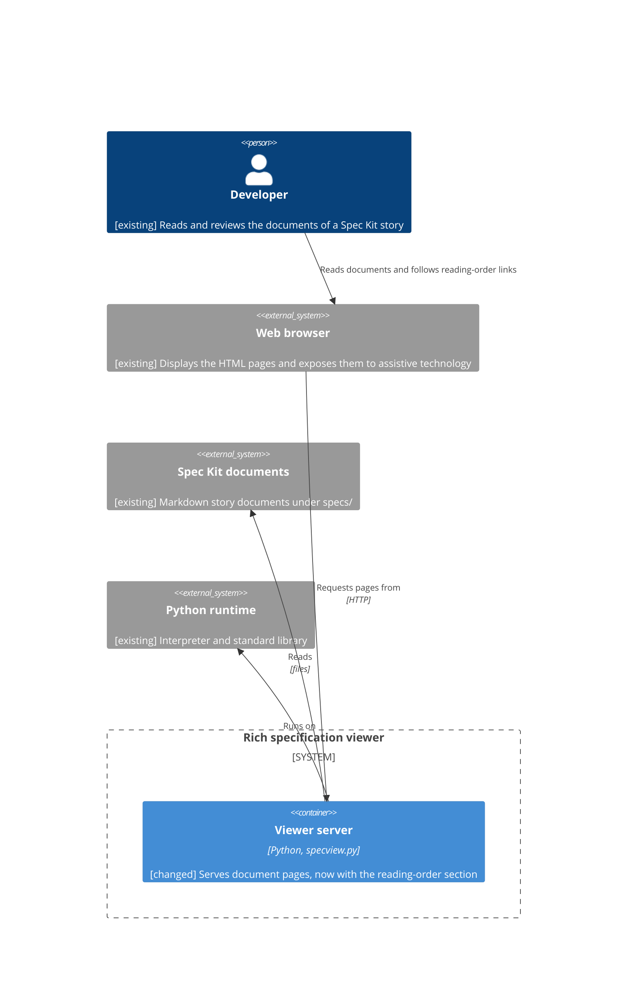
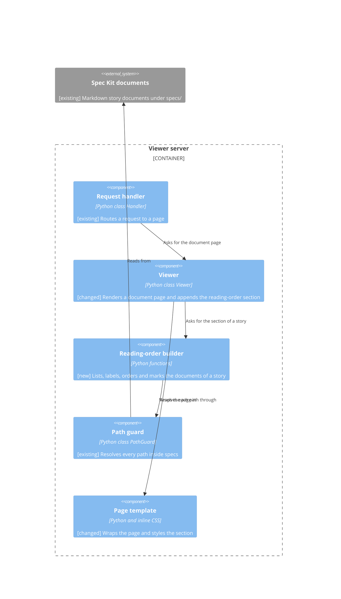

<!--
  STAGE 3 OF THE DEFINITION PIPELINE: HOW will the system do it?

  Gate: TEC-G01 to TEC-G19 (the Technical quality gate). Run `eil check --stage technical`.
  Approval: one recorded confirmation from the responsible developer (or a person named in
  eil-config.yml), after the comprehension check has been taken on this version
  (`/speckit-eil-comprehend`).

  - The developer owns the design. The AI may propose alternatives and challenge decisions; what is
    written as a decision is the developer's choice, and its owner is a person.
  - Every decision traces to the functional or non-functional requirements it serves.
  - Tag any text the AI wrote with [ai-draft] until a human has reviewed it.
  - A section or diagram that does not apply is removed and listed under "Not applicable" with a reason.
-->

# Technical Specification: Reading-order navigation for story documents

## Technical Requirements

- The feature is part of `specview.py` and uses only the Python standard library, so it adds no dependency and keeps the Python 3.11 minimum (FR-016, NFR-003).
- The section is worked out from file and folder names and the position of symbolic links only; the content of a document is never read to build it (FR-014, DEC-002).
- Every path is resolved through the existing `PathGuard`, so nothing outside `specs/` is listed or linked (FR-013, FR-014).
- The order of the entries is a pure function of the names, so it never depends on the order the file system returns (FR-007, NFR-001, DEC-004).
- The markup is a labelled navigation region with an ordered list, with the current entry marked and not a link (FR-002, FR-010, NFR-002, DEC-006).
- Reference tooltips, error marking, search, folder navigation, breadcrumbs and Mermaid diagrams are not touched, and the existing 74 tests keep passing (FR-016, NFR-003).

## Architecture

The viewer stays one process and one source file, `specview.py`. The change is inside the Viewer server container: when `Viewer._render_document` renders a document that lies inside a story folder, it asks a new reading-order builder for the section's HTML and appends it to the rendered body before the page is wrapped by the page template (DEC-001). The builder gets the story's files from the existing walk (DEC-002), resolves each of them through the path guard, and returns the HTML; it keeps no state. The finished page is stored in the existing page cache under the existing key, which already changes when a Markdown file of the story is added, renamed, removed or edited. There is no new container, route, store or external system. The container view shows the viewer and its neighbours, and the component view shows the parts inside the server.

## Component Design

**Reading-order builder** (new, module-level helpers and one `Viewer` method in `specview.py`):

- Responsibility: for a story and the path of the document being viewed, return the HTML of the "Documents in reading order" section.
- Interface: `Viewer.reading_order(story, current_rel)` returns an HTML string; helpers `stage_of(file_name)` (the two-digit stage number and name, or none: `s`, exactly two digits, a hyphen, a non-empty name, then `.md` in any case), `natural_key(text)` (casefolded text split into text and number parts, numbers compared by value, ties broken by the exact text) and `reading_order_key(parts, staged)` return the pieces the method uses (DEC-004).
- Dependencies: `Viewer._markdown_files`, `PathGuard.resolve`, `doc_url` and `esc`, all existing.
- Steps: (1) take the files of the story from the walk; (2) drop a file whose resolved path is not a file, as the story index already does for a symbolic link whose target is missing; (3) mark a file as an alias of its source under DEC-003 and keep it off the list; (4) build the label for each remaining file from its path relative to the story folder, as FR-003 to FR-005 say, and attach its alias names in round brackets in alphanumeric order (FR-006); (5) sort once with the key of DEC-004; (6) pick the current entry under DEC-005, and when the document being viewed is not among the walked files, which happens for a document reached through a symbolic link to a folder because the walk does not descend into those, add it to the list as the current entry under its own path, labelled and placed by the same rules (the handler has already resolved it through the path guard); (7) write the markup of DEC-006, escaping every name with `esc` and every link with `doc_url`.
- Label of a file named exactly `.md`: its name is empty once the extension is removed, so it is labelled `[ref doc: blank]`, after its folder path when it is in a nested folder (decided: CH-010).
- Constraints: no new dependency and no state, and a failure to stat or resolve one file skips that file, as `_markdown_files` and `story_key` already do.

**Viewer** (changed): `_render_document` appends the section after the rendered body when `story` is not `None`, and does nothing for a document directly under `specs/` (FR-012). `navigation_page` and `search` are not changed (FR-017).

**Page template** (changed): a few rules are added to the inline `CSS` for `.reading-order` (DEC-006); `page_html` is not changed.

**Request handler, Path guard** (existing, not changed): routing, the Host check and path resolution stay as they are.

## Data Design

Not applicable: see below.

## API and Integration Design

No endpoint, request or response structure is added or changed, and there is no new integration. The links in the section use the existing `/specs/<path>` document route, built with `doc_url`, and the existing handler answers them, including the not-found page for a document that was removed after the page was rendered (FR-016). The Host check and the refusal of paths outside `specs/` are unchanged. There is no versioning, authentication or authorisation to design: the viewer's only user is the developer (Security and Access Behaviour in the Functional Specification).

## Security Design

- The trust boundary is unchanged: the viewer reads files under `specs/` through `PathGuard` and answers requests whose Host is `localhost` or `127.0.0.1`.
- The builder reads names and resolves paths only and never opens a document, so a file outside `specs/` is never read for the section; a file that `PathGuard.resolve` places outside `specs/` is never listed or linked (FR-014, DEC-002).
- File and folder names are untrusted text. Each one is HTML-escaped with `esc` when it is written into a label or an alias name, and each link is built with `doc_url`, which percent-encodes the path, so a name that holds `<`, `&`, a quote or a space cannot change the markup or the link target.
- A symbolic link inside a story to a document elsewhere under `specs/` is listed; one that resolves outside `specs/` is not (FR-013, FR-014).
- No secret, sensitive data or audit trail is involved.

## Error Handling and Resilience

- **Idempotency and retries**: building the section is a read-only function of the file tree and the viewed path, so repeating a request gives the same page and has no side effect.
- **Concurrency**: requests are served by threads, and the builder keeps no state; two renders of the same page can store the same HTML in the page cache, which does no harm.
- **File problems**: a file that cannot be statted or resolved is skipped, and a symbolic link whose target is missing is not listed because its resolved path is not a file. A listed document removed after the page was rendered gives the existing not-found page when its link is followed.
- **Document viewed through a linked folder**: the walk does not list a document reached through a symbolic link to a folder, so the builder adds it as the current entry; no other file of that linked folder is listed.
- **Stale page**: a page already open can show a list that no longer matches the story until it is reloaded, which the Functional Specification accepts.
- **Dependency failure**: the builder depends on nothing outside the process; an unexpected exception is handled as any rendering exception is today, by the handler's 500 page.

## Observability

No logging, metric or alert is added. A failure to render a page is already reported by the handler (a 500 page and a traceback on the server's standard error), and the section adds no other operational signal.

## Performance

A story holds a handful of documents. Rendering a page now walks the story folder once more, resolves each file and sorts the entries, which is small beside the walk and the Markdown rendering the page already does; the page cache keeps the finished page until a file of the story changes. No volume or latency target is set by the requirements, and none is added.

## Testing Strategy

- **Unit tests** (`tests/unit/test_reading_order.py`, DEC-007): `stage_of` and the labels (`[stage 01: requirements]`, `notes [ref doc: notes]`, a nested path, `s1-x`, `s100-x`, `S01-x`, `s01_x`, `s01`, an upper-case `.MD`, a file named exactly `.md`); the sort key for `s00` to `s10`, case, numbers inside names, a folder's documents before a nested folder's, staged before unstaged within a folder, sibling folders, and the same order for any creation order; alias recognition on temporary folders with real symbolic links, including a regular `plan.md`, a link to an unstaged document, a link into another story, a link to a missing target and two aliases of one document (FR-004 to FR-009, NFR-001, NFR-003).
- **Integration tests** (`tests/integration/test_reading_order.py`, DEC-007): the section on a page of a nested story with its order and, for a document viewed through a symbolic link to a folder, that document as the only entry marked current; exactly one `aria-current="page"` and the current entry as plain text; an alias shown as `(spec.md)` and its source current when `spec.md` is viewed; a one-document story; a document directly under `specs/` with no section; no section on the folder navigation page or the search result; an empty folder adding nothing; two stories not listing each other; a symbolic link into another story listed and linked to its real path; a link to a file outside `specs/` not listed; the navigation region's accessible name and the list (FR-001 to FR-017, NFR-002, NFR-003).
- **Contrast test**: computes the contrast ratio of the link colour and the text colour against the background from the CSS values and requires at least 4.5:1 (NFR-002).
- **Existing tests**: all 74 keep passing, which shows tooltips, error marking, search, navigation and diagrams are unchanged (FR-016).
- There is no security, performance or migration test beyond these: no new input, no data change.

## Deployment and Migration

The change ships as an edited `specview.py` and two new test files. There is nothing to deploy, no data to migrate, no feature flag and no configuration; the next start of the viewer shows the section. Existing URLs and pages are unchanged. Rollback is reverting the change.

## Existing System Impact

`Viewer._render_document` and the inline `CSS` change; the page cache key, routes, search, folder navigation, breadcrumbs, tooltips and diagrams do not. The breadcrumbs also use `aria-current="page"` on a `span`, so a test that looks for the section's current entry must look inside the section. The existing test that checks the breadcrumbs' `aria-current` is not affected. No infrastructure, monitoring or support process changes.

## Alternatives Considered

Each decision records its rejected alternative:

- DEC-001: a new `/api/...` endpoint and script that inserts the section; rejected for the extra route, the dependence on script and the second request.
- DEC-002: reuse the cached `StoryIndex.documents` list; rejected because its alias logic treats any byte-identical copy as an alias, which FR-006 does not allow.
- DEC-003: recognise an alias by name and symbolic link alone; rejected because a link whose source is not listed would be hidden.
- DEC-004: a recursive walk that sorts each folder's parts separately; rejected for more code and an order that depends on correct recursion.
- DEC-005: link every entry to its own path; rejected because a cross-story entry would then show this story's section, against FR-013.
- DEC-006: an unordered list with the current entry marked by colour; rejected because FR-010 forbids colour alone.
- DEC-007: integration tests only; rejected because a failure of an ordering or label rule would be harder to localise.

## Risks and Trade-offs

- A page can be stale until it is reloaded; the Functional Specification accepts it, and CH-004 in the Requirements is the deferred risk of the same kind.
- The page cache key follows the story's Markdown files by name, time and size, so retargeting a symbolic link to a file with the same name, time and size would not refresh a cached page; this is rare and the page then corrects itself on the next edit or restart.
- The sort key is the part most likely to hide a mistake (digits, case, folders); DEC-007's unit tests exist to guard it.
- Two aliases with the same file name in different folders linked to one document would both read `(spec.md)`; FR-006 gives no rule for it and none is added.
- The section adds a second level-2 heading to every document and a second `nav` region besides the breadcrumbs (DEC-006).
- Casefolding is a Unicode rule, not a language-specific one, so names in some languages can order differently from a reader's expectation; the order is still the same on every run.

## Technical Decisions

<!--
  One item per significant decision. Every field is required; the owner is a person (the developer
  who decided), including when the AI proposed the option.

  **DEC-001**: Use asynchronous processing (traces: FR-001, NFR-001)
  Decision: Duplicate analysis runs asynchronously in a worker.
  Reason: A 10 MB import can exceed the synchronous latency limit.
  Rejected alternative: Analyse inside the import request.
  Trade-off: Results are not available to the caller straight away.
  Owner: Ada Dev
-->

**DEC-001**: Build the section on the server, inside the existing page rendering (traces: FR-001, FR-016, FR-017)
Decision: `Viewer._render_document` appends the section's HTML after the rendered body of every document that lies inside a story folder, and adds nothing to a document directly under `specs/`, the folder navigation page or the search results.
Reason: It reuses the existing document rendering flow and the existing page cache, so it works without JavaScript and needs no new route; the cache key already lists every Markdown file of the story, so adding, renaming or removing a file refreshes the page.
Rejected alternative: Serve the list from a new `/api/...` endpoint and have the page script fetch it and insert it into the page.
Trade-off: The section is only as current as the last render, so a page already open can be stale until it is reloaded, which the Functional Specification accepts; the document page and the section are produced together.
Owner: Lee Sinclair

**DEC-002**: Find the story's documents with the existing walk and the path guard (traces: FR-001, FR-006, FR-014, FR-015)
Decision: The section lists the files returned by `Viewer._markdown_files(<story folder>)`, which walks the story at any depth, matches `.md` in any case, does not follow symbolic links to folders and skips any file that `PathGuard.resolve` places outside `specs/`. An empty folder contributes no file and so no entry. Alias recognition does not use `StoryIndex.aliases`.
Reason: The same discovery and path guard serve the rest of the viewer, so a file that is unreachable or outside `specs/` is never listed; `StoryIndex.aliases` counts any byte-identical copy as an alias, which FR-006 does not allow.
Rejected alternative: Reuse the cached `StoryIndex.documents` list and filter it back to what FR-006 allows.
Trade-off: The story folder is walked once more for each page render, on top of the walk the page cache key already does.
Owner: Lee Sinclair

**DEC-003**: Recognise an alias only from the link and its resolved target (traces: FR-006, FR-010)
Decision: A file is an alias when its name is exactly `spec.md`, `plan.md` or `tasks.md` (the names in `ALIAS_NAMES`), the file itself is a symbolic link, and the fully resolved target (a chain of links is followed to its end) lies in the same story, has a stage-prefixed file name and has an entry in the list. It is then not an entry of its own and its file name is shown in round brackets after the source entry. Any other file with one of those names is an ordinary entry, including a link whose target is missing, unreachable, outside the story or without a stage, and a link to a staged document the walk does not list.
Reason: FR-006 allows only a symbolic link to a stage document of the same story; checking the resolved target and requiring an entry for it means a document is never hidden with nowhere to attach.
Rejected alternative: Recognise an alias by name and symbolic link alone and look up its source in the story index.
Trade-off: A link to a staged document that the walk does not list, such as one reached through a symbolic link to a folder, is shown as an ordinary entry, not as an alias.
Owner: Lee Sinclair

**DEC-004**: Order the entries with one sort key (traces: FR-007, FR-008, FR-009, NFR-001)
Decision: Each document gets one sort key and the whole list is sorted once. The key has a folder part for each folder on the document's path, followed by a document part, so a document sorts before every document of a nested folder. Within a folder a document with a stage sorts before one without. Names are compared with `casefold`, with each run of digits compared by its numeric value, and names that are equal under that comparison are ordered by their exact characters. Sibling nested folders are ordered by the same name comparison.
Reason: One comparison gives a total order that depends only on the names, so it is the same on every page view and every run whatever the file creation order or file system order, as NFR-001 requires; the Functional Specification does not state the order of sibling folders, so this decision does.
Rejected alternative: Build the list by walking the folders recursively and sorting each folder's staged documents, unstaged documents and subfolders separately.
Trade-off: The sort key is harder to read than a recursive walk and needs a unit test for each rule; sibling folders are ordered like documents, so a folder named `s10-x` comes after `s02-x`.
Owner: Lee Sinclair

**DEC-005**: Find the current entry by the path viewed and link each entry to its own path (traces: FR-010, FR-011, FR-013)
Decision: The current entry is the entry whose path is the path being viewed; when that path is an alias (DEC-003) it is the alias's source entry, and a symbolic link that is not an alias is current under its own path. Every other entry is a link to the entry's own path in the story, built with `doc_url`, except an entry whose symbolic link resolves into another story, which links to the target's real path so that page shows the other story's section.
Reason: This gives exactly one current entry and keeps each page showing the section of the story it belongs to, as FR-010 and FR-013 require.
Rejected alternative: Always link to the entry's own path, so a cross-story link would be served under this story's path.
Trade-off: A cross-story entry sits in this story's order but leads to a page in another story, so the reader leaves the story's reading order by following it.
Owner: Lee Sinclair

**DEC-006**: Mark the section up as a labelled navigation region with an ordered list (traces: FR-002, FR-010, FR-011, NFR-002)
Decision: The section is a `<nav class="reading-order" aria-label="Documents in reading order">` holding a visible `<h2>` with the same text and an ordered list `<ol>` with one `<li>` per entry. A link entry is an `<a href>`, with any alias names in round brackets after it inside the same `<li>`; the current entry is a `<span aria-current="page">` and not a link. Links keep the viewer's existing underlined link style and colour; the current entry is bold, not underlined, and uses the text colour. The style is a few rules added to the inline `CSS`, with no external file, and the colours give a contrast ratio of at least 4.5:1 against the page background.
Reason: A labelled `nav` with a list lets assistive technology find the region, read the entries as a list and identify the current one, and the current entry differs from a link by more than colour, as FR-010 and NFR-002 require.
Rejected alternative: An unordered list in which the current entry is marked by a background colour.
Trade-off: The page has a second `nav` besides the breadcrumbs, told apart by its accessible name; the section adds a second level-2 heading to every document, which can read as part of the document's own outline.
Owner: Lee Sinclair

**DEC-007**: Test the pure rules in unit tests and the page through the real server (traces: NFR-003, NFR-002, FR-016)
Decision: Add `tests/unit/test_reading_order.py` for stage detection and labels, the sort key and alias recognition on temporary folders with real symbolic links, and `tests/integration/test_reading_order.py` that starts the real server on temporary story folders, as `tests/integration/support.py` does, and checks the section on the page. A test computes the contrast ratios from the colours in the CSS. No package is added, and the existing tests must keep passing.
Reason: The ordering and label rules are pure and are tested directly, so a failure points at the rule; the page, the symbolic links and the isolation between stories only exist through the real server, so those are tested there.
Rejected alternative: Integration tests through HTTP only.
Trade-off: Two new test files to maintain, and the integration tests create temporary folders and symbolic links, so they need an operating system that supports symbolic links, as the existing path-guard test already does.
Owner: Lee Sinclair

## Container View

**ART-007**: Containers of the rich specification viewer (traces: FR-001, DEC-001)



## Component Views

**ART-008**: Inside the viewer server (traces: FR-001, DEC-001, DEC-002, DEC-005)



## Sequence Diagrams

No sequence diagram is drawn: every use case stays inside the Viewer server; see Not applicable.

## Data Model

Not applicable: see below.

## Not applicable

- Data Design: no persistent data is added or changed; the section is worked out on every render and kept only in the existing in-memory page cache.
- Data Model: no persistent data is added or changed, so there is no entity to draw.
- UC-001: stays inside the Viewer server container; the section is built by the reading-order builder in the component view.
- UC-002: stays inside the Viewer server container.
- UC-003: stays inside the Viewer server container; no section is built.

## Challenges

<!-- Recorded by `eil challenge`. -->

```eil:challenge
{
  "id": "CH-009",
  "stage": "technical",
  "raised_by": "ai",
  "raised_at": "2026-10-01T13:05:32Z",
  "target": "DEC-002",
  "text": "DEC-002 lists only files that Viewer._markdown_files returns, and that walk does not descend into symbolic links to folders, but the handler still serves a document reached through such a link (for example specs/A/linkdir/x.md, which PathGuard accepts). That page is inside story A, so FR-001 and FR-010 say it shows A's section with its own entry current, yet the walk never lists it and no entry would be current. Decide what the design does: list a document viewed through a linked folder as the current entry, show no current entry, or show no section on that page.",
  "status": "closed",
  "severity": "medium",
  "responder": "Lee Sinclair",
  "response": "accepted",
  "at": "2026-10-01T13:07:54Z",
  "reason": "a"
}
```

```eil:challenge
{
  "id": "CH-010",
  "stage": "technical",
  "raised_by": "ai",
  "raised_at": "2026-10-01T13:05:32Z",
  "target": "DEC-004",
  "text": "A file named exactly .md is matched by the viewer's case-insensitive .md suffix test, so FR-003's 'path without the file extension' leaves an empty name: the entry label would be [ref doc: ] with nothing before it, and its link would have no readable text. Say how such a file is labelled, or that it is not listed.",
  "status": "closed",
  "severity": "low",
  "responder": "Lee Sinclair",
  "response": "accepted",
  "at": "2026-10-01T13:09:04Z",
  "reason": "[ ref doc: blank ]"
}
```

## Overrides

<!-- Recorded by `eil override`, each naming who, what and why. -->

## Change Log

<!-- eil:begin changelog -->
<!-- eil:end changelog -->

## Record

<!-- eil:begin provenance -->
```json
{
  "version": 1,
  "blocks": {
    "Technical Requirements#08ddb0ee5a98": {
      "hash": "sha256:08ddb0ee5a986252d8dd152b42ca75d75bd2806cf1bdb10b74414e65fc79d219",
      "class": "inferred",
      "adds": "Lists the constraints the design takes from the functional requirements, the standard library and the existing path guard.",
      "reviewed": {
        "by": "Lee Sinclair",
        "at": "2026-10-01T13:10:49Z",
        "list": "RVW-005",
        "reply": "approve all except Performance and DEC-004"
      }
    },
    "Architecture#23a4daf1fd53": {
      "hash": "sha256:23a4daf1fd53219eebb9ee19073c41ea9e0f99ec03514a4129a1fb4d32883728",
      "class": "inferred",
      "adds": "Describes where the section is built in the existing server and that no container, route or store is added.",
      "reviewed": {
        "by": "Lee Sinclair",
        "at": "2026-10-01T13:10:49Z",
        "list": "RVW-005",
        "reply": "approve all except Performance and DEC-004"
      }
    },
    "Component Design#c78e5f6ca86c": {
      "hash": "sha256:c78e5f6ca86c54fdf33cf5430dbeee690c8e632f42533ce4869943f59021eb2c",
      "class": "inferred",
      "adds": "Describes the reading-order builder, its steps, the label of a file named .md, the current entry for a document viewed through a linked folder, and the changed viewer and page template.",
      "reviewed": {
        "by": "Lee Sinclair",
        "at": "2026-10-01T13:10:49Z",
        "list": "RVW-005",
        "reply": "approve all except Performance and DEC-004"
      }
    },
    "Component Design#33229a8a5217": {
      "hash": "sha256:33229a8a5217e54a10667c494a098f6564ee22738193bba47ba670ef0a9d122b",
      "class": "inferred",
      "adds": "Describes the reading-order builder, its steps and the changed viewer and page template, including that an unreadable symbolic link is not listed."
    },
    "Component Design#92be1887a474": {
      "hash": "sha256:92be1887a474d540cd7b14091d1f7e30515eb4ec002fcb05f6d3ef5a6fc01856",
      "class": "inferred",
      "adds": "Describes the reading-order builder, its steps, the label of a file named .md, the current entry for a document viewed through a linked folder, and the changed viewer and page template.",
      "reviewed": {
        "by": "Lee Sinclair",
        "at": "2026-10-01T13:10:49Z",
        "list": "RVW-005",
        "reply": "approve all except Performance and DEC-004"
      }
    },
    "Component Design#208b5466c198": {
      "hash": "sha256:208b5466c1980882bfb69da6d083bfc5dd76ff14ee2457c34b0634b893f80951",
      "class": "inferred",
      "adds": "Describes the reading-order builder, its steps, the label of a file named .md, the current entry for a document viewed through a linked folder, and the changed viewer and page template.",
      "reviewed": {
        "by": "Lee Sinclair",
        "at": "2026-10-01T13:10:49Z",
        "list": "RVW-005",
        "reply": "approve all except Performance and DEC-004"
      }
    },
    "Component Design#982a96cf2f98": {
      "hash": "sha256:982a96cf2f9812be4eac5edabc7debd6294a806e55c8e1709b733d11a295b9ae",
      "class": "inferred",
      "adds": "Describes the reading-order builder, its steps, the label of a file named .md, the current entry for a document viewed through a linked folder, and the changed viewer and page template.",
      "reviewed": {
        "by": "Lee Sinclair",
        "at": "2026-10-01T13:10:49Z",
        "list": "RVW-005",
        "reply": "approve all except Performance and DEC-004"
      }
    },
    "Data Design#9daf251d3cf3": {
      "hash": "sha256:9daf251d3cf3a148ba4f513abc4eae8548b68f015d138f7411dd2dde989b33a2",
      "class": "inferred",
      "adds": "Says the data design does not apply.",
      "reviewed": {
        "by": "Lee Sinclair",
        "at": "2026-10-01T13:10:49Z",
        "list": "RVW-005",
        "reply": "approve all except Performance and DEC-004"
      }
    },
    "API and Integration Design#dfa7f8873e37": {
      "hash": "sha256:dfa7f8873e37a52d9e08c1197d29049bfcc6d92b27a9eb95ba0c0524425e4418",
      "class": "inferred",
      "adds": "Says no endpoint or integration changes and the links use the existing document route.",
      "reviewed": {
        "by": "Lee Sinclair",
        "at": "2026-10-01T13:10:49Z",
        "list": "RVW-005",
        "reply": "approve all except Performance and DEC-004"
      }
    },
    "Security Design#0e41873397f1": {
      "hash": "sha256:0e41873397f12d2cc13091a036a061cb155065a59047096ca75110fa8fea7407",
      "class": "inferred",
      "adds": "Says names are escaped, links are encoded and no document is read to build the section.",
      "reviewed": {
        "by": "Lee Sinclair",
        "at": "2026-10-01T13:10:49Z",
        "list": "RVW-005",
        "reply": "approve all except Performance and DEC-004"
      }
    },
    "Error Handling and Resilience#7b0633297348": {
      "hash": "sha256:7b0633297348a40d21224632b3eae658fa9f233a59cb5401130b2fa292523a93",
      "class": "inferred",
      "adds": "Describes repeatability, concurrency, skipped unreadable files and the stale page."
    },
    "Observability#a2a6e2f81c71": {
      "hash": "sha256:a2a6e2f81c7108c6859bce2eb03e0ef2ffd4a30d68674eae6acfd0669821d1ed",
      "class": "inferred",
      "adds": "Says no logging or metric is added.",
      "reviewed": {
        "by": "Lee Sinclair",
        "at": "2026-10-01T13:10:49Z",
        "list": "RVW-005",
        "reply": "approve all except Performance and DEC-004"
      }
    },
    "Performance#26606c4bfa52": {
      "hash": "sha256:26606c4bfa52a6fb318a9d8b5bec00bf655d12fef30b6dc91d319afc7ac04d11",
      "class": "inferred",
      "adds": "Says the extra walk is small and no target is set.",
      "reviewed": {
        "by": "Lee Sinclair",
        "at": "2026-10-01T13:12:05Z",
        "list": "RVW-006",
        "reply": "A and a"
      }
    },
    "Testing Strategy#914f583e9a43": {
      "hash": "sha256:914f583e9a4366ae8816226c1b43a478d4deeec895680da2e7e46d46c9588ed7",
      "class": "inferred",
      "adds": "Lists the unit, integration and contrast tests and what each verifies."
    },
    "Deployment and Migration#069039ded277": {
      "hash": "sha256:069039ded2778c346d751221c84a5e4675b766143a13decfa928a0f792b8dbbc",
      "class": "inferred",
      "adds": "Says nothing is deployed or migrated and rollback is a revert.",
      "reviewed": {
        "by": "Lee Sinclair",
        "at": "2026-10-01T13:10:49Z",
        "list": "RVW-005",
        "reply": "approve all except Performance and DEC-004"
      }
    },
    "Existing System Impact#8c4027b70e07": {
      "hash": "sha256:8c4027b70e073215d7202083f2b978e91e614d1313de2fb513f32a834dcdf216",
      "class": "inferred",
      "adds": "Names the render method and CSS as changed and the breadcrumbs' aria-current as a point to avoid confusing.",
      "reviewed": {
        "by": "Lee Sinclair",
        "at": "2026-10-01T13:10:49Z",
        "list": "RVW-005",
        "reply": "approve all except Performance and DEC-004"
      }
    },
    "Alternatives Considered#fe3dd390e8b3": {
      "hash": "sha256:fe3dd390e8b3e6c6833d8afe5900f15417c7ce25e41702dd15cf25abba4a2f59",
      "class": "inferred",
      "adds": "Summarises the rejected alternative of each decision.",
      "reviewed": {
        "by": "Lee Sinclair",
        "at": "2026-10-01T13:10:49Z",
        "list": "RVW-005",
        "reply": "approve all except Performance and DEC-004"
      }
    },
    "Alternatives Considered#f54f1d93cb9b": {
      "hash": "sha256:f54f1d93cb9baef378a09a36745de33fe1f031da16e8d048f42162ac3d747cca",
      "class": "inferred",
      "adds": "Summarises the rejected alternative of each decision.",
      "reviewed": {
        "by": "Lee Sinclair",
        "at": "2026-10-01T13:10:49Z",
        "list": "RVW-005",
        "reply": "approve all except Performance and DEC-004"
      }
    },
    "Risks and Trade-offs#a339db906ad4": {
      "hash": "sha256:a339db906ad4bb95d6f6aaa3bfac7a8a4c2b0ab6824eef39f18dca7884d95b5a",
      "class": "inferred",
      "adds": "Lists staleness, cache-key limits, sort-key risk, alias name collisions, headings and casefolding.",
      "reviewed": {
        "by": "Lee Sinclair",
        "at": "2026-10-01T13:10:49Z",
        "list": "RVW-005",
        "reply": "approve all except Performance and DEC-004"
      }
    },
    "DEC-001": {
      "hash": "sha256:bb921b2401109f1ece0e7a13243eaba9121b572231d2c6402f21a46830d083aa",
      "class": "inferred",
      "adds": "Technical decision to build the section on the server, with its alternative and trade-off.",
      "reviewed": {
        "by": "Lee Sinclair",
        "at": "2026-10-01T13:10:49Z",
        "list": "RVW-005",
        "reply": "approve all except Performance and DEC-004"
      }
    },
    "DEC-002": {
      "hash": "sha256:e5e293b732dc3070124d2538a452ac15b148fb9937d58da144d4ee8d004b2032",
      "class": "inferred",
      "adds": "Technical decision to reuse the existing walk and path guard, with its alternative and trade-off.",
      "reviewed": {
        "by": "Lee Sinclair",
        "at": "2026-10-01T13:10:49Z",
        "list": "RVW-005",
        "reply": "approve all except Performance and DEC-004"
      }
    },
    "DEC-003": {
      "hash": "sha256:36efe9d2ce0818895e0200cf12258c73ee561dcb82dbf2c4a1723d203a605105",
      "class": "inferred",
      "adds": "Technical decision on how an alias is recognised, with its alternative and trade-off.",
      "reviewed": {
        "by": "Lee Sinclair",
        "at": "2026-10-01T13:10:49Z",
        "list": "RVW-005",
        "reply": "approve all except Performance and DEC-004"
      }
    },
    "DEC-004": {
      "hash": "sha256:7b10b4a428165cd28fee8fa2619828a86dc5bbf81c06f10415da597c69d300d7",
      "class": "inferred",
      "adds": "Technical decision on the sort key, including the order of sibling folders the functional text does not state.",
      "reviewed": {
        "by": "Lee Sinclair",
        "at": "2026-10-01T13:12:05Z",
        "list": "RVW-006",
        "reply": "A and a"
      }
    },
    "DEC-005": {
      "hash": "sha256:141ce780db6dcb541ca4b1c2e4792550978c143cbd5eea57838c9736579db7be",
      "class": "inferred",
      "adds": "Technical decision on the current entry and link targets, with its alternative and trade-off.",
      "reviewed": {
        "by": "Lee Sinclair",
        "at": "2026-10-01T13:10:49Z",
        "list": "RVW-005",
        "reply": "approve all except Performance and DEC-004"
      }
    },
    "DEC-006": {
      "hash": "sha256:39b03e67818d400e49ee296e2e3c28ac91daeaa69b23d14ab9a0ae88a080b5de",
      "class": "inferred",
      "adds": "Technical decision on the markup and styling, with its alternative and trade-off.",
      "reviewed": {
        "by": "Lee Sinclair",
        "at": "2026-10-01T13:10:49Z",
        "list": "RVW-005",
        "reply": "approve all except Performance and DEC-004"
      }
    },
    "DEC-007": {
      "hash": "sha256:c092606ae0d1acdb955329fb0999903f6b0219c952e9d0bbaa51fa3ef1b8ce76",
      "class": "inferred",
      "adds": "Technical decision on the unit and integration tests, with its alternative and trade-off.",
      "reviewed": {
        "by": "Lee Sinclair",
        "at": "2026-10-01T13:10:49Z",
        "list": "RVW-005",
        "reply": "approve all except Performance and DEC-004"
      }
    },
    "ART-007": {
      "hash": "sha256:084128aeb0d17c901971f78251314276ef4c4b2cc3d9bb09ed723e078fc5eeb9",
      "class": "inferred",
      "adds": "Container view of the viewer, showing one changed container and its neighbours.",
      "reviewed": {
        "by": "Lee Sinclair",
        "at": "2026-10-01T13:10:49Z",
        "list": "RVW-005",
        "reply": "approve all except Performance and DEC-004"
      }
    },
    "ART-008": {
      "hash": "sha256:f6fef5898a572d62890e617df6b3c58cd89f75af3a3f1c891255b59bd498b730",
      "class": "inferred",
      "adds": "Component view of the viewer server, showing the new reading-order builder and the changed viewer and template.",
      "reviewed": {
        "by": "Lee Sinclair",
        "at": "2026-10-01T13:10:49Z",
        "list": "RVW-005",
        "reply": "approve all except Performance and DEC-004"
      }
    },
    "Sequence Diagrams#edf915f5448c": {
      "hash": "sha256:edf915f5448c79a7cb7e9ccfb12174118e2c98f06f674db8b510a528f0764a86",
      "class": "inferred",
      "adds": "Says no sequence diagram is drawn because each use case stays in one container.",
      "reviewed": {
        "by": "Lee Sinclair",
        "at": "2026-10-01T13:10:49Z",
        "list": "RVW-005",
        "reply": "approve all except Performance and DEC-004"
      }
    },
    "Data Model#9daf251d3cf3": {
      "hash": "sha256:9daf251d3cf3a148ba4f513abc4eae8548b68f015d138f7411dd2dde989b33a2",
      "class": "inferred",
      "adds": "Says the data model does not apply.",
      "reviewed": {
        "by": "Lee Sinclair",
        "at": "2026-10-01T13:10:49Z",
        "list": "RVW-005",
        "reply": "approve all except Performance and DEC-004"
      }
    },
    "Not applicable#e69803592795": {
      "hash": "sha256:e69803592795b7b98cd11ea32de776843d279bea9623b173564a9be54a7fb2f1",
      "class": "inferred",
      "adds": "Lists the data design, data model and three use cases as not applicable with reasons.",
      "reviewed": {
        "by": "Lee Sinclair",
        "at": "2026-10-01T13:10:49Z",
        "list": "RVW-005",
        "reply": "approve all except Performance and DEC-004"
      }
    },
    "Component Design#d2f9746dc0be": {
      "hash": "sha256:d2f9746dc0bef51347212f3b15c40174ea7e4658cfa69c32041fb4a1e49c4c61",
      "class": "inferred",
      "adds": "Describes the reading-order builder, its steps, the label of a file named .md, the current entry for a document viewed through a linked folder, and the changed viewer and page template.",
      "reviewed": {
        "by": "Lee Sinclair",
        "at": "2026-10-01T13:10:49Z",
        "list": "RVW-005",
        "reply": "approve all except Performance and DEC-004"
      }
    },
    "Error Handling and Resilience#17ff94dc5234": {
      "hash": "sha256:17ff94dc5234321444d1356d1f354e3f2b76ec0730ec4491c4e28623c66fa98e",
      "class": "inferred",
      "adds": "Describes repeatability, concurrency, skipped unreadable files, a document viewed through a linked folder and the stale page.",
      "reviewed": {
        "by": "Lee Sinclair",
        "at": "2026-10-01T13:10:49Z",
        "list": "RVW-005",
        "reply": "approve all except Performance and DEC-004"
      }
    },
    "Testing Strategy#3d3d43466d20": {
      "hash": "sha256:3d3d43466d2059593a63449ee42c1ddac8b096c969da4edd1bcb0d1be8a5b83c",
      "class": "inferred",
      "adds": "Lists the unit, integration and contrast tests and what each verifies, including a linked folder and a file named .md.",
      "reviewed": {
        "by": "Lee Sinclair",
        "at": "2026-10-01T13:10:49Z",
        "list": "RVW-005",
        "reply": "approve all except Performance and DEC-004"
      }
    }
  },
  "acceptances": [
    {
      "id": "RVW-005",
      "stage": "technical",
      "kind": "inferred",
      "digest": "sha256:9b85f20bc813bd7fb11826b25b5b4bfd7f371e88deddc5b94f145d3bb3335004",
      "by": "Lee Sinclair",
      "at": "2026-10-01T13:10:49Z",
      "reply": "approve all except Performance and DEC-004",
      "accepted": [
        "Technical Requirements#08ddb0ee5a98",
        "Architecture#23a4daf1fd53",
        "Component Design#c78e5f6ca86c",
        "Component Design#d2f9746dc0be",
        "Component Design#92be1887a474",
        "Component Design#208b5466c198",
        "Component Design#982a96cf2f98",
        "Data Design#9daf251d3cf3",
        "API and Integration Design#dfa7f8873e37",
        "Security Design#0e41873397f1",
        "Error Handling and Resilience#17ff94dc5234",
        "Observability#a2a6e2f81c71",
        "Testing Strategy#3d3d43466d20",
        "Deployment and Migration#069039ded277",
        "Existing System Impact#8c4027b70e07",
        "Alternatives Considered#fe3dd390e8b3",
        "Alternatives Considered#f54f1d93cb9b",
        "Risks and Trade-offs#a339db906ad4",
        "DEC-001",
        "DEC-002",
        "DEC-003",
        "DEC-005",
        "DEC-006",
        "DEC-007",
        "ART-007",
        "ART-008",
        "Sequence Diagrams#edf915f5448c",
        "Data Model#9daf251d3cf3",
        "Not applicable#e69803592795"
      ],
      "except": [
        "Performance#26606c4bfa52",
        "DEC-004"
      ],
      "questioned": [],
      "reopened": [],
      "reason": null,
      "hashes": {
        "Performance#26606c4bfa52": "sha256:26606c4bfa52a6fb318a9d8b5bec00bf655d12fef30b6dc91d319afc7ac04d11",
        "DEC-004": "sha256:7b10b4a428165cd28fee8fa2619828a86dc5bbf81c06f10415da597c69d300d7",
        "Technical Requirements#08ddb0ee5a98": "sha256:08ddb0ee5a986252d8dd152b42ca75d75bd2806cf1bdb10b74414e65fc79d219",
        "Architecture#23a4daf1fd53": "sha256:23a4daf1fd53219eebb9ee19073c41ea9e0f99ec03514a4129a1fb4d32883728",
        "Component Design#c78e5f6ca86c": "sha256:c78e5f6ca86c54fdf33cf5430dbeee690c8e632f42533ce4869943f59021eb2c",
        "Component Design#d2f9746dc0be": "sha256:d2f9746dc0bef51347212f3b15c40174ea7e4658cfa69c32041fb4a1e49c4c61",
        "Component Design#92be1887a474": "sha256:92be1887a474d540cd7b14091d1f7e30515eb4ec002fcb05f6d3ef5a6fc01856",
        "Component Design#208b5466c198": "sha256:208b5466c1980882bfb69da6d083bfc5dd76ff14ee2457c34b0634b893f80951",
        "Component Design#982a96cf2f98": "sha256:982a96cf2f9812be4eac5edabc7debd6294a806e55c8e1709b733d11a295b9ae",
        "Data Design#9daf251d3cf3": "sha256:9daf251d3cf3a148ba4f513abc4eae8548b68f015d138f7411dd2dde989b33a2",
        "API and Integration Design#dfa7f8873e37": "sha256:dfa7f8873e37a52d9e08c1197d29049bfcc6d92b27a9eb95ba0c0524425e4418",
        "Security Design#0e41873397f1": "sha256:0e41873397f12d2cc13091a036a061cb155065a59047096ca75110fa8fea7407",
        "Error Handling and Resilience#17ff94dc5234": "sha256:17ff94dc5234321444d1356d1f354e3f2b76ec0730ec4491c4e28623c66fa98e",
        "Observability#a2a6e2f81c71": "sha256:a2a6e2f81c7108c6859bce2eb03e0ef2ffd4a30d68674eae6acfd0669821d1ed",
        "Testing Strategy#3d3d43466d20": "sha256:3d3d43466d2059593a63449ee42c1ddac8b096c969da4edd1bcb0d1be8a5b83c",
        "Deployment and Migration#069039ded277": "sha256:069039ded2778c346d751221c84a5e4675b766143a13decfa928a0f792b8dbbc",
        "Existing System Impact#8c4027b70e07": "sha256:8c4027b70e073215d7202083f2b978e91e614d1313de2fb513f32a834dcdf216",
        "Alternatives Considered#fe3dd390e8b3": "sha256:fe3dd390e8b3e6c6833d8afe5900f15417c7ce25e41702dd15cf25abba4a2f59",
        "Alternatives Considered#f54f1d93cb9b": "sha256:f54f1d93cb9baef378a09a36745de33fe1f031da16e8d048f42162ac3d747cca",
        "Risks and Trade-offs#a339db906ad4": "sha256:a339db906ad4bb95d6f6aaa3bfac7a8a4c2b0ab6824eef39f18dca7884d95b5a",
        "DEC-001": "sha256:bb921b2401109f1ece0e7a13243eaba9121b572231d2c6402f21a46830d083aa",
        "DEC-002": "sha256:e5e293b732dc3070124d2538a452ac15b148fb9937d58da144d4ee8d004b2032",
        "DEC-003": "sha256:36efe9d2ce0818895e0200cf12258c73ee561dcb82dbf2c4a1723d203a605105",
        "DEC-005": "sha256:141ce780db6dcb541ca4b1c2e4792550978c143cbd5eea57838c9736579db7be",
        "DEC-006": "sha256:39b03e67818d400e49ee296e2e3c28ac91daeaa69b23d14ab9a0ae88a080b5de",
        "DEC-007": "sha256:c092606ae0d1acdb955329fb0999903f6b0219c952e9d0bbaa51fa3ef1b8ce76",
        "ART-007": "sha256:084128aeb0d17c901971f78251314276ef4c4b2cc3d9bb09ed723e078fc5eeb9",
        "ART-008": "sha256:f6fef5898a572d62890e617df6b3c58cd89f75af3a3f1c891255b59bd498b730",
        "Sequence Diagrams#edf915f5448c": "sha256:edf915f5448c79a7cb7e9ccfb12174118e2c98f06f674db8b510a528f0764a86",
        "Data Model#9daf251d3cf3": "sha256:9daf251d3cf3a148ba4f513abc4eae8548b68f015d138f7411dd2dde989b33a2",
        "Not applicable#e69803592795": "sha256:e69803592795b7b98cd11ea32de776843d279bea9623b173564a9be54a7fb2f1"
      }
    },
    {
      "id": "RVW-006",
      "stage": "technical",
      "kind": "inferred",
      "digest": "sha256:bdec5fc7e72fdae6c869b0148c5334108bd480cf52c8ebd211b49f6c787eadc5",
      "by": "Lee Sinclair",
      "at": "2026-10-01T13:12:05Z",
      "reply": "A and a",
      "accepted": [
        "Performance#26606c4bfa52",
        "DEC-004"
      ],
      "except": [],
      "questioned": [],
      "reopened": [],
      "reason": null,
      "hashes": {
        "Performance#26606c4bfa52": "sha256:26606c4bfa52a6fb318a9d8b5bec00bf655d12fef30b6dc91d319afc7ac04d11",
        "DEC-004": "sha256:7b10b4a428165cd28fee8fa2619828a86dc5bbf81c06f10415da597c69d300d7"
      }
    }
  ]
}
```
<!-- eil:end provenance -->

## Comprehension Check

<!-- The record of the check taken on this version: levels, outcomes, attempts and item ids only. Never a question, an answer, a hint or a score. -->

<!-- eil:begin comprehension -->
```json
{
  "stage": "technical",
  "fingerprint": "sha256:987df2a93c0a8cb8215628b1e9e4b29af9d9f5e95acd1f2af20b83825c488d6d",
  "taken_by": "Lee Sinclair",
  "started_at": "2026-10-01T13:17:36Z",
  "updated_at": "2026-10-01T13:23:40Z",
  "levels": [
    {
      "level": "recognise",
      "outcome": "understood",
      "attempts": 1,
      "items": [
        "DEC-001"
      ]
    },
    {
      "level": "explain",
      "outcome": "revealed",
      "attempts": 2,
      "items": [
        "DEC-004"
      ]
    },
    {
      "level": "apply",
      "outcome": "revealed",
      "attempts": 2,
      "items": [
        "DEC-007"
      ]
    },
    {
      "level": "trace",
      "outcome": "revealed",
      "attempts": 1,
      "items": [
        "DEC-006"
      ]
    },
    {
      "level": "evaluate",
      "outcome": "coached",
      "attempts": 2,
      "items": [
        "DEC-002"
      ]
    }
  ]
}
```
<!-- eil:end comprehension -->

## Quality Assessment

<!-- eil:begin assessment -->
```json
{
  "stage": "technical",
  "evaluated_at": "2026-10-01T13:23:40Z",
  "fingerprint": "sha256:987df2a93c0a8cb8215628b1e9e4b29af9d9f5e95acd1f2af20b83825c488d6d",
  "criteria": [
    {
      "id": "TEC-G01",
      "kind": "judgment",
      "status": "met",
      "reason": "AI assessment: Every functional requirement traces to a decision or component, and the one gap found, FR-010 for a document viewed through a linked folder, is closed by the answer to CH-009.",
      "basis": "sha256:87e286676cf6921bc86cb82503238eca8c7bfb6ea30800283df52909c1bd1c17"
    },
    {
      "id": "TEC-G02",
      "kind": "traceability",
      "status": "met",
      "reason": ""
    },
    {
      "id": "TEC-G03",
      "kind": "structural",
      "status": "met",
      "reason": ""
    },
    {
      "id": "TEC-G04",
      "kind": "structural",
      "status": "met",
      "reason": ""
    },
    {
      "id": "TEC-G05",
      "kind": "structural",
      "status": "met",
      "reason": ""
    },
    {
      "id": "TEC-G06",
      "kind": "structural",
      "status": "met",
      "reason": ""
    },
    {
      "id": "TEC-G07",
      "kind": "structural",
      "status": "met",
      "reason": ""
    },
    {
      "id": "TEC-G08",
      "kind": "judgment",
      "status": "met",
      "reason": "AI assessment: DEC-007 puts the pure ordering, label and alias rules under unit tests and the page, isolation and symbolic-link cases under integration tests, with a contrast test and the 74 existing tests.",
      "basis": "sha256:6beef5a71f16f4c9371836c7447afe85b12a6d0549fbe1e97326f6048b8c915d"
    },
    {
      "id": "TEC-G09",
      "kind": "structural",
      "status": "met",
      "reason": ""
    },
    {
      "id": "TEC-G10",
      "kind": "structural",
      "status": "met",
      "reason": ""
    },
    {
      "id": "TEC-G11",
      "kind": "structural",
      "status": "met",
      "reason": ""
    },
    {
      "id": "TEC-G12",
      "kind": "traceability",
      "status": "met",
      "reason": ""
    },
    {
      "id": "TEC-G13",
      "kind": "judgment",
      "status": "met",
      "reason": "AI assessment: The design stays in the single standard-library file and reuses the existing walk, PathGuard, doc_url, esc, page cache and inline CSS, and adds tests in the existing unittest style.",
      "basis": "sha256:987df2a93c0a8cb8215628b1e9e4b29af9d9f5e95acd1f2af20b83825c488d6d"
    },
    {
      "id": "TEC-G14",
      "kind": "judgment",
      "status": "met",
      "reason": "AI assessment: Each of the seven decisions states what is built, why, the rejected alternative and the trade-off, and the architecture and component text explain the flow from render to section.",
      "basis": "sha256:987df2a93c0a8cb8215628b1e9e4b29af9d9f5e95acd1f2af20b83825c488d6d"
    },
    {
      "id": "TEC-G15",
      "kind": "structural",
      "status": "met",
      "reason": ""
    },
    {
      "id": "TEC-G16",
      "kind": "structural",
      "status": "met",
      "reason": ""
    },
    {
      "id": "TEC-G17",
      "kind": "structural",
      "status": "met",
      "reason": ""
    },
    {
      "id": "TEC-G18",
      "kind": "structural",
      "status": "met",
      "reason": ""
    },
    {
      "id": "TEC-G19",
      "kind": "structural",
      "status": "met",
      "reason": ""
    }
  ],
  "assessment": {
    "ambiguity": [
      "FR-006 gives no rule when two aliases in different folders have the same file name and point to one document; the design leaves both reading the same name."
    ],
    "missing": [],
    "contradictions": [],
    "unsupported_assumptions": [
      "Performance assumes a story holds a handful of documents; no figure is stated in the requirements."
    ],
    "untestable": []
  },
  "findings": []
}
```
<!-- eil:end assessment -->

## Approval

<!-- eil:begin approval -->
```json
{
  "stage": "technical",
  "by": "Lee Sinclair",
  "at": "2026-10-01T13:24:53Z",
  "fingerprint": "sha256:987df2a93c0a8cb8215628b1e9e4b29af9d9f5e95acd1f2af20b83825c488d6d",
  "reached": "first",
  "attestation": "I approve the technical spec",
  "upstream": {
    "requirements": "sha256:c220988973e9202a33a1882e931d570dde67f456ba124e34b4807d758bf9808f",
    "functional": "sha256:9bbe8058897923aaf053399ce7cbf4463aa9aa04cc37abdd342182af8a8762fd"
  },
  "items": {
    "DEC-001": "sha256:bb921b2401109f1ece0e7a13243eaba9121b572231d2c6402f21a46830d083aa",
    "DEC-002": "sha256:e5e293b732dc3070124d2538a452ac15b148fb9937d58da144d4ee8d004b2032",
    "DEC-003": "sha256:36efe9d2ce0818895e0200cf12258c73ee561dcb82dbf2c4a1723d203a605105",
    "DEC-004": "sha256:7b10b4a428165cd28fee8fa2619828a86dc5bbf81c06f10415da597c69d300d7",
    "DEC-005": "sha256:141ce780db6dcb541ca4b1c2e4792550978c143cbd5eea57838c9736579db7be",
    "DEC-006": "sha256:39b03e67818d400e49ee296e2e3c28ac91daeaa69b23d14ab9a0ae88a080b5de",
    "DEC-007": "sha256:c092606ae0d1acdb955329fb0999903f6b0219c952e9d0bbaa51fa3ef1b8ce76",
    "ART-007": "sha256:084128aeb0d17c901971f78251314276ef4c4b2cc3d9bb09ed723e078fc5eeb9",
    "ART-008": "sha256:f6fef5898a572d62890e617df6b3c58cd89f75af3a3f1c891255b59bd498b730"
  },
  "section_fingerprints": {
    "Technical Requirements": "sha256:138ff15f08b1744882e8e15286ccd1fe5cf4560cba7d05a58313ed3b5e573e42",
    "Architecture": "sha256:555fb3fb963dcaac3240cba08e0a4807c954bb25e2950af1ad610640d5fbb105",
    "Component Design": "sha256:77e9c33ec8fd6080b90c2d32976d3809dda0eb2817af0ecf30badd384dbd9780",
    "Data Design": "sha256:ab24b8954c76fbb88c58a92d98f6ea76db6affd80efbb5ec7c7a6f6428c86712",
    "API and Integration Design": "sha256:e5416b7a7db3e683e6c9c97f64fc27ee1dcc3caba6af9b0d22b8b9750cc83f27",
    "Security Design": "sha256:9fd708cc03efd093af1b8b981aed646156206ae8ab71c1f26f5c08d67e348647",
    "Error Handling and Resilience": "sha256:d437e09bc2b93020324de411517d1af45608075925e35dca24999a12e72fbf66",
    "Observability": "sha256:a5d14ffa6b169e859c33cce2110b5419c1da674d8b7e27be5136d963ff650616",
    "Performance": "sha256:174f8e5cb141c2bcfea408a465b01805c82ea62bbff943e1cf1ef05a2d0e8854",
    "Testing Strategy": "sha256:730341c42044bf9a690b29dcb818fa4c19a59b7edbbc3d848505c4e99b66ea0f",
    "Deployment and Migration": "sha256:657ad1f87347c6a7b36e3a1164b3ed32873a24b0c6aa7ca752e08dbbf7ad41c8",
    "Existing System Impact": "sha256:59ee539f40f3fd0831e01fb3c12495e2812fbe2671e3f320bae1bc7250b85f81",
    "Alternatives Considered": "sha256:2bfd263809254e4e6a9a50833892441d0f17d2abe5de94860d62be4f719e2f36",
    "Risks and Trade-offs": "sha256:7a56ca79218b9ec097d2907e436dc31795209657b02f00c206e363a4de7528d3",
    "Technical Decisions": "sha256:529bc9b7c394f670ea88d970e2f9acd7599ba8d2acc5a4ea46bb0654c232728e",
    "Container View": "sha256:53a435a735a1dbf04cfb4e1ac5ac0f38aa66dc9c8bd8b1d0e4d13d7df5d111b0",
    "Component Views": "sha256:4e41b3158a9f487d463f0a40835175534b1482aa0979eaff2c7551fadde2920e",
    "Sequence Diagrams": "sha256:08e8e7d7f23bc22f6752a975d2f051ae20293b357a2a65bd1ff867c8b450d1cc",
    "Data Model": "sha256:f6ce97b538f3c65fd136a7aef8e9773e7cc9c0e579625f90b522a4bcb0598648",
    "Not applicable": "sha256:4ec8c26dde73ed501c04293e5e7557cec6f401dd363ab30d8f19e143fa65ffe2"
  },
  "upstream_items": {
    "FR-014": "sha256:ad118cfdcba914b6dcced02aeaa12e219170b3d9b9b64e1cb3ae800f2cf133cd",
    "REQ-007": "sha256:bb73c59fe2c6e1a8dc4e62a7718608d9cc9c9b2c1ca3dc4e1b8d91b8ace51041",
    "FR-011": "sha256:0ca8c3df85b82bec17637d1f09bab4668b4bd26b3337664b6990b103bab3b0ec",
    "FR-002": "sha256:32dc804048b7e426e532d1b98c0fc50d4ebdb1ebea550a3caa6e72002e6f2e6f",
    "REQ-010": "sha256:aeba84bc66554b71b5aa5286cde9cbe4906cc3b0b502f744baa1561c4f22890a",
    "REQ-006": "sha256:e517cbec32193438afe0b76b99eb5cc9d95f0fce65987fc63aa5d8ee7f783a47",
    "FR-017": "sha256:1dd105d6d7f7eac38abd4ce9c97be3e06a173c742a3cb34e6d0bcf1e15376376",
    "REQ-004": "sha256:b52a4907c94a13f2f9fa348ca1da6350f4504b1786482733a63bf8784b4b091f",
    "FR-010": "sha256:8aa5f448ddb370a99dcbb5281add4a0106cbb03152c32325dd17c921f07fe781",
    "REQ-011": "sha256:ef32b333ad49ed6d560a3000ff6018a61fc3b9c3c62c7ff1d361ca6da28ef3b6",
    "REQ-008": "sha256:f70bd5a6e36b3acdc1e0ef4100073132fb4a46ffcc099383dc4bc14f247254fe",
    "UC-001": "sha256:39bc034f14596d29449003ea963e3a0b3f51215ee9e15e11c5fef4ae2aaed9ab",
    "REQ-003": "sha256:aedb4376fbb5fa1aa745d236c36bf0e638196fe7604260ebfc5adba12d358b9e",
    "UC-002": "sha256:98a48e376358abb62b44feb49ed89036461de691abb57208c9127ef4e0918d00",
    "REQ-001": "sha256:256ed10c2afe9e022501c4f25204361be56ca8ebe3e3b4e74b6738c84ce8c568",
    "FR-009": "sha256:ac1727d2ea6122e201b9f35a77530ece91dba013c30ac656bc80c791a5884aa5",
    "NFR-002": "sha256:b6d43217718ec3585d21c7e35c03545369d59141a6cd7f07acb47100eef1826b",
    "FR-001": "sha256:9b8829cba27184e4e9004fc0ba4af995bb30d52c81be952f804b2817d4ed7a36",
    "FR-008": "sha256:1efd77e47f9d55a3f735dac2b82d9d1534cd786f60fffcd8463bf2a28f8da6c6",
    "REQ-005": "sha256:05e5b7ff7f62222173552749b93cd16789de08c57b13afb8171919152c976b57",
    "FR-013": "sha256:38d94ad5c0f0b784877847af344fd77e14f9941ad73bbc98a535b7942b21e73a",
    "NFR-001": "sha256:df17800aee3588d157d4116760d6c0ac8b1aaaf338acd002ab064f7c755650e9",
    "NFR-003": "sha256:38473b65fca10e09faa1982b8eee81daace9150eebf3baefbaa5e7209036eabf",
    "FR-007": "sha256:7bcffe16420753854d6ef411e7c3099f58fe40bf91b17e707680884c894d989d",
    "FR-006": "sha256:3e514e8dfd04bc478e405c56c902c4d400ee8620a0edc9f5da1d311dea49978d",
    "FR-015": "sha256:f1d6d8705d95ac71564ee91d3882b78a9adc9ded77660d8d1531a57c74db3bb0",
    "FR-016": "sha256:ea3570068dfeaaa7dda913bd48c48be6dd4a84a8b69fe0e06859657edfaeb67d",
    "REQ-009": "sha256:726e06a357ca16e93d7ddde707c7d9b1a7a0d583ae14dfc677a33b7b0efa370c"
  },
  "overrides_used": [],
  "comprehension": {
    "understood": 1,
    "coached": 1,
    "revealed": 3,
    "skipped": 0,
    "not_applicable": 0
  }
}
```
<!-- eil:end approval -->
