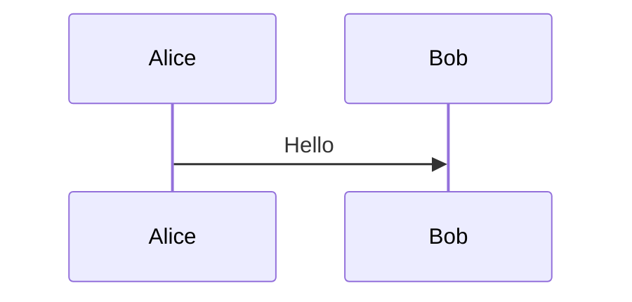
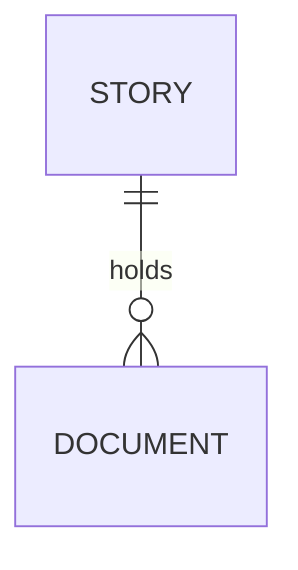

# Functional Specification: Demo

## Functional Requirements

**FR-001**: The system shall show each document. (traces: REQ-001)

**FR-002**: The system shall explain codes such as REQ-002 and UC-001. (traces: REQ-002, UC-001)

**FR-003**: This refers to FR-777, which is defined nowhere, and to NFR-001. (traces: REQ-001)

**NFR-001**: Pages stay readable.

A shared code UC-050 is defined in two documents. A code only in another story: REQ-900.

Codes in code are not references: `REQ-001`, and a checklist item CHK-001 is not a code form.

| Requirement | Satisfied by |
|---|---|
| REQ-001 | FR-001, FR-003 |

## Use Cases and Scenarios

### UC-001: Developer reads a document

- **Main flow**: the page is rendered and shown.

## Diagrams







```mermaid
this is not valid mermaid
```

```python
print("REQ-001 inside a code block")
```

## Challenges

```eil:challenge
{
  "id": "CH-001",
  "stage": "functional",
  "raised_by": "ai",
  "target": "FR-002",
  "text": "FR-002 does not say what a tooltip holds.",
  "status": "accepted",
  "response": "accepted",
  "by": "Lee Sinclair",
  "reason": "the whole section"
}
```

This page mentions CH-001, which was answered.
