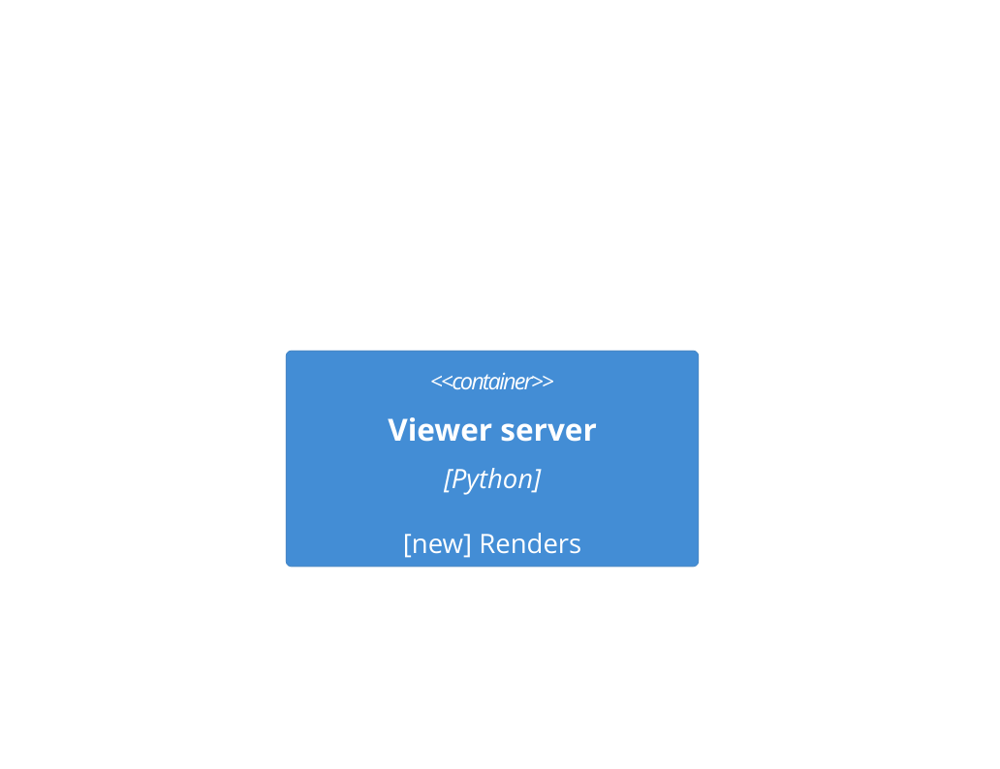

# Technical Specification: Demo

## Technical Decisions

**DEC-001**: Render on request (traces: FR-001)
Decision: One process renders each page.
Owner: Lee Sinclair

**UC-050**: A duplicate definition used to test ambiguity.

Nested definitions come from CHK-900 and SC-001.

